```python
Bakery Sales Analytics 
```


```python
import pandas as  pd 
import numpy as np
import matplotlib as plt
import seaborn as sn
```


```python
import pandas as pd

df = pd.read_excel(
    r"C:\Users\hanra\OneDrive\Desktop\BakerySalesAnalytics\bakery_synthetic_dataset.csv (1).xlsx"
)
```


```python
df.head()
```


<div>
<style scoped>
    .dataframe tbody tr th:only-of-type {
        vertical-align: middle;
    }

    .dataframe tbody tr th {
        vertical-align: top;
    }

    .dataframe thead th {
        text-align: right;
    }
</style>
<table border="1" class="dataframe">
  <thead>
    <tr style="text-align: right;">
      <th></th>
      <th>Transaction_ID</th>
      <th>Date</th>
      <th>Time</th>
      <th>Customer_ID</th>
      <th>Customer_Age</th>
      <th>Customer_Gender</th>
      <th>Product</th>
      <th>Category</th>
      <th>Quantity</th>
      <th>Unit_Price</th>
      <th>...</th>
      <th>Promotion_Applied</th>
      <th>Promotion_Type</th>
      <th>Promotion_Score</th>
      <th>Customer_Rating</th>
      <th>Customer_Segment</th>
      <th>Loyalty_Member</th>
      <th>Profit</th>
      <th>Waste_Cost</th>
      <th>Recommended_Product</th>
      <th>Recommended_Discount</th>
    </tr>
  </thead>
  <tbody>
    <tr>
      <th>0</th>
      <td>TXN000038</td>
      <td>2023-01-01</td>
      <td>07:13:00</td>
      <td>CUST01289</td>
      <td>32</td>
      <td>Male</td>
      <td>Rusk</td>
      <td>Biscuits &amp; Cookies</td>
      <td>1</td>
      <td>34.79</td>
      <td>...</td>
      <td>Yes</td>
      <td>Festival</td>
      <td>100</td>
      <td>4</td>
      <td>Young Professional</td>
      <td>Yes</td>
      <td>-4.28</td>
      <td>7.71</td>
      <td>Rusk</td>
      <td>13.0</td>
    </tr>
    <tr>
      <th>1</th>
      <td>TXN000039</td>
      <td>2023-01-01</td>
      <td>07:13:00</td>
      <td>CUST01289</td>
      <td>32</td>
      <td>Male</td>
      <td>Peanut Butter</td>
      <td>Spreads</td>
      <td>4</td>
      <td>176.62</td>
      <td>...</td>
      <td>Yes</td>
      <td>Festival</td>
      <td>100</td>
      <td>4</td>
      <td>Young Professional</td>
      <td>Yes</td>
      <td>-105.15</td>
      <td>171.43</td>
      <td>Bread</td>
      <td>9.0</td>
    </tr>
    <tr>
      <th>2</th>
      <td>TXN000040</td>
      <td>2023-01-01</td>
      <td>07:13:00</td>
      <td>CUST01289</td>
      <td>32</td>
      <td>Male</td>
      <td>Black Forest Cake</td>
      <td>Cakes</td>
      <td>2</td>
      <td>448.03</td>
      <td>...</td>
      <td>Yes</td>
      <td>Festival</td>
      <td>100</td>
      <td>4</td>
      <td>Young Professional</td>
      <td>Yes</td>
      <td>-461.14</td>
      <td>520.00</td>
      <td>Soft Drink</td>
      <td>14.7</td>
    </tr>
    <tr>
      <th>3</th>
      <td>TXN000041</td>
      <td>2023-01-01</td>
      <td>07:13:00</td>
      <td>CUST01289</td>
      <td>32</td>
      <td>Male</td>
      <td>Honey</td>
      <td>Spreads</td>
      <td>4</td>
      <td>219.12</td>
      <td>...</td>
      <td>Yes</td>
      <td>Festival</td>
      <td>100</td>
      <td>4</td>
      <td>Young Professional</td>
      <td>Yes</td>
      <td>-92.52</td>
      <td>222.86</td>
      <td>Honey</td>
      <td>3.3</td>
    </tr>
    <tr>
      <th>4</th>
      <td>TXN000043</td>
      <td>2023-01-01</td>
      <td>08:15:00</td>
      <td>CUST01077</td>
      <td>17</td>
      <td>Female</td>
      <td>Tea</td>
      <td>Beverages</td>
      <td>2</td>
      <td>29.85</td>
      <td>...</td>
      <td>Yes</td>
      <td>Festival</td>
      <td>100</td>
      <td>4</td>
      <td>Student</td>
      <td>No</td>
      <td>-0.66</td>
      <td>24.00</td>
      <td>Biscuit</td>
      <td>25.2</td>
    </tr>
  </tbody>
</table>
<p>5 rows × 41 columns</p>
</div>


```python
df.shape
```


    (16569, 41)


```python
df.tail()
```


<div>
<style scoped>
    .dataframe tbody tr th:only-of-type {
        vertical-align: middle;
    }

    .dataframe tbody tr th {
        vertical-align: top;
    }

    .dataframe thead th {
        text-align: right;
    }
</style>
<table border="1" class="dataframe">
  <thead>
    <tr style="text-align: right;">
      <th></th>
      <th>Transaction_ID</th>
      <th>Date</th>
      <th>Time</th>
      <th>Customer_ID</th>
      <th>Customer_Age</th>
      <th>Customer_Gender</th>
      <th>Product</th>
      <th>Category</th>
      <th>Quantity</th>
      <th>Unit_Price</th>
      <th>...</th>
      <th>Promotion_Applied</th>
      <th>Promotion_Type</th>
      <th>Promotion_Score</th>
      <th>Customer_Rating</th>
      <th>Customer_Segment</th>
      <th>Loyalty_Member</th>
      <th>Profit</th>
      <th>Waste_Cost</th>
      <th>Recommended_Product</th>
      <th>Recommended_Discount</th>
    </tr>
  </thead>
  <tbody>
    <tr>
      <th>16564</th>
      <td>TXN016563</td>
      <td>2024-12-31</td>
      <td>16:13:00</td>
      <td>CUST01577</td>
      <td>68</td>
      <td>Male</td>
      <td>Coffee</td>
      <td>Beverages</td>
      <td>2</td>
      <td>49.04</td>
      <td>...</td>
      <td>No</td>
      <td>NaN</td>
      <td>47</td>
      <td>3</td>
      <td>Senior Citizen</td>
      <td>Yes</td>
      <td>50.08</td>
      <td>12.0</td>
      <td>Donut</td>
      <td>10.1</td>
    </tr>
    <tr>
      <th>16565</th>
      <td>TXN016558</td>
      <td>2024-12-31</td>
      <td>17:43:00</td>
      <td>CUST01436</td>
      <td>61</td>
      <td>Female</td>
      <td>Chocolate Cupcake</td>
      <td>Cupcakes</td>
      <td>2</td>
      <td>40.38</td>
      <td>...</td>
      <td>No</td>
      <td>NaN</td>
      <td>25</td>
      <td>2</td>
      <td>Senior Citizen</td>
      <td>Yes</td>
      <td>20.76</td>
      <td>20.0</td>
      <td>Chocolate Cupcake</td>
      <td>0.0</td>
    </tr>
    <tr>
      <th>16566</th>
      <td>TXN016564</td>
      <td>2024-12-31</td>
      <td>18:10:00</td>
      <td>CUST00836</td>
      <td>48</td>
      <td>Female</td>
      <td>Coffee</td>
      <td>Beverages</td>
      <td>3</td>
      <td>50.06</td>
      <td>...</td>
      <td>No</td>
      <td>NaN</td>
      <td>44</td>
      <td>4</td>
      <td>Family</td>
      <td>No</td>
      <td>78.18</td>
      <td>18.0</td>
      <td>Muffin</td>
      <td>24.9</td>
    </tr>
    <tr>
      <th>16567</th>
      <td>TXN016565</td>
      <td>2024-12-31</td>
      <td>18:10:00</td>
      <td>CUST00836</td>
      <td>48</td>
      <td>Female</td>
      <td>Donut</td>
      <td>Bakery Snacks</td>
      <td>6</td>
      <td>39.48</td>
      <td>...</td>
      <td>No</td>
      <td>NaN</td>
      <td>44</td>
      <td>4</td>
      <td>Family</td>
      <td>No</td>
      <td>76.88</td>
      <td>40.0</td>
      <td>Coffee</td>
      <td>10.5</td>
    </tr>
    <tr>
      <th>16568</th>
      <td>TXN016562</td>
      <td>2024-12-31</td>
      <td>20:05:00</td>
      <td>CUST01217</td>
      <td>30</td>
      <td>Male</td>
      <td>Whole Wheat Bread</td>
      <td>Bakery Staples</td>
      <td>1</td>
      <td>46.87</td>
      <td>...</td>
      <td>No</td>
      <td>NaN</td>
      <td>60</td>
      <td>4</td>
      <td>Young Professional</td>
      <td>No</td>
      <td>-34.13</td>
      <td>54.0</td>
      <td>Whole Wheat Bread</td>
      <td>23.6</td>
    </tr>
  </tbody>
</table>
<p>5 rows × 41 columns</p>
</div>


```python
df.describe
```


    <bound method NDFrame.describe of       Transaction_ID       Date      Time Customer_ID  Customer_Age  \
    0          TXN000038 2023-01-01  07:13:00   CUST01289            32   
    1          TXN000039 2023-01-01  07:13:00   CUST01289            32   
    2          TXN000040 2023-01-01  07:13:00   CUST01289            32   
    3          TXN000041 2023-01-01  07:13:00   CUST01289            32   
    4          TXN000043 2023-01-01  08:15:00   CUST01077            17   
    ...              ...        ...       ...         ...           ...   
    16564      TXN016563 2024-12-31  16:13:00   CUST01577            68   
    16565      TXN016558 2024-12-31  17:43:00   CUST01436            61   
    16566      TXN016564 2024-12-31  18:10:00   CUST00836            48   
    16567      TXN016565 2024-12-31  18:10:00   CUST00836            48   
    16568      TXN016562 2024-12-31  20:05:00   CUST01217            30   
    
          Customer_Gender            Product            Category  Quantity  \
    0                Male               Rusk  Biscuits & Cookies         1   
    1                Male      Peanut Butter             Spreads         4   
    2                Male  Black Forest Cake               Cakes         2   
    3                Male              Honey             Spreads         4   
    4              Female                Tea           Beverages         2   
    ...               ...                ...                 ...       ...   
    16564            Male             Coffee           Beverages         2   
    16565          Female  Chocolate Cupcake            Cupcakes         2   
    16566          Female             Coffee           Beverages         3   
    16567          Female              Donut       Bakery Snacks         6   
    16568            Male  Whole Wheat Bread      Bakery Staples         1   
    
           Unit_Price  ...  Promotion_Applied  Promotion_Type  Promotion_Score  \
    0           34.79  ...                Yes        Festival              100   
    1          176.62  ...                Yes        Festival              100   
    2          448.03  ...                Yes        Festival              100   
    3          219.12  ...                Yes        Festival              100   
    4           29.85  ...                Yes        Festival              100   
    ...           ...  ...                ...             ...              ...   
    16564       49.04  ...                 No             NaN               47   
    16565       40.38  ...                 No             NaN               25   
    16566       50.06  ...                 No             NaN               44   
    16567       39.48  ...                 No             NaN               44   
    16568       46.87  ...                 No             NaN               60   
    
           Customer_Rating    Customer_Segment Loyalty_Member  Profit Waste_Cost  \
    0                    4  Young Professional            Yes   -4.28       7.71   
    1                    4  Young Professional            Yes -105.15     171.43   
    2                    4  Young Professional            Yes -461.14     520.00   
    3                    4  Young Professional            Yes  -92.52     222.86   
    4                    4             Student             No   -0.66      24.00   
    ...                ...                 ...            ...     ...        ...   
    16564                3      Senior Citizen            Yes   50.08      12.00   
    16565                2      Senior Citizen            Yes   20.76      20.00   
    16566                4              Family             No   78.18      18.00   
    16567                4              Family             No   76.88      40.00   
    16568                4  Young Professional             No  -34.13      54.00   
    
          Recommended_Product Recommended_Discount  
    0                    Rusk                 13.0  
    1                   Bread                  9.0  
    2              Soft Drink                 14.7  
    3                   Honey                  3.3  
    4                 Biscuit                 25.2  
    ...                   ...                  ...  
    16564               Donut                 10.1  
    16565   Chocolate Cupcake                  0.0  
    16566              Muffin                 24.9  
    16567              Coffee                 10.5  
    16568   Whole Wheat Bread                 23.6  
    
    [16569 rows x 41 columns]>


```python
df.describe()
```


<div>
<style scoped>
    .dataframe tbody tr th:only-of-type {
        vertical-align: middle;
    }

    .dataframe tbody tr th {
        vertical-align: top;
    }

    .dataframe thead th {
        text-align: right;
    }
</style>
<table border="1" class="dataframe">
  <thead>
    <tr style="text-align: right;">
      <th></th>
      <th>Date</th>
      <th>Customer_Age</th>
      <th>Quantity</th>
      <th>Unit_Price</th>
      <th>Discount_Percentage</th>
      <th>Discount_Amount</th>
      <th>Selling_Price</th>
      <th>Total_Bill</th>
      <th>Temperature</th>
      <th>Shelf_Life_Days</th>
      <th>...</th>
      <th>Expiry_Date</th>
      <th>Stock_Available</th>
      <th>Units_Produced</th>
      <th>Units_Sold</th>
      <th>Unsold_Units</th>
      <th>Promotion_Score</th>
      <th>Customer_Rating</th>
      <th>Profit</th>
      <th>Waste_Cost</th>
      <th>Recommended_Discount</th>
    </tr>
  </thead>
  <tbody>
    <tr>
      <th>count</th>
      <td>16569</td>
      <td>16569.000000</td>
      <td>16569.000000</td>
      <td>16569.000000</td>
      <td>16569.000000</td>
      <td>16569.000000</td>
      <td>16569.00000</td>
      <td>16569.000000</td>
      <td>16569.000000</td>
      <td>16569.000000</td>
      <td>...</td>
      <td>16569</td>
      <td>16569.000000</td>
      <td>16569.000000</td>
      <td>16569.000000</td>
      <td>16569.000000</td>
      <td>16569.000000</td>
      <td>16569.000000</td>
      <td>16569.000000</td>
      <td>16569.000000</td>
      <td>16569.000000</td>
    </tr>
    <tr>
      <th>mean</th>
      <td>2024-01-04 00:36:45.757740544</td>
      <td>34.478786</td>
      <td>2.590621</td>
      <td>85.691360</td>
      <td>6.656159</td>
      <td>14.785769</td>
      <td>79.96156</td>
      <td>207.864865</td>
      <td>25.720255</td>
      <td>33.566238</td>
      <td>...</td>
      <td>2024-02-06 14:12:08.734383360</td>
      <td>2.747661</td>
      <td>7.647414</td>
      <td>4.899753</td>
      <td>2.747661</td>
      <td>62.002595</td>
      <td>3.677168</td>
      <td>-13.901820</td>
      <td>83.819953</td>
      <td>14.644976</td>
    </tr>
    <tr>
      <th>min</th>
      <td>2023-01-01 00:00:00</td>
      <td>16.000000</td>
      <td>1.000000</td>
      <td>24.250000</td>
      <td>0.000000</td>
      <td>0.000000</td>
      <td>17.17000</td>
      <td>17.610000</td>
      <td>6.400000</td>
      <td>1.000000</td>
      <td>...</td>
      <td>2023-01-02 00:00:00</td>
      <td>1.000000</td>
      <td>2.000000</td>
      <td>1.000000</td>
      <td>1.000000</td>
      <td>0.000000</td>
      <td>1.000000</td>
      <td>-2152.660000</td>
      <td>1.250000</td>
      <td>0.000000</td>
    </tr>
    <tr>
      <th>25%</th>
      <td>2023-07-06 00:00:00</td>
      <td>23.000000</td>
      <td>2.000000</td>
      <td>39.540000</td>
      <td>0.000000</td>
      <td>0.000000</td>
      <td>36.50000</td>
      <td>74.340000</td>
      <td>19.900000</td>
      <td>2.000000</td>
      <td>...</td>
      <td>2023-08-05 00:00:00</td>
      <td>2.000000</td>
      <td>5.000000</td>
      <td>2.000000</td>
      <td>2.000000</td>
      <td>47.000000</td>
      <td>3.000000</td>
      <td>-34.120000</td>
      <td>20.250000</td>
      <td>7.000000</td>
    </tr>
    <tr>
      <th>50%</th>
      <td>2024-01-05 00:00:00</td>
      <td>30.000000</td>
      <td>2.000000</td>
      <td>50.810000</td>
      <td>3.800000</td>
      <td>4.180000</td>
      <td>48.24000</td>
      <td>119.960000</td>
      <td>26.100000</td>
      <td>3.000000</td>
      <td>...</td>
      <td>2024-02-07 00:00:00</td>
      <td>2.000000</td>
      <td>7.000000</td>
      <td>4.000000</td>
      <td>2.000000</td>
      <td>63.000000</td>
      <td>4.000000</td>
      <td>-0.420000</td>
      <td>42.000000</td>
      <td>13.900000</td>
    </tr>
    <tr>
      <th>75%</th>
      <td>2024-07-06 00:00:00</td>
      <td>44.000000</td>
      <td>3.000000</td>
      <td>71.910000</td>
      <td>10.200000</td>
      <td>14.520000</td>
      <td>70.55000</td>
      <td>209.110000</td>
      <td>32.100000</td>
      <td>20.000000</td>
      <td>...</td>
      <td>2024-08-09 00:00:00</td>
      <td>3.000000</td>
      <td>10.000000</td>
      <td>6.000000</td>
      <td>3.000000</td>
      <td>77.000000</td>
      <td>4.000000</td>
      <td>25.140000</td>
      <td>84.000000</td>
      <td>21.000000</td>
    </tr>
    <tr>
      <th>max</th>
      <td>2024-12-31 00:00:00</td>
      <td>74.000000</td>
      <td>6.000000</td>
      <td>463.490000</td>
      <td>30.000000</td>
      <td>694.990000</td>
      <td>463.30000</td>
      <td>2758.980000</td>
      <td>45.800000</td>
      <td>365.000000</td>
      <td>...</td>
      <td>2025-12-20 00:00:00</td>
      <td>21.000000</td>
      <td>39.000000</td>
      <td>25.000000</td>
      <td>21.000000</td>
      <td>100.000000</td>
      <td>5.000000</td>
      <td>898.420000</td>
      <td>1820.000000</td>
      <td>40.000000</td>
    </tr>
    <tr>
      <th>std</th>
      <td>NaN</td>
      <td>15.298997</td>
      <td>1.251657</td>
      <td>96.951194</td>
      <td>8.000234</td>
      <td>35.453266</td>
      <td>91.04616</td>
      <td>281.230170</td>
      <td>8.891182</td>
      <td>74.682588</td>
      <td>...</td>
      <td>NaN</td>
      <td>1.900341</td>
      <td>4.435466</td>
      <td>3.332442</td>
      <td>1.900341</td>
      <td>21.163254</td>
      <td>0.824545</td>
      <td>109.335028</td>
      <td>131.696669</td>
      <td>9.344917</td>
    </tr>
  </tbody>
</table>
<p>8 rows × 21 columns</p>
</div>


```python
df.info()
```

    <class 'pandas.core.frame.DataFrame'>
    RangeIndex: 16569 entries, 0 to 16568
    Data columns (total 41 columns):
     #   Column                Non-Null Count  Dtype         
    ---  ------                --------------  -----         
     0   Transaction_ID        16569 non-null  object        
     1   Date                  16569 non-null  datetime64[ns]
     2   Time                  16569 non-null  object        
     3   Customer_ID           16569 non-null  object        
     4   Customer_Age          16569 non-null  int64         
     5   Customer_Gender       16569 non-null  object        
     6   Product               16569 non-null  object        
     7   Category              16569 non-null  object        
     8   Quantity              16569 non-null  int64         
     9   Unit_Price            16569 non-null  float64       
     10  Discount_Percentage   16569 non-null  float64       
     11  Discount_Amount       16569 non-null  float64       
     12  Selling_Price         16569 non-null  float64       
     13  Total_Bill            16569 non-null  float64       
     14  Payment_Method        16569 non-null  object        
     15  Weather               16569 non-null  object        
     16  Temperature           16569 non-null  float64       
     17  Season                16569 non-null  object        
     18  Day_of_Week           16569 non-null  object        
     19  Weekend               16569 non-null  object        
     20  Festival              609 non-null    object        
     21  Store_ID              16569 non-null  object        
     22  Employee_ID           16569 non-null  object        
     23  Shelf_Life_Days       16569 non-null  int64         
     24  Manufacturing_Date    16569 non-null  datetime64[ns]
     25  Expiry_Date           16569 non-null  datetime64[ns]
     26  Stock_Available       16569 non-null  int64         
     27  Units_Produced        16569 non-null  int64         
     28  Units_Sold            16569 non-null  int64         
     29  Unsold_Units          16569 non-null  int64         
     30  Expiry_Risk           16569 non-null  object        
     31  Promotion_Applied     16569 non-null  object        
     32  Promotion_Type        3360 non-null   object        
     33  Promotion_Score       16569 non-null  int64         
     34  Customer_Rating       16569 non-null  int64         
     35  Customer_Segment      16569 non-null  object        
     36  Loyalty_Member        16569 non-null  object        
     37  Profit                16569 non-null  float64       
     38  Waste_Cost            16569 non-null  float64       
     39  Recommended_Product   16569 non-null  object        
     40  Recommended_Discount  16569 non-null  float64       
    dtypes: datetime64[ns](3), float64(9), int64(9), object(20)
    memory usage: 5.2+ MB
    


```python
df.duplicated()
```


    0        False
    1        False
    2        False
    3        False
    4        False
             ...  
    16564    False
    16565    False
    16566    False
    16567    False
    16568    False
    Length: 16569, dtype: bool


```python
df.columns.tolist()
```


    ['Transaction_ID',
     'Date',
     'Time',
     'Customer_ID',
     'Customer_Age',
     'Customer_Gender',
     'Product',
     'Category',
     'Quantity',
     'Unit_Price',
     'Discount_Percentage',
     'Discount_Amount',
     'Selling_Price',
     'Total_Bill',
     'Payment_Method',
     'Weather',
     'Temperature',
     'Season',
     'Day_of_Week',
     'Weekend',
     'Festival',
     'Store_ID',
     'Employee_ID',
     'Shelf_Life_Days',
     'Manufacturing_Date',
     'Expiry_Date',
     'Stock_Available',
     'Units_Produced',
     'Units_Sold',
     'Unsold_Units',
     'Expiry_Risk',
     'Promotion_Applied',
     'Promotion_Type',
     'Promotion_Score',
     'Customer_Rating',
     'Customer_Segment',
     'Loyalty_Member',
     'Profit',
     'Waste_Cost',
     'Recommended_Product',
     'Recommended_Discount']


```python
df.info()
```

    <class 'pandas.core.frame.DataFrame'>
    RangeIndex: 16569 entries, 0 to 16568
    Data columns (total 41 columns):
     #   Column                Non-Null Count  Dtype         
    ---  ------                --------------  -----         
     0   Transaction_ID        16569 non-null  object        
     1   Date                  16569 non-null  datetime64[ns]
     2   Time                  16569 non-null  object        
     3   Customer_ID           16569 non-null  object        
     4   Customer_Age          16569 non-null  int64         
     5   Customer_Gender       16569 non-null  object        
     6   Product               16569 non-null  object        
     7   Category              16569 non-null  object        
     8   Quantity              16569 non-null  int64         
     9   Unit_Price            16569 non-null  float64       
     10  Discount_Percentage   16569 non-null  float64       
     11  Discount_Amount       16569 non-null  float64       
     12  Selling_Price         16569 non-null  float64       
     13  Total_Bill            16569 non-null  float64       
     14  Payment_Method        16569 non-null  object        
     15  Weather               16569 non-null  object        
     16  Temperature           16569 non-null  float64       
     17  Season                16569 non-null  object        
     18  Day_of_Week           16569 non-null  object        
     19  Weekend               16569 non-null  object        
     20  Festival              609 non-null    object        
     21  Store_ID              16569 non-null  object        
     22  Employee_ID           16569 non-null  object        
     23  Shelf_Life_Days       16569 non-null  int64         
     24  Manufacturing_Date    16569 non-null  datetime64[ns]
     25  Expiry_Date           16569 non-null  datetime64[ns]
     26  Stock_Available       16569 non-null  int64         
     27  Units_Produced        16569 non-null  int64         
     28  Units_Sold            16569 non-null  int64         
     29  Unsold_Units          16569 non-null  int64         
     30  Expiry_Risk           16569 non-null  object        
     31  Promotion_Applied     16569 non-null  object        
     32  Promotion_Type        3360 non-null   object        
     33  Promotion_Score       16569 non-null  int64         
     34  Customer_Rating       16569 non-null  int64         
     35  Customer_Segment      16569 non-null  object        
     36  Loyalty_Member        16569 non-null  object        
     37  Profit                16569 non-null  float64       
     38  Waste_Cost            16569 non-null  float64       
     39  Recommended_Product   16569 non-null  object        
     40  Recommended_Discount  16569 non-null  float64       
    dtypes: datetime64[ns](3), float64(9), int64(9), object(20)
    memory usage: 5.2+ MB
    


```python
# Basic statistical summary
df.describe().T
```


<div>
<style scoped>
    .dataframe tbody tr th:only-of-type {
        vertical-align: middle;
    }

    .dataframe tbody tr th {
        vertical-align: top;
    }

    .dataframe thead th {
        text-align: right;
    }
</style>
<table border="1" class="dataframe">
  <thead>
    <tr style="text-align: right;">
      <th></th>
      <th>count</th>
      <th>mean</th>
      <th>min</th>
      <th>25%</th>
      <th>50%</th>
      <th>75%</th>
      <th>max</th>
      <th>std</th>
    </tr>
  </thead>
  <tbody>
    <tr>
      <th>Date</th>
      <td>16569</td>
      <td>2024-01-04 00:36:45.757740544</td>
      <td>2023-01-01 00:00:00</td>
      <td>2023-07-06 00:00:00</td>
      <td>2024-01-05 00:00:00</td>
      <td>2024-07-06 00:00:00</td>
      <td>2024-12-31 00:00:00</td>
      <td>NaN</td>
    </tr>
    <tr>
      <th>Customer_Age</th>
      <td>16569.0</td>
      <td>34.478786</td>
      <td>16.0</td>
      <td>23.0</td>
      <td>30.0</td>
      <td>44.0</td>
      <td>74.0</td>
      <td>15.298997</td>
    </tr>
    <tr>
      <th>Quantity</th>
      <td>16569.0</td>
      <td>2.590621</td>
      <td>1.0</td>
      <td>2.0</td>
      <td>2.0</td>
      <td>3.0</td>
      <td>6.0</td>
      <td>1.251657</td>
    </tr>
    <tr>
      <th>Unit_Price</th>
      <td>16569.0</td>
      <td>85.69136</td>
      <td>24.25</td>
      <td>39.54</td>
      <td>50.81</td>
      <td>71.91</td>
      <td>463.49</td>
      <td>96.951194</td>
    </tr>
    <tr>
      <th>Discount_Percentage</th>
      <td>16569.0</td>
      <td>6.656159</td>
      <td>0.0</td>
      <td>0.0</td>
      <td>3.8</td>
      <td>10.2</td>
      <td>30.0</td>
      <td>8.000234</td>
    </tr>
    <tr>
      <th>Discount_Amount</th>
      <td>16569.0</td>
      <td>14.785769</td>
      <td>0.0</td>
      <td>0.0</td>
      <td>4.18</td>
      <td>14.52</td>
      <td>694.99</td>
      <td>35.453266</td>
    </tr>
    <tr>
      <th>Selling_Price</th>
      <td>16569.0</td>
      <td>79.96156</td>
      <td>17.17</td>
      <td>36.5</td>
      <td>48.24</td>
      <td>70.55</td>
      <td>463.3</td>
      <td>91.04616</td>
    </tr>
    <tr>
      <th>Total_Bill</th>
      <td>16569.0</td>
      <td>207.864865</td>
      <td>17.61</td>
      <td>74.34</td>
      <td>119.96</td>
      <td>209.11</td>
      <td>2758.98</td>
      <td>281.23017</td>
    </tr>
    <tr>
      <th>Temperature</th>
      <td>16569.0</td>
      <td>25.720255</td>
      <td>6.4</td>
      <td>19.9</td>
      <td>26.1</td>
      <td>32.1</td>
      <td>45.8</td>
      <td>8.891182</td>
    </tr>
    <tr>
      <th>Shelf_Life_Days</th>
      <td>16569.0</td>
      <td>33.566238</td>
      <td>1.0</td>
      <td>2.0</td>
      <td>3.0</td>
      <td>20.0</td>
      <td>365.0</td>
      <td>74.682588</td>
    </tr>
    <tr>
      <th>Manufacturing_Date</th>
      <td>16569</td>
      <td>2024-01-04 00:36:45.757740544</td>
      <td>2023-01-01 00:00:00</td>
      <td>2023-07-06 00:00:00</td>
      <td>2024-01-05 00:00:00</td>
      <td>2024-07-06 00:00:00</td>
      <td>2024-12-31 00:00:00</td>
      <td>NaN</td>
    </tr>
    <tr>
      <th>Expiry_Date</th>
      <td>16569</td>
      <td>2024-02-06 14:12:08.734383360</td>
      <td>2023-01-02 00:00:00</td>
      <td>2023-08-05 00:00:00</td>
      <td>2024-02-07 00:00:00</td>
      <td>2024-08-09 00:00:00</td>
      <td>2025-12-20 00:00:00</td>
      <td>NaN</td>
    </tr>
    <tr>
      <th>Stock_Available</th>
      <td>16569.0</td>
      <td>2.747661</td>
      <td>1.0</td>
      <td>2.0</td>
      <td>2.0</td>
      <td>3.0</td>
      <td>21.0</td>
      <td>1.900341</td>
    </tr>
    <tr>
      <th>Units_Produced</th>
      <td>16569.0</td>
      <td>7.647414</td>
      <td>2.0</td>
      <td>5.0</td>
      <td>7.0</td>
      <td>10.0</td>
      <td>39.0</td>
      <td>4.435466</td>
    </tr>
    <tr>
      <th>Units_Sold</th>
      <td>16569.0</td>
      <td>4.899753</td>
      <td>1.0</td>
      <td>2.0</td>
      <td>4.0</td>
      <td>6.0</td>
      <td>25.0</td>
      <td>3.332442</td>
    </tr>
    <tr>
      <th>Unsold_Units</th>
      <td>16569.0</td>
      <td>2.747661</td>
      <td>1.0</td>
      <td>2.0</td>
      <td>2.0</td>
      <td>3.0</td>
      <td>21.0</td>
      <td>1.900341</td>
    </tr>
    <tr>
      <th>Promotion_Score</th>
      <td>16569.0</td>
      <td>62.002595</td>
      <td>0.0</td>
      <td>47.0</td>
      <td>63.0</td>
      <td>77.0</td>
      <td>100.0</td>
      <td>21.163254</td>
    </tr>
    <tr>
      <th>Customer_Rating</th>
      <td>16569.0</td>
      <td>3.677168</td>
      <td>1.0</td>
      <td>3.0</td>
      <td>4.0</td>
      <td>4.0</td>
      <td>5.0</td>
      <td>0.824545</td>
    </tr>
    <tr>
      <th>Profit</th>
      <td>16569.0</td>
      <td>-13.90182</td>
      <td>-2152.66</td>
      <td>-34.12</td>
      <td>-0.42</td>
      <td>25.14</td>
      <td>898.42</td>
      <td>109.335028</td>
    </tr>
    <tr>
      <th>Waste_Cost</th>
      <td>16569.0</td>
      <td>83.819953</td>
      <td>1.25</td>
      <td>20.25</td>
      <td>42.0</td>
      <td>84.0</td>
      <td>1820.0</td>
      <td>131.696669</td>
    </tr>
    <tr>
      <th>Recommended_Discount</th>
      <td>16569.0</td>
      <td>14.644976</td>
      <td>0.0</td>
      <td>7.0</td>
      <td>13.9</td>
      <td>21.0</td>
      <td>40.0</td>
      <td>9.344917</td>
    </tr>
  </tbody>
</table>
</div>


```python
# Unique values for important categorical columns

for col in [
    'Category',
    'Payment_Method',
    'Weather',
    'Season',
    'Day_of_Week',
    'Weekend',
    'Expiry_Risk',
    'Promotion_Applied',
    'Promotion_Type',
    'Customer_Segment',
    'Loyalty_Member'
]:
    print(f"\n--- {col} ---")
    print(df[col].value_counts(dropna=False))
```

    
    --- Category ---
    Category
    Beverages             2938
    Dairy                 2498
    Bakery Staples        1943
    Cakes                 1881
    Savoury Snacks        1736
    Biscuits & Cookies    1427
    Spreads               1251
    Cupcakes              1239
    Bakery Snacks          910
    Muffins                746
    Name: count, dtype: int64
    
    --- Payment_Method ---
    Payment_Method
    UPI       7541
    Card      3994
    Cash      3305
    Wallet    1729
    Name: count, dtype: int64
    
    --- Weather ---
    Weather
    Clear       3024
    Cold        2487
    Rainy       2340
    Cloudy      2125
    Sunny       2061
    Humid       1532
    Hot         1483
    Pleasant     853
    Foggy        664
    Name: count, dtype: int64
    
    --- Season ---
    Season
    Monsoon    5519
    Summer     4145
    Winter     4058
    Autumn     2847
    Name: count, dtype: int64
    
    --- Day_of_Week ---
    Day_of_Week
    Saturday     4124
    Sunday       3734
    Friday       2040
    Tuesday      1788
    Thursday     1764
    Wednesday    1736
    Monday       1383
    Name: count, dtype: int64
    
    --- Weekend ---
    Weekend
    No     8711
    Yes    7858
    Name: count, dtype: int64
    
    --- Expiry_Risk ---
    Expiry_Risk
    Medium    8799
    Low       5938
    High      1832
    Name: count, dtype: int64
    
    --- Promotion_Applied ---
    Promotion_Applied
    No     13209
    Yes     3360
    Name: count, dtype: int64
    
    --- Promotion_Type ---
    Promotion_Type
    NaN             13209
    Weekend          2211
    Festival          362
    Flash Sale        212
    Bundle Offer      209
    Clearance         196
    Combo             170
    Name: count, dtype: int64
    
    --- Customer_Segment ---
    Customer_Segment
    Young Professional    5165
    Family                4999
    Student               4426
    Senior Citizen        1979
    Name: count, dtype: int64
    
    --- Loyalty_Member ---
    Loyalty_Member
    No     10568
    Yes     6001
    Name: count, dtype: int64
    


```python
 Dataset Overview 
```


```python
# Dataset shape
print("Rows:", df.shape[0])
print("Columns:", df.shape[1])

# First 5 records
display(df.head())

# Data types
display(df.dtypes)
```

    Rows: 16569
    Columns: 41
    


<div>
<style scoped>
    .dataframe tbody tr th:only-of-type {
        vertical-align: middle;
    }

    .dataframe tbody tr th {
        vertical-align: top;
    }

    .dataframe thead th {
        text-align: right;
    }
</style>
<table border="1" class="dataframe">
  <thead>
    <tr style="text-align: right;">
      <th></th>
      <th>Transaction_ID</th>
      <th>Date</th>
      <th>Time</th>
      <th>Customer_ID</th>
      <th>Customer_Age</th>
      <th>Customer_Gender</th>
      <th>Product</th>
      <th>Category</th>
      <th>Quantity</th>
      <th>Unit_Price</th>
      <th>...</th>
      <th>Promotion_Applied</th>
      <th>Promotion_Type</th>
      <th>Promotion_Score</th>
      <th>Customer_Rating</th>
      <th>Customer_Segment</th>
      <th>Loyalty_Member</th>
      <th>Profit</th>
      <th>Waste_Cost</th>
      <th>Recommended_Product</th>
      <th>Recommended_Discount</th>
    </tr>
  </thead>
  <tbody>
    <tr>
      <th>0</th>
      <td>TXN000038</td>
      <td>2023-01-01</td>
      <td>07:13:00</td>
      <td>CUST01289</td>
      <td>32</td>
      <td>Male</td>
      <td>Rusk</td>
      <td>Biscuits &amp; Cookies</td>
      <td>1</td>
      <td>34.79</td>
      <td>...</td>
      <td>Yes</td>
      <td>Festival</td>
      <td>100</td>
      <td>4</td>
      <td>Young Professional</td>
      <td>Yes</td>
      <td>-4.28</td>
      <td>7.71</td>
      <td>Rusk</td>
      <td>13.0</td>
    </tr>
    <tr>
      <th>1</th>
      <td>TXN000039</td>
      <td>2023-01-01</td>
      <td>07:13:00</td>
      <td>CUST01289</td>
      <td>32</td>
      <td>Male</td>
      <td>Peanut Butter</td>
      <td>Spreads</td>
      <td>4</td>
      <td>176.62</td>
      <td>...</td>
      <td>Yes</td>
      <td>Festival</td>
      <td>100</td>
      <td>4</td>
      <td>Young Professional</td>
      <td>Yes</td>
      <td>-105.15</td>
      <td>171.43</td>
      <td>Bread</td>
      <td>9.0</td>
    </tr>
    <tr>
      <th>2</th>
      <td>TXN000040</td>
      <td>2023-01-01</td>
      <td>07:13:00</td>
      <td>CUST01289</td>
      <td>32</td>
      <td>Male</td>
      <td>Black Forest Cake</td>
      <td>Cakes</td>
      <td>2</td>
      <td>448.03</td>
      <td>...</td>
      <td>Yes</td>
      <td>Festival</td>
      <td>100</td>
      <td>4</td>
      <td>Young Professional</td>
      <td>Yes</td>
      <td>-461.14</td>
      <td>520.00</td>
      <td>Soft Drink</td>
      <td>14.7</td>
    </tr>
    <tr>
      <th>3</th>
      <td>TXN000041</td>
      <td>2023-01-01</td>
      <td>07:13:00</td>
      <td>CUST01289</td>
      <td>32</td>
      <td>Male</td>
      <td>Honey</td>
      <td>Spreads</td>
      <td>4</td>
      <td>219.12</td>
      <td>...</td>
      <td>Yes</td>
      <td>Festival</td>
      <td>100</td>
      <td>4</td>
      <td>Young Professional</td>
      <td>Yes</td>
      <td>-92.52</td>
      <td>222.86</td>
      <td>Honey</td>
      <td>3.3</td>
    </tr>
    <tr>
      <th>4</th>
      <td>TXN000043</td>
      <td>2023-01-01</td>
      <td>08:15:00</td>
      <td>CUST01077</td>
      <td>17</td>
      <td>Female</td>
      <td>Tea</td>
      <td>Beverages</td>
      <td>2</td>
      <td>29.85</td>
      <td>...</td>
      <td>Yes</td>
      <td>Festival</td>
      <td>100</td>
      <td>4</td>
      <td>Student</td>
      <td>No</td>
      <td>-0.66</td>
      <td>24.00</td>
      <td>Biscuit</td>
      <td>25.2</td>
    </tr>
  </tbody>
</table>
<p>5 rows × 41 columns</p>
</div>


    Transaction_ID                  object
    Date                    datetime64[ns]
    Time                            object
    Customer_ID                     object
    Customer_Age                     int64
    Customer_Gender                 object
    Product                         object
    Category                        object
    Quantity                         int64
    Unit_Price                     float64
    Discount_Percentage            float64
    Discount_Amount                float64
    Selling_Price                  float64
    Total_Bill                     float64
    Payment_Method                  object
    Weather                         object
    Temperature                    float64
    Season                          object
    Day_of_Week                     object
    Weekend                         object
    Festival                        object
    Store_ID                        object
    Employee_ID                     object
    Shelf_Life_Days                  int64
    Manufacturing_Date      datetime64[ns]
    Expiry_Date             datetime64[ns]
    Stock_Available                  int64
    Units_Produced                   int64
    Units_Sold                       int64
    Unsold_Units                     int64
    Expiry_Risk                     object
    Promotion_Applied               object
    Promotion_Type                  object
    Promotion_Score                  int64
    Customer_Rating                  int64
    Customer_Segment                object
    Loyalty_Member                  object
    Profit                         float64
    Waste_Cost                     float64
    Recommended_Product             object
    Recommended_Discount           float64
    dtype: object


```python
2. Numerical summary
```


```python
display(df.describe().T)
```


<div>
<style scoped>
    .dataframe tbody tr th:only-of-type {
        vertical-align: middle;
    }

    .dataframe tbody tr th {
        vertical-align: top;
    }

    .dataframe thead th {
        text-align: right;
    }
</style>
<table border="1" class="dataframe">
  <thead>
    <tr style="text-align: right;">
      <th></th>
      <th>count</th>
      <th>mean</th>
      <th>min</th>
      <th>25%</th>
      <th>50%</th>
      <th>75%</th>
      <th>max</th>
      <th>std</th>
    </tr>
  </thead>
  <tbody>
    <tr>
      <th>Date</th>
      <td>16569</td>
      <td>2024-01-04 00:36:45.757740544</td>
      <td>2023-01-01 00:00:00</td>
      <td>2023-07-06 00:00:00</td>
      <td>2024-01-05 00:00:00</td>
      <td>2024-07-06 00:00:00</td>
      <td>2024-12-31 00:00:00</td>
      <td>NaN</td>
    </tr>
    <tr>
      <th>Customer_Age</th>
      <td>16569.0</td>
      <td>34.478786</td>
      <td>16.0</td>
      <td>23.0</td>
      <td>30.0</td>
      <td>44.0</td>
      <td>74.0</td>
      <td>15.298997</td>
    </tr>
    <tr>
      <th>Quantity</th>
      <td>16569.0</td>
      <td>2.590621</td>
      <td>1.0</td>
      <td>2.0</td>
      <td>2.0</td>
      <td>3.0</td>
      <td>6.0</td>
      <td>1.251657</td>
    </tr>
    <tr>
      <th>Unit_Price</th>
      <td>16569.0</td>
      <td>85.69136</td>
      <td>24.25</td>
      <td>39.54</td>
      <td>50.81</td>
      <td>71.91</td>
      <td>463.49</td>
      <td>96.951194</td>
    </tr>
    <tr>
      <th>Discount_Percentage</th>
      <td>16569.0</td>
      <td>6.656159</td>
      <td>0.0</td>
      <td>0.0</td>
      <td>3.8</td>
      <td>10.2</td>
      <td>30.0</td>
      <td>8.000234</td>
    </tr>
    <tr>
      <th>Discount_Amount</th>
      <td>16569.0</td>
      <td>14.785769</td>
      <td>0.0</td>
      <td>0.0</td>
      <td>4.18</td>
      <td>14.52</td>
      <td>694.99</td>
      <td>35.453266</td>
    </tr>
    <tr>
      <th>Selling_Price</th>
      <td>16569.0</td>
      <td>79.96156</td>
      <td>17.17</td>
      <td>36.5</td>
      <td>48.24</td>
      <td>70.55</td>
      <td>463.3</td>
      <td>91.04616</td>
    </tr>
    <tr>
      <th>Total_Bill</th>
      <td>16569.0</td>
      <td>207.864865</td>
      <td>17.61</td>
      <td>74.34</td>
      <td>119.96</td>
      <td>209.11</td>
      <td>2758.98</td>
      <td>281.23017</td>
    </tr>
    <tr>
      <th>Temperature</th>
      <td>16569.0</td>
      <td>25.720255</td>
      <td>6.4</td>
      <td>19.9</td>
      <td>26.1</td>
      <td>32.1</td>
      <td>45.8</td>
      <td>8.891182</td>
    </tr>
    <tr>
      <th>Shelf_Life_Days</th>
      <td>16569.0</td>
      <td>33.566238</td>
      <td>1.0</td>
      <td>2.0</td>
      <td>3.0</td>
      <td>20.0</td>
      <td>365.0</td>
      <td>74.682588</td>
    </tr>
    <tr>
      <th>Manufacturing_Date</th>
      <td>16569</td>
      <td>2024-01-04 00:36:45.757740544</td>
      <td>2023-01-01 00:00:00</td>
      <td>2023-07-06 00:00:00</td>
      <td>2024-01-05 00:00:00</td>
      <td>2024-07-06 00:00:00</td>
      <td>2024-12-31 00:00:00</td>
      <td>NaN</td>
    </tr>
    <tr>
      <th>Expiry_Date</th>
      <td>16569</td>
      <td>2024-02-06 14:12:08.734383360</td>
      <td>2023-01-02 00:00:00</td>
      <td>2023-08-05 00:00:00</td>
      <td>2024-02-07 00:00:00</td>
      <td>2024-08-09 00:00:00</td>
      <td>2025-12-20 00:00:00</td>
      <td>NaN</td>
    </tr>
    <tr>
      <th>Stock_Available</th>
      <td>16569.0</td>
      <td>2.747661</td>
      <td>1.0</td>
      <td>2.0</td>
      <td>2.0</td>
      <td>3.0</td>
      <td>21.0</td>
      <td>1.900341</td>
    </tr>
    <tr>
      <th>Units_Produced</th>
      <td>16569.0</td>
      <td>7.647414</td>
      <td>2.0</td>
      <td>5.0</td>
      <td>7.0</td>
      <td>10.0</td>
      <td>39.0</td>
      <td>4.435466</td>
    </tr>
    <tr>
      <th>Units_Sold</th>
      <td>16569.0</td>
      <td>4.899753</td>
      <td>1.0</td>
      <td>2.0</td>
      <td>4.0</td>
      <td>6.0</td>
      <td>25.0</td>
      <td>3.332442</td>
    </tr>
    <tr>
      <th>Unsold_Units</th>
      <td>16569.0</td>
      <td>2.747661</td>
      <td>1.0</td>
      <td>2.0</td>
      <td>2.0</td>
      <td>3.0</td>
      <td>21.0</td>
      <td>1.900341</td>
    </tr>
    <tr>
      <th>Promotion_Score</th>
      <td>16569.0</td>
      <td>62.002595</td>
      <td>0.0</td>
      <td>47.0</td>
      <td>63.0</td>
      <td>77.0</td>
      <td>100.0</td>
      <td>21.163254</td>
    </tr>
    <tr>
      <th>Customer_Rating</th>
      <td>16569.0</td>
      <td>3.677168</td>
      <td>1.0</td>
      <td>3.0</td>
      <td>4.0</td>
      <td>4.0</td>
      <td>5.0</td>
      <td>0.824545</td>
    </tr>
    <tr>
      <th>Profit</th>
      <td>16569.0</td>
      <td>-13.90182</td>
      <td>-2152.66</td>
      <td>-34.12</td>
      <td>-0.42</td>
      <td>25.14</td>
      <td>898.42</td>
      <td>109.335028</td>
    </tr>
    <tr>
      <th>Waste_Cost</th>
      <td>16569.0</td>
      <td>83.819953</td>
      <td>1.25</td>
      <td>20.25</td>
      <td>42.0</td>
      <td>84.0</td>
      <td>1820.0</td>
      <td>131.696669</td>
    </tr>
    <tr>
      <th>Recommended_Discount</th>
      <td>16569.0</td>
      <td>14.644976</td>
      <td>0.0</td>
      <td>7.0</td>
      <td>13.9</td>
      <td>21.0</td>
      <td>40.0</td>
      <td>9.344917</td>
    </tr>
  </tbody>
</table>
</div>


```python
3. Categorical overview
```


      Cell In[18], line 1
        3. Categorical overview
           ^
    SyntaxError: invalid syntax
    


```python
categorical_cols = df.select_dtypes(include='object').columns

for col in categorical_cols:
    print(f"\n--- {col} ---")
    print(df[col].value_counts(dropna=False).head(15))
```

    
    --- Transaction_ID ---
    Transaction_ID
    TXN000038    1
    TXN011069    1
    TXN011050    1
    TXN011041    1
    TXN011042    1
    TXN011043    1
    TXN011044    1
    TXN011048    1
    TXN011049    1
    TXN011058    1
    TXN011059    1
    TXN011040    1
    TXN011060    1
    TXN011061    1
    TXN011062    1
    Name: count, dtype: int64
    
    --- Time ---
    Time
    08:47:00    49
    17:50:00    45
    09:06:00    45
    07:24:00    44
    10:48:00    44
    10:44:00    40
    10:08:00    39
    10:31:00    38
    08:20:00    38
    09:05:00    37
    09:50:00    37
    10:11:00    37
    08:26:00    36
    16:48:00    36
    10:42:00    36
    Name: count, dtype: int64
    
    --- Customer_ID ---
    Customer_ID
    CUST00942    27
    CUST01255    25
    CUST00828    23
    CUST00714    22
    CUST02126    21
    CUST01722    21
    CUST00914    21
    CUST01588    21
    CUST00564    20
    CUST00762    20
    CUST00393    20
    CUST00628    20
    CUST00034    20
    CUST01660    20
    CUST00670    20
    Name: count, dtype: int64
    
    --- Customer_Gender ---
    Customer_Gender
    Female    8678
    Male      7381
    Other      510
    Name: count, dtype: int64
    
    --- Product ---
    Product
    Bread                1062
    Coffee                868
    Milk                  588
    Butter                585
    Jam                   584
    Eggs                  568
    Soft Drink            565
    Tea                   560
    Cold Coffee           520
    Chocolate Cake        506
    Black Forest Cake     495
    Pizza Slice           494
    Sandwich              472
    Biscuit               471
    Donut                 471
    Name: count, dtype: int64
    
    --- Category ---
    Category
    Beverages             2938
    Dairy                 2498
    Bakery Staples        1943
    Cakes                 1881
    Savoury Snacks        1736
    Biscuits & Cookies    1427
    Spreads               1251
    Cupcakes              1239
    Bakery Snacks          910
    Muffins                746
    Name: count, dtype: int64
    
    --- Payment_Method ---
    Payment_Method
    UPI       7541
    Card      3994
    Cash      3305
    Wallet    1729
    Name: count, dtype: int64
    
    --- Weather ---
    Weather
    Clear       3024
    Cold        2487
    Rainy       2340
    Cloudy      2125
    Sunny       2061
    Humid       1532
    Hot         1483
    Pleasant     853
    Foggy        664
    Name: count, dtype: int64
    
    --- Season ---
    Season
    Monsoon    5519
    Summer     4145
    Winter     4058
    Autumn     2847
    Name: count, dtype: int64
    
    --- Day_of_Week ---
    Day_of_Week
    Saturday     4124
    Sunday       3734
    Friday       2040
    Tuesday      1788
    Thursday     1764
    Wednesday    1736
    Monday       1383
    Name: count, dtype: int64
    
    --- Weekend ---
    Weekend
    No     8711
    Yes    7858
    Name: count, dtype: int64
    
    --- Festival ---
    Festival
    NaN                 15960
    Diwali                119
    Eid                   114
    Dussehra               96
    Christmas              82
    New Year               78
    Holi                   63
    Independence Day       57
    Name: count, dtype: int64
    
    --- Store_ID ---
    Store_ID
    ST02    5649
    ST03    5495
    ST01    5425
    Name: count, dtype: int64
    
    --- Employee_ID ---
    Employee_ID
    EMP019    907
    EMP013    892
    EMP001    872
    EMP005    871
    EMP008    864
    EMP004    860
    EMP016    858
    EMP017    827
    EMP011    825
    EMP015    823
    EMP018    818
    EMP007    816
    EMP006    811
    EMP020    807
    EMP012    802
    Name: count, dtype: int64
    
    --- Expiry_Risk ---
    Expiry_Risk
    Medium    8799
    Low       5938
    High      1832
    Name: count, dtype: int64
    
    --- Promotion_Applied ---
    Promotion_Applied
    No     13209
    Yes     3360
    Name: count, dtype: int64
    
    --- Promotion_Type ---
    Promotion_Type
    NaN             13209
    Weekend          2211
    Festival          362
    Flash Sale        212
    Bundle Offer      209
    Clearance         196
    Combo             170
    Name: count, dtype: int64
    
    --- Customer_Segment ---
    Customer_Segment
    Young Professional    5165
    Family                4999
    Student               4426
    Senior Citizen        1979
    Name: count, dtype: int64
    
    --- Loyalty_Member ---
    Loyalty_Member
    No     10568
    Yes     6001
    Name: count, dtype: int64
    
    --- Recommended_Product ---
    Recommended_Product
    Bread                2120
    Soft Drink           1001
    Coffee                894
    Eggs                  568
    Biscuit               560
    Pizza Slice           520
    Cold Coffee           494
    Juice                 472
    Tea                   471
    Cupcake               469
    Tea Cake              462
    Whole Wheat Bread     441
    Brown Bread           440
    Donut                 439
    Croissant             439
    Name: count, dtype: int64
    


```python
4. Time-period EDA
```


```python
print("Start Date:", df['Date'].min())
print("End Date:", df['Date'].max())
```

    Start Date: 2023-01-01 00:00:00
    End Date: 2024-12-31 00:00:00
    


```python
df['Year'] = df['Date'].dt.year
df['Month'] = df['Date'].dt.month
df['Month_Name'] = df['Date'].dt.month_name()
df['Year_Month'] = df['Date'].dt.to_period('M').astype(str)
```


```python
df[['Date', 'Year', 'Month', 'Month_Name', 'Year_Month']].head()
```


<div>
<style scoped>
    .dataframe tbody tr th:only-of-type {
        vertical-align: middle;
    }

    .dataframe tbody tr th {
        vertical-align: top;
    }

    .dataframe thead th {
        text-align: right;
    }
</style>
<table border="1" class="dataframe">
  <thead>
    <tr style="text-align: right;">
      <th></th>
      <th>Date</th>
      <th>Year</th>
      <th>Month</th>
      <th>Month_Name</th>
      <th>Year_Month</th>
    </tr>
  </thead>
  <tbody>
    <tr>
      <th>0</th>
      <td>2023-01-01</td>
      <td>2023</td>
      <td>1</td>
      <td>January</td>
      <td>2023-01</td>
    </tr>
    <tr>
      <th>1</th>
      <td>2023-01-01</td>
      <td>2023</td>
      <td>1</td>
      <td>January</td>
      <td>2023-01</td>
    </tr>
    <tr>
      <th>2</th>
      <td>2023-01-01</td>
      <td>2023</td>
      <td>1</td>
      <td>January</td>
      <td>2023-01</td>
    </tr>
    <tr>
      <th>3</th>
      <td>2023-01-01</td>
      <td>2023</td>
      <td>1</td>
      <td>January</td>
      <td>2023-01</td>
    </tr>
    <tr>
      <th>4</th>
      <td>2023-01-01</td>
      <td>2023</td>
      <td>1</td>
      <td>January</td>
      <td>2023-01</td>
    </tr>
  </tbody>
</table>
</div>


```python
5. Basic business KPIs
```


```python
total_revenue = df['Total_Bill'].sum()
total_quantity = df['Quantity'].sum()
total_profit = df['Profit'].sum()
total_waste = df['Waste_Cost'].sum()
total_transactions = df['Transaction_ID'].nunique()

print("Total Revenue:", total_revenue)
print("Total Quantity:", total_quantity)
print("Total Profit:", total_profit)
print("Total Waste Cost:", total_waste)
print("Total Transactions:", total_transactions)
```

    Total Revenue: 3444112.95
    Total Quantity: 42924
    Total Profit: -230339.25
    Total Waste Cost: 1388812.7999999998
    Total Transactions: 16569
    


```python
aov = total_revenue / total_transactions

print("Average Transaction Value:", aov)
```

    Average Transaction Value: 207.86486510954194
    


```python
6. Revenue trend
```


```python
import matplotlib.pyplot as plt

monthly_revenue = (
    df.groupby('Year_Month')['Total_Bill']
      .sum()
      .reset_index()
)

plt.figure(figsize=(12, 5))
plt.plot(
    monthly_revenue['Year_Month'],
    monthly_revenue['Total_Bill'],
    marker='o'
)

plt.title('Monthly Revenue Trend')
plt.xlabel('Month')
plt.ylabel('Revenue')
plt.xticks(rotation=45)
plt.tight_layout()
plt.show()
```


    
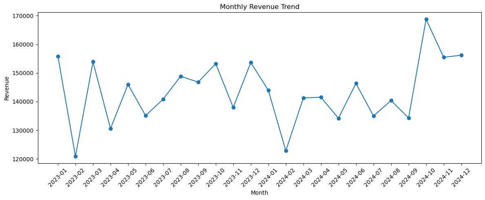
    


```python
7. Revenue by category
```


```python
category_revenue = (
    df.groupby('Category')['Total_Bill']
      .sum()
      .sort_values(ascending=False)
)

display(category_revenue)
```


    Category
    Cakes                 1288747.25
    Spreads                471715.05
    Dairy                  362120.30
    Beverages              356122.32
    Biscuits & Cookies     253973.20
    Savoury Snacks         205352.82
    Bakery Staples         203043.67
    Cupcakes               112313.00
    Bakery Snacks          105506.11
    Muffins                 85219.23
    Name: Total_Bill, dtype: float64


```python
plt.figure(figsize=(10, 5))

category_revenue.plot(kind='bar')

plt.title('Revenue by Category')
plt.xlabel('Category')
plt.ylabel('Revenue')
plt.xticks(rotation=45)
plt.tight_layout()
plt.show()
```


    
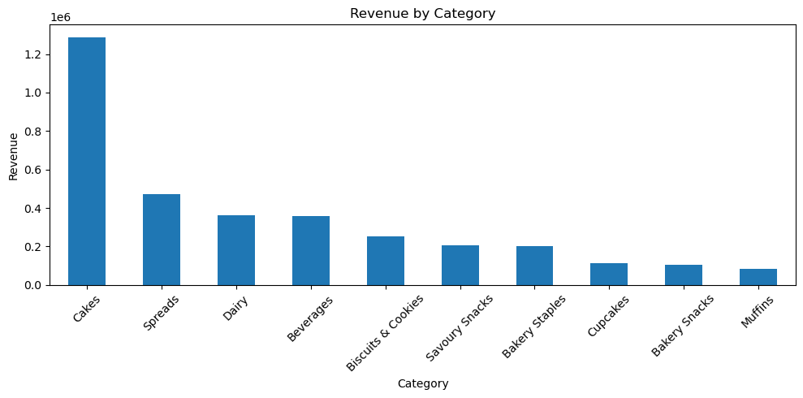
    


```python
8. Top products
```


```python
top_products = (
    df.groupby('Product')['Total_Bill']
      .sum()
      .sort_values(ascending=False)
      .head(10)
)

display(top_products)
```


    Product
    Chocolate Cake       531066.35
    Black Forest Cake    529732.87
    Tea Cake             166445.98
    Honey                160684.62
    Peanut Butter        159723.27
    Jam                  151307.16
    Chocolate Cookies    105172.42
    Bread                105149.05
    Coffee               104281.43
    Cold Coffee           91001.41
    Name: Total_Bill, dtype: float64


```python
plt.figure(figsize=(10, 6))

top_products.sort_values().plot(kind='barh')

plt.title('Top 10 Products by Revenue')
plt.xlabel('Revenue')
plt.ylabel('Product')
plt.tight_layout()
plt.show()
```


    

    


```python
9. Quantity vs Revenue
```


```python
product_performance = (
    df.groupby('Product')
      .agg(
          Revenue=('Total_Bill', 'sum'),
          Quantity=('Quantity', 'sum'),
          Profit=('Profit', 'sum')
      )
      .sort_values('Revenue', ascending=False)
)

display(product_performance.head(10))
```


<div>
<style scoped>
    .dataframe tbody tr th:only-of-type {
        vertical-align: middle;
    }

    .dataframe tbody tr th {
        vertical-align: top;
    }

    .dataframe thead th {
        text-align: right;
    }
</style>
<table border="1" class="dataframe">
  <thead>
    <tr style="text-align: right;">
      <th></th>
      <th>Revenue</th>
      <th>Quantity</th>
      <th>Profit</th>
    </tr>
    <tr>
      <th>Product</th>
      <th></th>
      <th></th>
      <th></th>
    </tr>
  </thead>
  <tbody>
    <tr>
      <th>Chocolate Cake</th>
      <td>531066.35</td>
      <td>1357</td>
      <td>-40012.97</td>
    </tr>
    <tr>
      <th>Black Forest Cake</th>
      <td>529732.87</td>
      <td>1259</td>
      <td>-54908.52</td>
    </tr>
    <tr>
      <th>Tea Cake</th>
      <td>166445.98</td>
      <td>1189</td>
      <td>-12753.28</td>
    </tr>
    <tr>
      <th>Honey</th>
      <td>160684.62</td>
      <td>779</td>
      <td>-39437.53</td>
    </tr>
    <tr>
      <th>Peanut Butter</th>
      <td>159723.27</td>
      <td>945</td>
      <td>-19757.21</td>
    </tr>
    <tr>
      <th>Jam</th>
      <td>151307.16</td>
      <td>1481</td>
      <td>-14823.33</td>
    </tr>
    <tr>
      <th>Chocolate Cookies</th>
      <td>105172.42</td>
      <td>874</td>
      <td>-7168.21</td>
    </tr>
    <tr>
      <th>Bread</th>
      <td>105149.05</td>
      <td>2807</td>
      <td>5215.16</td>
    </tr>
    <tr>
      <th>Coffee</th>
      <td>104281.43</td>
      <td>2240</td>
      <td>35301.44</td>
    </tr>
    <tr>
      <th>Cold Coffee</th>
      <td>91001.41</td>
      <td>1394</td>
      <td>22204.34</td>
    </tr>
  </tbody>
</table>
</div>


```python
plt.figure(figsize=(10, 6))

plt.scatter(
    product_performance['Quantity'],
    product_performance['Revenue']
)

plt.title('Product Quantity vs Revenue')
plt.xlabel('Quantity Sold')
plt.ylabel('Revenue')
plt.tight_layout()
plt.show()
```


    
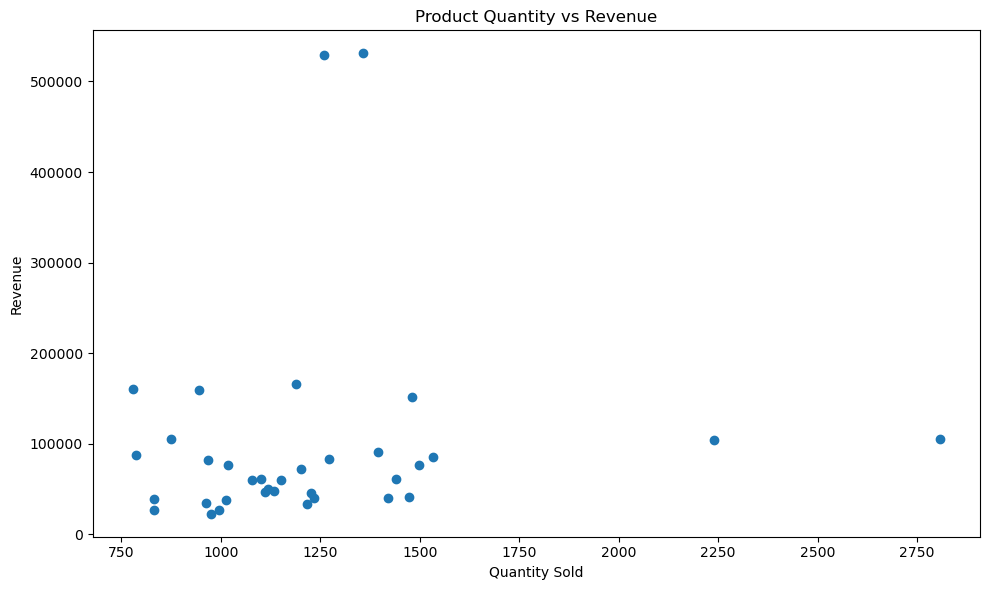
    


```python
profit_by_category = (
    df.groupby('Category')
      .agg(
          Revenue=('Total_Bill', 'sum'),
          Profit=('Profit', 'sum'),
          Transactions=('Transaction_ID', 'nunique')
      )
      .sort_values('Profit')
)

display(profit_by_category)
```


<div>
<style scoped>
    .dataframe tbody tr th:only-of-type {
        vertical-align: middle;
    }

    .dataframe tbody tr th {
        vertical-align: top;
    }

    .dataframe thead th {
        text-align: right;
    }
</style>
<table border="1" class="dataframe">
  <thead>
    <tr style="text-align: right;">
      <th></th>
      <th>Revenue</th>
      <th>Profit</th>
      <th>Transactions</th>
    </tr>
    <tr>
      <th>Category</th>
      <th></th>
      <th></th>
      <th></th>
    </tr>
  </thead>
  <tbody>
    <tr>
      <th>Cakes</th>
      <td>1288747.25</td>
      <td>-107657.26</td>
      <td>1881</td>
    </tr>
    <tr>
      <th>Dairy</th>
      <td>362120.30</td>
      <td>-105527.20</td>
      <td>2498</td>
    </tr>
    <tr>
      <th>Spreads</th>
      <td>471715.05</td>
      <td>-74018.07</td>
      <td>1251</td>
    </tr>
    <tr>
      <th>Biscuits &amp; Cookies</th>
      <td>253973.20</td>
      <td>-18558.17</td>
      <td>1427</td>
    </tr>
    <tr>
      <th>Muffins</th>
      <td>85219.23</td>
      <td>-3177.92</td>
      <td>746</td>
    </tr>
    <tr>
      <th>Bakery Staples</th>
      <td>203043.67</td>
      <td>-1436.10</td>
      <td>1943</td>
    </tr>
    <tr>
      <th>Savoury Snacks</th>
      <td>205352.82</td>
      <td>667.53</td>
      <td>1736</td>
    </tr>
    <tr>
      <th>Bakery Snacks</th>
      <td>105506.11</td>
      <td>1993.42</td>
      <td>910</td>
    </tr>
    <tr>
      <th>Cupcakes</th>
      <td>112313.00</td>
      <td>2550.53</td>
      <td>1239</td>
    </tr>
    <tr>
      <th>Beverages</th>
      <td>356122.32</td>
      <td>74823.99</td>
      <td>2938</td>
    </tr>
  </tbody>
</table>
</div>


```python
df[['Transaction_ID', 'Product', 'Quantity',
    'Unit_Price', 'Discount_Percentage',
    'Total_Bill', 'Profit', 'Waste_Cost']].sort_values(
        'Profit'
    ).head(10)
```


<div>
<style scoped>
    .dataframe tbody tr th:only-of-type {
        vertical-align: middle;
    }

    .dataframe tbody tr th {
        vertical-align: top;
    }

    .dataframe thead th {
        text-align: right;
    }
</style>
<table border="1" class="dataframe">
  <thead>
    <tr style="text-align: right;">
      <th></th>
      <th>Transaction_ID</th>
      <th>Product</th>
      <th>Quantity</th>
      <th>Unit_Price</th>
      <th>Discount_Percentage</th>
      <th>Total_Bill</th>
      <th>Profit</th>
      <th>Waste_Cost</th>
    </tr>
  </thead>
  <tbody>
    <tr>
      <th>5405</th>
      <td>TXN005399</td>
      <td>Black Forest Cake</td>
      <td>5</td>
      <td>445.78</td>
      <td>28.3</td>
      <td>1598.12</td>
      <td>-2152.66</td>
      <td>1820.00</td>
    </tr>
    <tr>
      <th>3762</th>
      <td>TXN003771</td>
      <td>Chocolate Cake</td>
      <td>4</td>
      <td>419.96</td>
      <td>25.6</td>
      <td>1249.80</td>
      <td>-1536.60</td>
      <td>1396.36</td>
    </tr>
    <tr>
      <th>3900</th>
      <td>TXN003904</td>
      <td>Chocolate Cake</td>
      <td>4</td>
      <td>427.04</td>
      <td>26.9</td>
      <td>1248.66</td>
      <td>-1450.84</td>
      <td>1280.00</td>
    </tr>
    <tr>
      <th>922</th>
      <td>TXN000946</td>
      <td>Black Forest Cake</td>
      <td>4</td>
      <td>450.37</td>
      <td>25.0</td>
      <td>1351.11</td>
      <td>-1439.26</td>
      <td>1300.00</td>
    </tr>
    <tr>
      <th>13452</th>
      <td>TXN013459</td>
      <td>Chocolate Cake</td>
      <td>6</td>
      <td>428.32</td>
      <td>16.0</td>
      <td>2158.73</td>
      <td>-1132.46</td>
      <td>1440.00</td>
    </tr>
    <tr>
      <th>14273</th>
      <td>TXN014282</td>
      <td>Black Forest Cake</td>
      <td>5</td>
      <td>437.36</td>
      <td>14.0</td>
      <td>1880.65</td>
      <td>-1025.50</td>
      <td>1300.00</td>
    </tr>
    <tr>
      <th>14910</th>
      <td>TXN014914</td>
      <td>Chocolate Cake</td>
      <td>4</td>
      <td>416.10</td>
      <td>1.2</td>
      <td>1644.43</td>
      <td>-1015.54</td>
      <td>1680.00</td>
    </tr>
    <tr>
      <th>4666</th>
      <td>TXN004662</td>
      <td>Chocolate Cake</td>
      <td>3</td>
      <td>410.54</td>
      <td>21.9</td>
      <td>961.90</td>
      <td>-987.82</td>
      <td>960.00</td>
    </tr>
    <tr>
      <th>1605</th>
      <td>TXN001599</td>
      <td>Black Forest Cake</td>
      <td>3</td>
      <td>440.34</td>
      <td>10.6</td>
      <td>1180.99</td>
      <td>-987.04</td>
      <td>1248.00</td>
    </tr>
    <tr>
      <th>578</th>
      <td>TXN000580</td>
      <td>Black Forest Cake</td>
      <td>2</td>
      <td>454.32</td>
      <td>1.8</td>
      <td>892.28</td>
      <td>-944.08</td>
      <td>1300.00</td>
    </tr>
  </tbody>
</table>
</div>


```python
df[['Transaction_ID', 'Product', 'Quantity',
    'Unit_Price', 'Discount_Percentage',
    'Total_Bill', 'Profit', 'Waste_Cost']].sort_values(
        'Profit', ascending=False
    ).head(10)
```


<div>
<style scoped>
    .dataframe tbody tr th:only-of-type {
        vertical-align: middle;
    }

    .dataframe tbody tr th {
        vertical-align: top;
    }

    .dataframe thead th {
        text-align: right;
    }
</style>
<table border="1" class="dataframe">
  <thead>
    <tr style="text-align: right;">
      <th></th>
      <th>Transaction_ID</th>
      <th>Product</th>
      <th>Quantity</th>
      <th>Unit_Price</th>
      <th>Discount_Percentage</th>
      <th>Total_Bill</th>
      <th>Profit</th>
      <th>Waste_Cost</th>
    </tr>
  </thead>
  <tbody>
    <tr>
      <th>9881</th>
      <td>TXN009887</td>
      <td>Black Forest Cake</td>
      <td>6</td>
      <td>453.07</td>
      <td>0.0</td>
      <td>2718.42</td>
      <td>898.42</td>
      <td>260.00</td>
    </tr>
    <tr>
      <th>7565</th>
      <td>TXN007561</td>
      <td>Chocolate Cake</td>
      <td>6</td>
      <td>418.89</td>
      <td>2.2</td>
      <td>2458.05</td>
      <td>831.85</td>
      <td>130.91</td>
    </tr>
    <tr>
      <th>1047</th>
      <td>TXN001040</td>
      <td>Chocolate Cake</td>
      <td>6</td>
      <td>423.38</td>
      <td>0.0</td>
      <td>2540.28</td>
      <td>812.28</td>
      <td>288.00</td>
    </tr>
    <tr>
      <th>7559</th>
      <td>TXN007563</td>
      <td>Chocolate Cake</td>
      <td>5</td>
      <td>424.19</td>
      <td>0.0</td>
      <td>2120.95</td>
      <td>811.86</td>
      <td>109.09</td>
    </tr>
    <tr>
      <th>15449</th>
      <td>TXN015451</td>
      <td>Black Forest Cake</td>
      <td>6</td>
      <td>459.83</td>
      <td>0.0</td>
      <td>2758.98</td>
      <td>808.98</td>
      <td>390.00</td>
    </tr>
    <tr>
      <th>10652</th>
      <td>TXN010648</td>
      <td>Chocolate Cake</td>
      <td>6</td>
      <td>412.46</td>
      <td>0.0</td>
      <td>2474.76</td>
      <td>794.76</td>
      <td>240.00</td>
    </tr>
    <tr>
      <th>1868</th>
      <td>TXN001860</td>
      <td>Black Forest Cake</td>
      <td>5</td>
      <td>449.10</td>
      <td>0.0</td>
      <td>2245.50</td>
      <td>783.00</td>
      <td>162.50</td>
    </tr>
    <tr>
      <th>10392</th>
      <td>TXN010384</td>
      <td>Chocolate Cake</td>
      <td>5</td>
      <td>432.33</td>
      <td>0.0</td>
      <td>2161.65</td>
      <td>761.65</td>
      <td>200.00</td>
    </tr>
    <tr>
      <th>5840</th>
      <td>TXN005830</td>
      <td>Chocolate Cake</td>
      <td>6</td>
      <td>408.74</td>
      <td>0.0</td>
      <td>2452.44</td>
      <td>724.44</td>
      <td>288.00</td>
    </tr>
    <tr>
      <th>14754</th>
      <td>TXN014757</td>
      <td>Chocolate Cake</td>
      <td>5</td>
      <td>417.34</td>
      <td>0.0</td>
      <td>2086.70</td>
      <td>702.08</td>
      <td>184.62</td>
    </tr>
  </tbody>
</table>
</div>


```python
print("Profitable transactions:",
      (df['Profit'] > 0).sum())

print("Loss-making transactions:",
      (df['Profit'] < 0).sum())

print("Break-even transactions:",
      (df['Profit'] == 0).sum())
```

    Profitable transactions: 8215
    Loss-making transactions: 8353
    Break-even transactions: 1
    


```python
import matplotlib.pyplot as plt

# Profit statistics
profit_stats = df['Profit'].describe()

stats = [
    'min',
    '25%',
    '50%',
    'mean',
    '75%',
    'max'
]

labels = [
    'Minimum',
    '25th Percentile',
    'Median',
    'Mean',
    '75th Percentile',
    'Maximum'
]

values = [profit_stats[s] for s in stats]

# Create visual
plt.figure(figsize=(10, 5))

plt.bar(labels, values)

plt.axhline(0, linewidth=1)

plt.title('Profit Distribution — Descriptive Summary')
plt.xlabel('Statistic')
plt.ylabel('Profit')

plt.xticks(rotation=20)
plt.tight_layout()
plt.show()
```


    
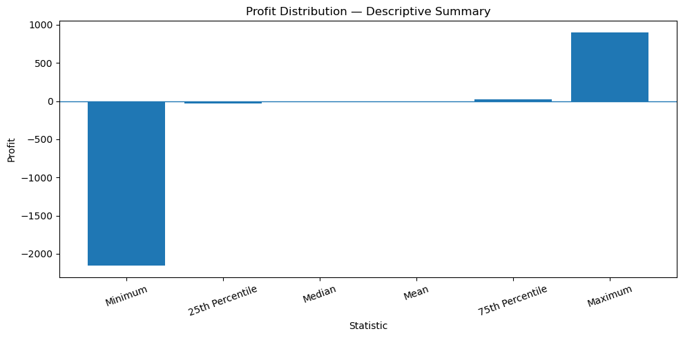
    


```python
plt.figure(figsize=(10, 5))

plt.hist(df['Profit'], bins=50)

plt.axvline(0, linewidth=1)

plt.title('Transaction-Level Profit Distribution')
plt.xlabel('Profit')
plt.ylabel('Number of Transactions')

plt.tight_layout()
plt.show()
```


    
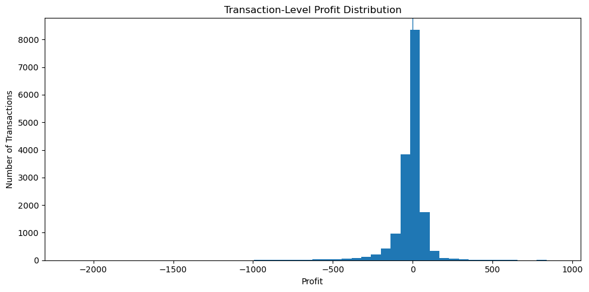
    


```python
# ==========================================
# 1. OVERALL SALES KPIs
# ==========================================

total_revenue = df['Total_Bill'].sum()
total_quantity = df['Quantity'].sum()
total_transactions = df['Transaction_ID'].nunique()
average_transaction_value = total_revenue / total_transactions
total_profit = df['Profit'].sum()
total_waste_cost = df['Waste_Cost'].sum()

print(f"Total Revenue        : {total_revenue:,.2f}")
print(f"Total Quantity Sold  : {total_quantity:,.0f}")
print(f"Total Transactions   : {total_transactions:,.0f}")
print(f"Average Transaction  : {average_transaction_value:,.2f}")
print(f"Total Profit         : {total_profit:,.2f}")
print(f"Total Waste Cost     : {total_waste_cost:,.2f}")
```

    Total Revenue        : 3,444,112.95
    Total Quantity Sold  : 42,924
    Total Transactions   : 16,569
    Average Transaction  : 207.86
    Total Profit         : -230,339.25
    Total Waste Cost     : 1,388,812.80
    


```python
# Create time-based columns
df['Year'] = df['Date'].dt.year
df['Month'] = df['Date'].dt.month
df['Month_Name'] = df['Date'].dt.month_name()
df['Year_Month'] = df['Date'].dt.to_period('M').astype(str)
```


```python
# ==========================================
# 2. MONTHLY REVENUE TREND
# ==========================================

monthly_revenue = (
    df.groupby('Year_Month')
      .agg(
          Revenue=('Total_Bill', 'sum'),
          Quantity=('Quantity', 'sum'),
          Transactions=('Transaction_ID', 'nunique')
      )
      .reset_index()
)

display(monthly_revenue)
```


<div>
<style scoped>
    .dataframe tbody tr th:only-of-type {
        vertical-align: middle;
    }

    .dataframe tbody tr th {
        vertical-align: top;
    }

    .dataframe thead th {
        text-align: right;
    }
</style>
<table border="1" class="dataframe">
  <thead>
    <tr style="text-align: right;">
      <th></th>
      <th>Year_Month</th>
      <th>Revenue</th>
      <th>Quantity</th>
      <th>Transactions</th>
    </tr>
  </thead>
  <tbody>
    <tr>
      <th>0</th>
      <td>2023-01</td>
      <td>155863.86</td>
      <td>1872</td>
      <td>715</td>
    </tr>
    <tr>
      <th>1</th>
      <td>2023-02</td>
      <td>120919.90</td>
      <td>1546</td>
      <td>599</td>
    </tr>
    <tr>
      <th>2</th>
      <td>2023-03</td>
      <td>153890.78</td>
      <td>1914</td>
      <td>739</td>
    </tr>
    <tr>
      <th>3</th>
      <td>2023-04</td>
      <td>130588.49</td>
      <td>1680</td>
      <td>655</td>
    </tr>
    <tr>
      <th>4</th>
      <td>2023-05</td>
      <td>146010.48</td>
      <td>1785</td>
      <td>682</td>
    </tr>
    <tr>
      <th>5</th>
      <td>2023-06</td>
      <td>135113.98</td>
      <td>1621</td>
      <td>623</td>
    </tr>
    <tr>
      <th>6</th>
      <td>2023-07</td>
      <td>140839.10</td>
      <td>1915</td>
      <td>727</td>
    </tr>
    <tr>
      <th>7</th>
      <td>2023-08</td>
      <td>148867.39</td>
      <td>1819</td>
      <td>689</td>
    </tr>
    <tr>
      <th>8</th>
      <td>2023-09</td>
      <td>146809.54</td>
      <td>1762</td>
      <td>664</td>
    </tr>
    <tr>
      <th>9</th>
      <td>2023-10</td>
      <td>153245.03</td>
      <td>1826</td>
      <td>686</td>
    </tr>
    <tr>
      <th>10</th>
      <td>2023-11</td>
      <td>137971.76</td>
      <td>1696</td>
      <td>661</td>
    </tr>
    <tr>
      <th>11</th>
      <td>2023-12</td>
      <td>153649.15</td>
      <td>1920</td>
      <td>750</td>
    </tr>
    <tr>
      <th>12</th>
      <td>2024-01</td>
      <td>143979.75</td>
      <td>1828</td>
      <td>688</td>
    </tr>
    <tr>
      <th>13</th>
      <td>2024-02</td>
      <td>122840.34</td>
      <td>1607</td>
      <td>625</td>
    </tr>
    <tr>
      <th>14</th>
      <td>2024-03</td>
      <td>141297.70</td>
      <td>1789</td>
      <td>702</td>
    </tr>
    <tr>
      <th>15</th>
      <td>2024-04</td>
      <td>141537.76</td>
      <td>1809</td>
      <td>693</td>
    </tr>
    <tr>
      <th>16</th>
      <td>2024-05</td>
      <td>134200.18</td>
      <td>1717</td>
      <td>674</td>
    </tr>
    <tr>
      <th>17</th>
      <td>2024-06</td>
      <td>146345.63</td>
      <td>1901</td>
      <td>734</td>
    </tr>
    <tr>
      <th>18</th>
      <td>2024-07</td>
      <td>135015.07</td>
      <td>1846</td>
      <td>726</td>
    </tr>
    <tr>
      <th>19</th>
      <td>2024-08</td>
      <td>140376.21</td>
      <td>1834</td>
      <td>727</td>
    </tr>
    <tr>
      <th>20</th>
      <td>2024-09</td>
      <td>134316.61</td>
      <td>1647</td>
      <td>629</td>
    </tr>
    <tr>
      <th>21</th>
      <td>2024-10</td>
      <td>168757.84</td>
      <td>1972</td>
      <td>767</td>
    </tr>
    <tr>
      <th>22</th>
      <td>2024-11</td>
      <td>155458.30</td>
      <td>1872</td>
      <td>733</td>
    </tr>
    <tr>
      <th>23</th>
      <td>2024-12</td>
      <td>156218.10</td>
      <td>1746</td>
      <td>681</td>
    </tr>
  </tbody>
</table>
</div>


```python
import matplotlib.pyplot as plt

plt.figure(figsize=(12, 5))

plt.plot(
    monthly_revenue['Year_Month'],
    monthly_revenue['Revenue'],
    marker='o'
)

plt.title('Monthly Revenue Trend')
plt.xlabel('Month')
plt.ylabel('Revenue')

plt.xticks(rotation=45)
plt.tight_layout()
plt.show()
```


    

    


```python
monthly_revenue['MoM_Growth_%'] = (
    monthly_revenue['Revenue']
    .pct_change() * 100
)

display(monthly_revenue)
```


<div>
<style scoped>
    .dataframe tbody tr th:only-of-type {
        vertical-align: middle;
    }

    .dataframe tbody tr th {
        vertical-align: top;
    }

    .dataframe thead th {
        text-align: right;
    }
</style>
<table border="1" class="dataframe">
  <thead>
    <tr style="text-align: right;">
      <th></th>
      <th>Year_Month</th>
      <th>Revenue</th>
      <th>Quantity</th>
      <th>Transactions</th>
      <th>MoM_Growth_%</th>
    </tr>
  </thead>
  <tbody>
    <tr>
      <th>0</th>
      <td>2023-01</td>
      <td>155863.86</td>
      <td>1872</td>
      <td>715</td>
      <td>NaN</td>
    </tr>
    <tr>
      <th>1</th>
      <td>2023-02</td>
      <td>120919.90</td>
      <td>1546</td>
      <td>599</td>
      <td>-22.419540</td>
    </tr>
    <tr>
      <th>2</th>
      <td>2023-03</td>
      <td>153890.78</td>
      <td>1914</td>
      <td>739</td>
      <td>27.266711</td>
    </tr>
    <tr>
      <th>3</th>
      <td>2023-04</td>
      <td>130588.49</td>
      <td>1680</td>
      <td>655</td>
      <td>-15.142096</td>
    </tr>
    <tr>
      <th>4</th>
      <td>2023-05</td>
      <td>146010.48</td>
      <td>1785</td>
      <td>682</td>
      <td>11.809609</td>
    </tr>
    <tr>
      <th>5</th>
      <td>2023-06</td>
      <td>135113.98</td>
      <td>1621</td>
      <td>623</td>
      <td>-7.462820</td>
    </tr>
    <tr>
      <th>6</th>
      <td>2023-07</td>
      <td>140839.10</td>
      <td>1915</td>
      <td>727</td>
      <td>4.237252</td>
    </tr>
    <tr>
      <th>7</th>
      <td>2023-08</td>
      <td>148867.39</td>
      <td>1819</td>
      <td>689</td>
      <td>5.700328</td>
    </tr>
    <tr>
      <th>8</th>
      <td>2023-09</td>
      <td>146809.54</td>
      <td>1762</td>
      <td>664</td>
      <td>-1.382338</td>
    </tr>
    <tr>
      <th>9</th>
      <td>2023-10</td>
      <td>153245.03</td>
      <td>1826</td>
      <td>686</td>
      <td>4.383564</td>
    </tr>
    <tr>
      <th>10</th>
      <td>2023-11</td>
      <td>137971.76</td>
      <td>1696</td>
      <td>661</td>
      <td>-9.966568</td>
    </tr>
    <tr>
      <th>11</th>
      <td>2023-12</td>
      <td>153649.15</td>
      <td>1920</td>
      <td>750</td>
      <td>11.362753</td>
    </tr>
    <tr>
      <th>12</th>
      <td>2024-01</td>
      <td>143979.75</td>
      <td>1828</td>
      <td>688</td>
      <td>-6.293169</td>
    </tr>
    <tr>
      <th>13</th>
      <td>2024-02</td>
      <td>122840.34</td>
      <td>1607</td>
      <td>625</td>
      <td>-14.682211</td>
    </tr>
    <tr>
      <th>14</th>
      <td>2024-03</td>
      <td>141297.70</td>
      <td>1789</td>
      <td>702</td>
      <td>15.025488</td>
    </tr>
    <tr>
      <th>15</th>
      <td>2024-04</td>
      <td>141537.76</td>
      <td>1809</td>
      <td>693</td>
      <td>0.169897</td>
    </tr>
    <tr>
      <th>16</th>
      <td>2024-05</td>
      <td>134200.18</td>
      <td>1717</td>
      <td>674</td>
      <td>-5.184185</td>
    </tr>
    <tr>
      <th>17</th>
      <td>2024-06</td>
      <td>146345.63</td>
      <td>1901</td>
      <td>734</td>
      <td>9.050249</td>
    </tr>
    <tr>
      <th>18</th>
      <td>2024-07</td>
      <td>135015.07</td>
      <td>1846</td>
      <td>726</td>
      <td>-7.742329</td>
    </tr>
    <tr>
      <th>19</th>
      <td>2024-08</td>
      <td>140376.21</td>
      <td>1834</td>
      <td>727</td>
      <td>3.970772</td>
    </tr>
    <tr>
      <th>20</th>
      <td>2024-09</td>
      <td>134316.61</td>
      <td>1647</td>
      <td>629</td>
      <td>-4.316686</td>
    </tr>
    <tr>
      <th>21</th>
      <td>2024-10</td>
      <td>168757.84</td>
      <td>1972</td>
      <td>767</td>
      <td>25.641825</td>
    </tr>
    <tr>
      <th>22</th>
      <td>2024-11</td>
      <td>155458.30</td>
      <td>1872</td>
      <td>733</td>
      <td>-7.880843</td>
    </tr>
    <tr>
      <th>23</th>
      <td>2024-12</td>
      <td>156218.10</td>
      <td>1746</td>
      <td>681</td>
      <td>0.488748</td>
    </tr>
  </tbody>
</table>
</div>


```python
# ==========================================
# 3. CATEGORY PERFORMANCE
# ==========================================

category_performance = (
    df.groupby('Category')
      .agg(
          Revenue=('Total_Bill', 'sum'),
          Quantity_Sold=('Quantity', 'sum'),
          Transactions=('Transaction_ID', 'nunique'),
          Profit=('Profit', 'sum')
      )
      .sort_values('Revenue', ascending=False)
)

display(category_performance)
```


<div>
<style scoped>
    .dataframe tbody tr th:only-of-type {
        vertical-align: middle;
    }

    .dataframe tbody tr th {
        vertical-align: top;
    }

    .dataframe thead th {
        text-align: right;
    }
</style>
<table border="1" class="dataframe">
  <thead>
    <tr style="text-align: right;">
      <th></th>
      <th>Revenue</th>
      <th>Quantity_Sold</th>
      <th>Transactions</th>
      <th>Profit</th>
    </tr>
    <tr>
      <th>Category</th>
      <th></th>
      <th></th>
      <th></th>
      <th></th>
    </tr>
  </thead>
  <tbody>
    <tr>
      <th>Cakes</th>
      <td>1288747.25</td>
      <td>4905</td>
      <td>1881</td>
      <td>-107657.26</td>
    </tr>
    <tr>
      <th>Spreads</th>
      <td>471715.05</td>
      <td>3205</td>
      <td>1251</td>
      <td>-74018.07</td>
    </tr>
    <tr>
      <th>Dairy</th>
      <td>362120.30</td>
      <td>6492</td>
      <td>2498</td>
      <td>-105527.20</td>
    </tr>
    <tr>
      <th>Beverages</th>
      <td>356122.32</td>
      <td>7574</td>
      <td>2938</td>
      <td>74823.99</td>
    </tr>
    <tr>
      <th>Biscuits &amp; Cookies</th>
      <td>253973.20</td>
      <td>3712</td>
      <td>1427</td>
      <td>-18558.17</td>
    </tr>
    <tr>
      <th>Savoury Snacks</th>
      <td>205352.82</td>
      <td>4444</td>
      <td>1736</td>
      <td>667.53</td>
    </tr>
    <tr>
      <th>Bakery Staples</th>
      <td>203043.67</td>
      <td>5059</td>
      <td>1943</td>
      <td>-1436.10</td>
    </tr>
    <tr>
      <th>Cupcakes</th>
      <td>112313.00</td>
      <td>3211</td>
      <td>1239</td>
      <td>2550.53</td>
    </tr>
    <tr>
      <th>Bakery Snacks</th>
      <td>105506.11</td>
      <td>2379</td>
      <td>910</td>
      <td>1993.42</td>
    </tr>
    <tr>
      <th>Muffins</th>
      <td>85219.23</td>
      <td>1943</td>
      <td>746</td>
      <td>-3177.92</td>
    </tr>
  </tbody>
</table>
</div>


```python
import matplotlib.pyplot as plt

plt.figure(figsize=(10, 5))

category_performance['Revenue'].sort_values().plot(kind='barh')

plt.title('Revenue by Product Category')
plt.xlabel('Revenue')
plt.ylabel('Category')

plt.tight_layout()
plt.show()
```


    
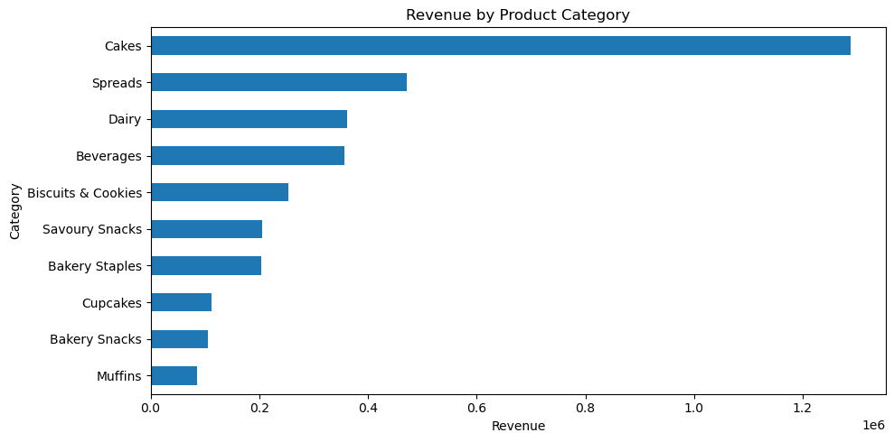
    


```python
category_performance['Revenue_Share_%'] = (
    category_performance['Revenue']
    / category_performance['Revenue'].sum()
    * 100
)

display(
    category_performance[
        ['Revenue', 'Revenue_Share_%', 'Quantity_Sold', 'Profit']
    ]
)
```


<div>
<style scoped>
    .dataframe tbody tr th:only-of-type {
        vertical-align: middle;
    }

    .dataframe tbody tr th {
        vertical-align: top;
    }

    .dataframe thead th {
        text-align: right;
    }
</style>
<table border="1" class="dataframe">
  <thead>
    <tr style="text-align: right;">
      <th></th>
      <th>Revenue</th>
      <th>Revenue_Share_%</th>
      <th>Quantity_Sold</th>
      <th>Profit</th>
    </tr>
    <tr>
      <th>Category</th>
      <th></th>
      <th></th>
      <th></th>
      <th></th>
    </tr>
  </thead>
  <tbody>
    <tr>
      <th>Cakes</th>
      <td>1288747.25</td>
      <td>37.418844</td>
      <td>4905</td>
      <td>-107657.26</td>
    </tr>
    <tr>
      <th>Spreads</th>
      <td>471715.05</td>
      <td>13.696271</td>
      <td>3205</td>
      <td>-74018.07</td>
    </tr>
    <tr>
      <th>Dairy</th>
      <td>362120.30</td>
      <td>10.514182</td>
      <td>6492</td>
      <td>-105527.20</td>
    </tr>
    <tr>
      <th>Beverages</th>
      <td>356122.32</td>
      <td>10.340030</td>
      <td>7574</td>
      <td>74823.99</td>
    </tr>
    <tr>
      <th>Biscuits &amp; Cookies</th>
      <td>253973.20</td>
      <td>7.374125</td>
      <td>3712</td>
      <td>-18558.17</td>
    </tr>
    <tr>
      <th>Savoury Snacks</th>
      <td>205352.82</td>
      <td>5.962430</td>
      <td>4444</td>
      <td>667.53</td>
    </tr>
    <tr>
      <th>Bakery Staples</th>
      <td>203043.67</td>
      <td>5.895384</td>
      <td>5059</td>
      <td>-1436.10</td>
    </tr>
    <tr>
      <th>Cupcakes</th>
      <td>112313.00</td>
      <td>3.261014</td>
      <td>3211</td>
      <td>2550.53</td>
    </tr>
    <tr>
      <th>Bakery Snacks</th>
      <td>105506.11</td>
      <td>3.063375</td>
      <td>2379</td>
      <td>1993.42</td>
    </tr>
    <tr>
      <th>Muffins</th>
      <td>85219.23</td>
      <td>2.474345</td>
      <td>1943</td>
      <td>-3177.92</td>
    </tr>
  </tbody>
</table>
</div>


```python
# ==========================================
# 4. PRODUCT PERFORMANCE
# ==========================================

product_performance = (
    df.groupby('Product')
      .agg(
          Revenue=('Total_Bill', 'sum'),
          Quantity_Sold=('Quantity', 'sum'),
          Transactions=('Transaction_ID', 'nunique'),
          Profit=('Profit', 'sum')
      )
      .sort_values('Revenue', ascending=False)
)

display(product_performance.head(20))
```


<div>
<style scoped>
    .dataframe tbody tr th:only-of-type {
        vertical-align: middle;
    }

    .dataframe tbody tr th {
        vertical-align: top;
    }

    .dataframe thead th {
        text-align: right;
    }
</style>
<table border="1" class="dataframe">
  <thead>
    <tr style="text-align: right;">
      <th></th>
      <th>Revenue</th>
      <th>Quantity_Sold</th>
      <th>Transactions</th>
      <th>Profit</th>
    </tr>
    <tr>
      <th>Product</th>
      <th></th>
      <th></th>
      <th></th>
      <th></th>
    </tr>
  </thead>
  <tbody>
    <tr>
      <th>Chocolate Cake</th>
      <td>531066.35</td>
      <td>1357</td>
      <td>506</td>
      <td>-40012.97</td>
    </tr>
    <tr>
      <th>Black Forest Cake</th>
      <td>529732.87</td>
      <td>1259</td>
      <td>495</td>
      <td>-54908.52</td>
    </tr>
    <tr>
      <th>Tea Cake</th>
      <td>166445.98</td>
      <td>1189</td>
      <td>462</td>
      <td>-12753.28</td>
    </tr>
    <tr>
      <th>Honey</th>
      <td>160684.62</td>
      <td>779</td>
      <td>304</td>
      <td>-39437.53</td>
    </tr>
    <tr>
      <th>Peanut Butter</th>
      <td>159723.27</td>
      <td>945</td>
      <td>363</td>
      <td>-19757.21</td>
    </tr>
    <tr>
      <th>Jam</th>
      <td>151307.16</td>
      <td>1481</td>
      <td>584</td>
      <td>-14823.33</td>
    </tr>
    <tr>
      <th>Chocolate Cookies</th>
      <td>105172.42</td>
      <td>874</td>
      <td>322</td>
      <td>-7168.21</td>
    </tr>
    <tr>
      <th>Bread</th>
      <td>105149.05</td>
      <td>2807</td>
      <td>1062</td>
      <td>5215.16</td>
    </tr>
    <tr>
      <th>Coffee</th>
      <td>104281.43</td>
      <td>2240</td>
      <td>868</td>
      <td>35301.44</td>
    </tr>
    <tr>
      <th>Cold Coffee</th>
      <td>91001.41</td>
      <td>1394</td>
      <td>520</td>
      <td>22204.34</td>
    </tr>
    <tr>
      <th>Cookies</th>
      <td>87749.90</td>
      <td>788</td>
      <td>305</td>
      <td>-8461.22</td>
    </tr>
    <tr>
      <th>Eggs</th>
      <td>85500.19</td>
      <td>1534</td>
      <td>568</td>
      <td>-30753.30</td>
    </tr>
    <tr>
      <th>Pizza Slice</th>
      <td>83560.65</td>
      <td>1272</td>
      <td>494</td>
      <td>-847.51</td>
    </tr>
    <tr>
      <th>Cheese</th>
      <td>81651.24</td>
      <td>969</td>
      <td>370</td>
      <td>-26385.09</td>
    </tr>
    <tr>
      <th>Butter</th>
      <td>77113.78</td>
      <td>1497</td>
      <td>585</td>
      <td>-17107.96</td>
    </tr>
    <tr>
      <th>Paneer</th>
      <td>76400.19</td>
      <td>1018</td>
      <td>387</td>
      <td>-22141.21</td>
    </tr>
    <tr>
      <th>Sandwich</th>
      <td>72634.18</td>
      <td>1201</td>
      <td>472</td>
      <td>-2135.18</td>
    </tr>
    <tr>
      <th>Pastry</th>
      <td>61502.05</td>
      <td>1100</td>
      <td>418</td>
      <td>17.51</td>
    </tr>
    <tr>
      <th>Soft Drink</th>
      <td>60611.58</td>
      <td>1440</td>
      <td>565</td>
      <td>-7067.01</td>
    </tr>
    <tr>
      <th>Juice</th>
      <td>60250.57</td>
      <td>1079</td>
      <td>425</td>
      <td>10216.41</td>
    </tr>
  </tbody>
</table>
</div>


```python
top_10_revenue = product_performance.head(10)

plt.figure(figsize=(10, 6))

top_10_revenue['Revenue'].sort_values().plot(kind='barh')

plt.title('Top 10 Products by Revenue')
plt.xlabel('Revenue')
plt.ylabel('Product')

plt.tight_layout()
plt.show()
```


    
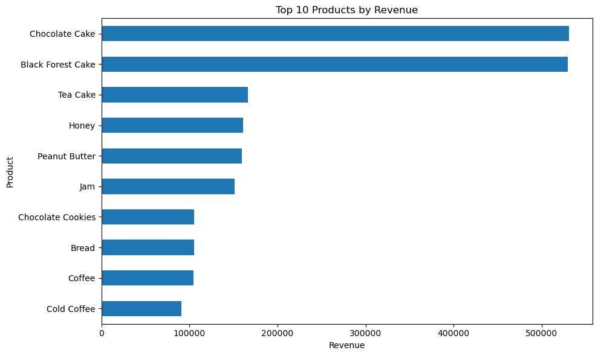
    


```python
top_10_quantity = (
    product_performance
    .sort_values('Quantity_Sold', ascending=False)
    .head(10)
)

plt.figure(figsize=(10, 6))

top_10_quantity['Quantity_Sold'].sort_values().plot(kind='barh')

plt.title('Top 10 Products by Quantity Sold')
plt.xlabel('Quantity Sold')
plt.ylabel('Product')

plt.tight_layout()
plt.show()
```


    
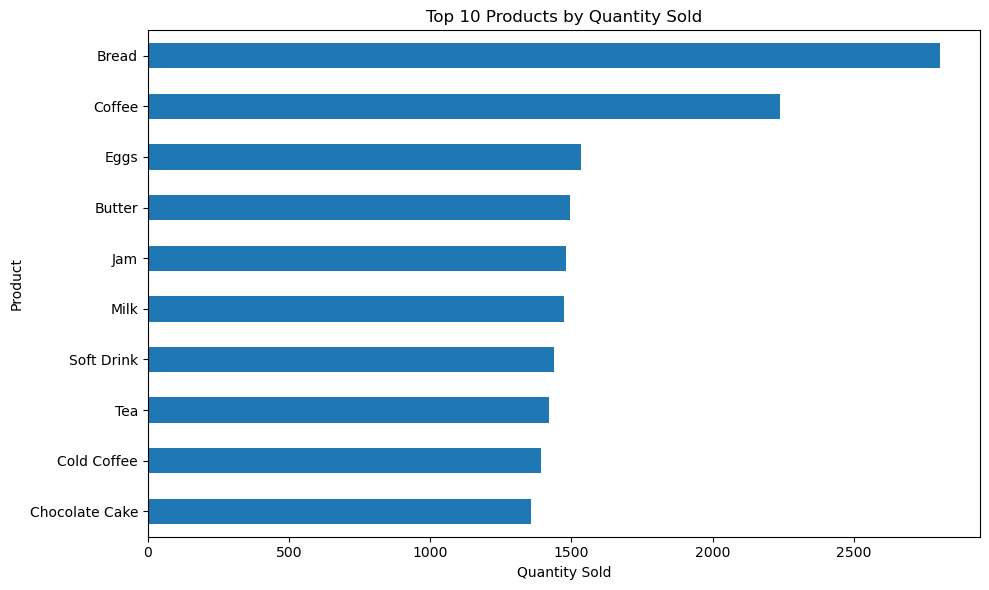
    


```python
plt.figure(figsize=(10, 6))

plt.scatter(
    product_performance['Quantity_Sold'],
    product_performance['Revenue']
)

plt.title('Product Revenue vs Quantity Sold')
plt.xlabel('Quantity Sold')
plt.ylabel('Revenue')

plt.tight_layout()
plt.show()
```


    
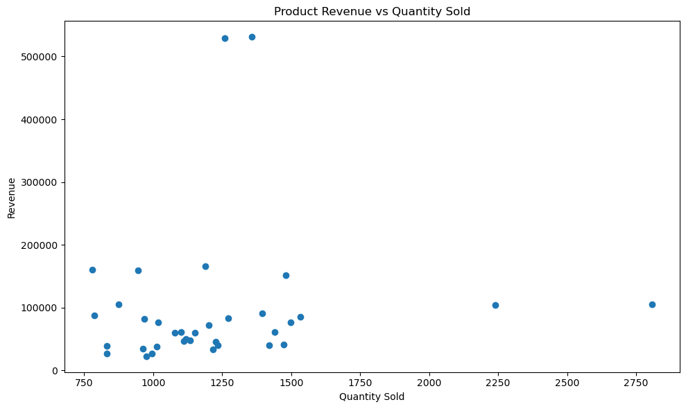
    


```python
# ==========================================
# 5. TIME-BASED SALES ANALYSIS
# ==========================================

day_revenue = (
    df.groupby('Day_of_Week')
      .agg(
          Revenue=('Total_Bill', 'sum'),
          Quantity_Sold=('Quantity', 'sum'),
          Transactions=('Transaction_ID', 'nunique')
      )
)

# Keep days in correct order
day_order = [
    'Monday', 'Tuesday', 'Wednesday',
    'Thursday', 'Friday', 'Saturday', 'Sunday'
]

day_revenue = day_revenue.reindex(day_order)

display(day_revenue)
```


<div>
<style scoped>
    .dataframe tbody tr th:only-of-type {
        vertical-align: middle;
    }

    .dataframe tbody tr th {
        vertical-align: top;
    }

    .dataframe thead th {
        text-align: right;
    }
</style>
<table border="1" class="dataframe">
  <thead>
    <tr style="text-align: right;">
      <th></th>
      <th>Revenue</th>
      <th>Quantity_Sold</th>
      <th>Transactions</th>
    </tr>
    <tr>
      <th>Day_of_Week</th>
      <th></th>
      <th></th>
      <th></th>
    </tr>
  </thead>
  <tbody>
    <tr>
      <th>Monday</th>
      <td>299542.60</td>
      <td>3581</td>
      <td>1383</td>
    </tr>
    <tr>
      <th>Tuesday</th>
      <td>372059.51</td>
      <td>4639</td>
      <td>1788</td>
    </tr>
    <tr>
      <th>Wednesday</th>
      <td>406533.73</td>
      <td>4515</td>
      <td>1736</td>
    </tr>
    <tr>
      <th>Thursday</th>
      <td>386718.94</td>
      <td>4624</td>
      <td>1764</td>
    </tr>
    <tr>
      <th>Friday</th>
      <td>437678.03</td>
      <td>5349</td>
      <td>2040</td>
    </tr>
    <tr>
      <th>Saturday</th>
      <td>806999.96</td>
      <td>10583</td>
      <td>4124</td>
    </tr>
    <tr>
      <th>Sunday</th>
      <td>734580.18</td>
      <td>9633</td>
      <td>3734</td>
    </tr>
  </tbody>
</table>
</div>


```python
plt.figure(figsize=(10, 5))

day_revenue['Revenue'].plot(kind='bar')

plt.title('Revenue by Day of Week')
plt.xlabel('Day')
plt.ylabel('Revenue')

plt.xticks(rotation=45)
plt.tight_layout()
plt.show()
```


    
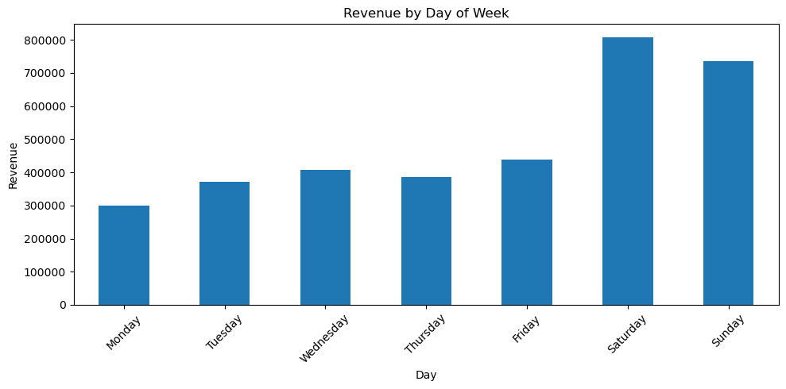
    


```python
df['Time'] = pd.to_datetime(
    df['Time'].astype(str),
    errors='coerce'
)

df['Hour'] = df['Time'].dt.hour
```

    C:\Users\hanra\AppData\Local\Temp\ipykernel_8100\171311825.py:1: UserWarning: Could not infer format, so each element will be parsed individually, falling back to `dateutil`. To ensure parsing is consistent and as-expected, please specify a format.
      df['Time'] = pd.to_datetime(
    


```python
print(df['Hour'].value_counts().sort_index())
```

    Hour
    7     1461
    8     1392
    9     1465
    10    1465
    11     987
    12    1024
    13     976
    14     993
    15     957
    16    1176
    17    1153
    18    1203
    19    1180
    20    1137
    Name: count, dtype: int64
    


```python
hourly_revenue = (
    df.groupby('Hour')
      .agg(
          Revenue=('Total_Bill', 'sum'),
          Quantity_Sold=('Quantity', 'sum'),
          Transactions=('Transaction_ID', 'nunique')
      )
      .reset_index()
)

display(hourly_revenue)
```


<div>
<style scoped>
    .dataframe tbody tr th:only-of-type {
        vertical-align: middle;
    }

    .dataframe tbody tr th {
        vertical-align: top;
    }

    .dataframe thead th {
        text-align: right;
    }
</style>
<table border="1" class="dataframe">
  <thead>
    <tr style="text-align: right;">
      <th></th>
      <th>Hour</th>
      <th>Revenue</th>
      <th>Quantity_Sold</th>
      <th>Transactions</th>
    </tr>
  </thead>
  <tbody>
    <tr>
      <th>0</th>
      <td>7</td>
      <td>271287.48</td>
      <td>3771</td>
      <td>1461</td>
    </tr>
    <tr>
      <th>1</th>
      <td>8</td>
      <td>248832.08</td>
      <td>3628</td>
      <td>1392</td>
    </tr>
    <tr>
      <th>2</th>
      <td>9</td>
      <td>267166.92</td>
      <td>3796</td>
      <td>1465</td>
    </tr>
    <tr>
      <th>3</th>
      <td>10</td>
      <td>265280.46</td>
      <td>3802</td>
      <td>1465</td>
    </tr>
    <tr>
      <th>4</th>
      <td>11</td>
      <td>205705.01</td>
      <td>2549</td>
      <td>987</td>
    </tr>
    <tr>
      <th>5</th>
      <td>12</td>
      <td>210629.32</td>
      <td>2657</td>
      <td>1024</td>
    </tr>
    <tr>
      <th>6</th>
      <td>13</td>
      <td>187825.89</td>
      <td>2522</td>
      <td>976</td>
    </tr>
    <tr>
      <th>7</th>
      <td>14</td>
      <td>191568.49</td>
      <td>2578</td>
      <td>993</td>
    </tr>
    <tr>
      <th>8</th>
      <td>15</td>
      <td>205818.16</td>
      <td>2456</td>
      <td>957</td>
    </tr>
    <tr>
      <th>9</th>
      <td>16</td>
      <td>271644.60</td>
      <td>3045</td>
      <td>1176</td>
    </tr>
    <tr>
      <th>10</th>
      <td>17</td>
      <td>295923.30</td>
      <td>3009</td>
      <td>1153</td>
    </tr>
    <tr>
      <th>11</th>
      <td>18</td>
      <td>285560.79</td>
      <td>3172</td>
      <td>1203</td>
    </tr>
    <tr>
      <th>12</th>
      <td>19</td>
      <td>272973.97</td>
      <td>3019</td>
      <td>1180</td>
    </tr>
    <tr>
      <th>13</th>
      <td>20</td>
      <td>263896.48</td>
      <td>2920</td>
      <td>1137</td>
    </tr>
  </tbody>
</table>
</div>


```python
plt.figure(figsize=(12, 5))

plt.plot(
    hourly_revenue['Hour'],
    hourly_revenue['Revenue'],
    marker='o'
)

plt.title('Revenue by Hour of Day')
plt.xlabel('Hour')
plt.ylabel('Revenue')

plt.xticks(hourly_revenue['Hour'])
plt.tight_layout()
plt.show()
```


    
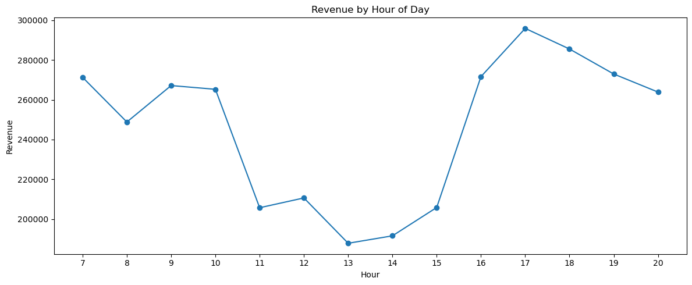
    


```python
peak_day = day_revenue['Revenue'].idxmax()
peak_hour = hourly_revenue.loc[
    hourly_revenue['Revenue'].idxmax(), 'Hour'
]

print("Highest Revenue Day :", peak_day)
print("Highest Revenue Hour:", peak_hour)
```

    Highest Revenue Day : Saturday
    Highest Revenue Hour: 17
    


```python
# ==========================================
# 6. CUSTOMER ANALYTICS
# ==========================================

customer_summary = (
    df.groupby('Customer_ID')
      .agg(
          Transactions=('Transaction_ID', 'nunique'),
          Total_Spend=('Total_Bill', 'sum'),
          Quantity_Sold=('Quantity', 'sum'),
          Avg_Transaction_Value=('Total_Bill', 'mean')
      )
)

display(customer_summary.head())
```


<div>
<style scoped>
    .dataframe tbody tr th:only-of-type {
        vertical-align: middle;
    }

    .dataframe tbody tr th {
        vertical-align: top;
    }

    .dataframe thead th {
        text-align: right;
    }
</style>
<table border="1" class="dataframe">
  <thead>
    <tr style="text-align: right;">
      <th></th>
      <th>Transactions</th>
      <th>Total_Spend</th>
      <th>Quantity_Sold</th>
      <th>Avg_Transaction_Value</th>
    </tr>
    <tr>
      <th>Customer_ID</th>
      <th></th>
      <th></th>
      <th></th>
      <th></th>
    </tr>
  </thead>
  <tbody>
    <tr>
      <th>CUST00001</th>
      <td>12</td>
      <td>2914.21</td>
      <td>43</td>
      <td>242.850833</td>
    </tr>
    <tr>
      <th>CUST00002</th>
      <td>12</td>
      <td>1661.35</td>
      <td>28</td>
      <td>138.445833</td>
    </tr>
    <tr>
      <th>CUST00003</th>
      <td>11</td>
      <td>1617.53</td>
      <td>36</td>
      <td>147.048182</td>
    </tr>
    <tr>
      <th>CUST00004</th>
      <td>8</td>
      <td>910.70</td>
      <td>12</td>
      <td>113.837500</td>
    </tr>
    <tr>
      <th>CUST00005</th>
      <td>2</td>
      <td>491.63</td>
      <td>4</td>
      <td>245.815000</td>
    </tr>
  </tbody>
</table>
</div>


```python
unique_customers = df['Customer_ID'].nunique()

repeat_customers = (
    customer_summary['Transactions'] > 1
).sum()

repeat_customer_pct = (
    repeat_customers / unique_customers * 100
)

avg_customer_spend = customer_summary['Total_Spend'].mean()

print(f"Unique Customers       : {unique_customers:,}")
print(f"Repeat Customers       : {repeat_customers:,}")
print(f"Repeat Customer %      : {repeat_customer_pct:.2f}%")
print(f"Average Customer Spend : {avg_customer_spend:,.2f}")
```

    Unique Customers       : 2,173
    Repeat Customers       : 2,116
    Repeat Customer %      : 97.38%
    Average Customer Spend : 1,584.96
    


```python
top_customers = (
    customer_summary
    .sort_values('Total_Spend', ascending=False)
    .head(10)
)

display(top_customers)
```


<div>
<style scoped>
    .dataframe tbody tr th:only-of-type {
        vertical-align: middle;
    }

    .dataframe tbody tr th {
        vertical-align: top;
    }

    .dataframe thead th {
        text-align: right;
    }
</style>
<table border="1" class="dataframe">
  <thead>
    <tr style="text-align: right;">
      <th></th>
      <th>Transactions</th>
      <th>Total_Spend</th>
      <th>Quantity_Sold</th>
      <th>Avg_Transaction_Value</th>
    </tr>
    <tr>
      <th>Customer_ID</th>
      <th></th>
      <th></th>
      <th></th>
      <th></th>
    </tr>
  </thead>
  <tbody>
    <tr>
      <th>CUST00921</th>
      <td>15</td>
      <td>7436.79</td>
      <td>41</td>
      <td>495.786000</td>
    </tr>
    <tr>
      <th>CUST01313</th>
      <td>13</td>
      <td>6755.10</td>
      <td>42</td>
      <td>519.623077</td>
    </tr>
    <tr>
      <th>CUST01674</th>
      <td>13</td>
      <td>6713.76</td>
      <td>37</td>
      <td>516.443077</td>
    </tr>
    <tr>
      <th>CUST00794</th>
      <td>19</td>
      <td>6474.54</td>
      <td>52</td>
      <td>340.765263</td>
    </tr>
    <tr>
      <th>CUST00434</th>
      <td>14</td>
      <td>6343.66</td>
      <td>44</td>
      <td>453.118571</td>
    </tr>
    <tr>
      <th>CUST00366</th>
      <td>10</td>
      <td>6339.47</td>
      <td>28</td>
      <td>633.947000</td>
    </tr>
    <tr>
      <th>CUST00134</th>
      <td>19</td>
      <td>6225.78</td>
      <td>46</td>
      <td>327.672632</td>
    </tr>
    <tr>
      <th>CUST00268</th>
      <td>14</td>
      <td>6155.17</td>
      <td>47</td>
      <td>439.655000</td>
    </tr>
    <tr>
      <th>CUST01320</th>
      <td>12</td>
      <td>6098.36</td>
      <td>38</td>
      <td>508.196667</td>
    </tr>
    <tr>
      <th>CUST00665</th>
      <td>13</td>
      <td>5926.11</td>
      <td>36</td>
      <td>455.854615</td>
    </tr>
  </tbody>
</table>
</div>


```python
plt.figure(figsize=(10, 6))

top_customers['Total_Spend'].sort_values().plot(kind='barh')

plt.title('Top 10 Customers by Total Spend')
plt.xlabel('Total Spend')
plt.ylabel('Customer ID')

plt.tight_layout()
plt.show()
```


    
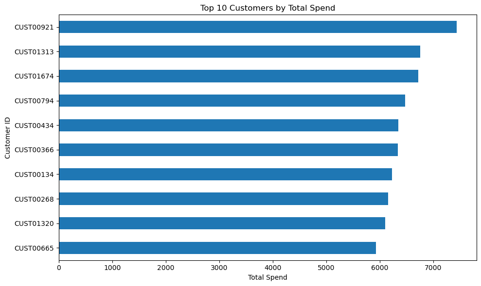
    


```python
segment_analysis = (
    df.groupby('Customer_Segment')
      .agg(
          Customers=('Customer_ID', 'nunique'),
          Revenue=('Total_Bill', 'sum'),
          Transactions=('Transaction_ID', 'nunique'),
          Quantity=('Quantity', 'sum'),
          Profit=('Profit', 'sum')
      )
      .sort_values('Revenue', ascending=False)
)

display(segment_analysis)
```


<div>
<style scoped>
    .dataframe tbody tr th:only-of-type {
        vertical-align: middle;
    }

    .dataframe tbody tr th {
        vertical-align: top;
    }

    .dataframe thead th {
        text-align: right;
    }
</style>
<table border="1" class="dataframe">
  <thead>
    <tr style="text-align: right;">
      <th></th>
      <th>Customers</th>
      <th>Revenue</th>
      <th>Transactions</th>
      <th>Quantity</th>
      <th>Profit</th>
    </tr>
    <tr>
      <th>Customer_Segment</th>
      <th></th>
      <th></th>
      <th></th>
      <th></th>
      <th></th>
    </tr>
  </thead>
  <tbody>
    <tr>
      <th>Family</th>
      <td>650</td>
      <td>1081045.76</td>
      <td>4999</td>
      <td>12988</td>
      <td>-74726.04</td>
    </tr>
    <tr>
      <th>Young Professional</th>
      <td>681</td>
      <td>1046190.82</td>
      <td>5165</td>
      <td>13378</td>
      <td>-71542.07</td>
    </tr>
    <tr>
      <th>Student</th>
      <td>584</td>
      <td>885323.43</td>
      <td>4426</td>
      <td>11515</td>
      <td>-51699.99</td>
    </tr>
    <tr>
      <th>Senior Citizen</th>
      <td>258</td>
      <td>431552.94</td>
      <td>1979</td>
      <td>5043</td>
      <td>-32371.15</td>
    </tr>
  </tbody>
</table>
</div>


```python
plt.figure(figsize=(10, 5))

segment_analysis['Revenue'].plot(kind='bar')

plt.title('Revenue by Customer Segment')
plt.xlabel('Customer Segment')
plt.ylabel('Revenue')

plt.xticks(rotation=45)
plt.tight_layout()
plt.show()
```


    
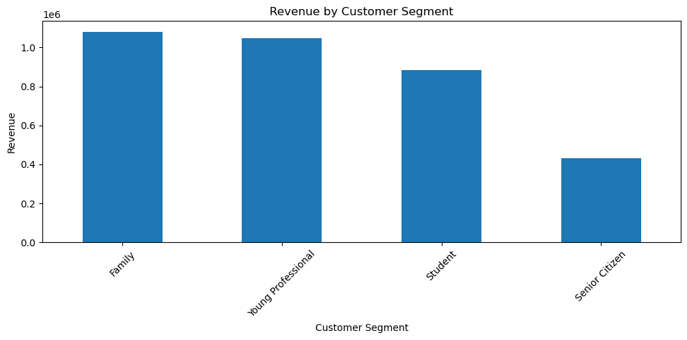
    


```python
# ==========================================
# 7. PROMOTION & DISCOUNT ANALYSIS
# ==========================================

promotion_analysis = (
    df.groupby('Promotion_Applied')
      .agg(
          Transactions=('Transaction_ID', 'nunique'),
          Revenue=('Total_Bill', 'sum'),
          Quantity=('Quantity', 'sum'),
          Avg_Discount=('Discount_Percentage', 'mean'),
          Profit=('Profit', 'sum')
      )
)

display(promotion_analysis)
```


<div>
<style scoped>
    .dataframe tbody tr th:only-of-type {
        vertical-align: middle;
    }

    .dataframe tbody tr th {
        vertical-align: top;
    }

    .dataframe thead th {
        text-align: right;
    }
</style>
<table border="1" class="dataframe">
  <thead>
    <tr style="text-align: right;">
      <th></th>
      <th>Transactions</th>
      <th>Revenue</th>
      <th>Quantity</th>
      <th>Avg_Discount</th>
      <th>Profit</th>
    </tr>
    <tr>
      <th>Promotion_Applied</th>
      <th></th>
      <th></th>
      <th></th>
      <th></th>
      <th></th>
    </tr>
  </thead>
  <tbody>
    <tr>
      <th>No</th>
      <td>13209</td>
      <td>2850135.83</td>
      <td>34311</td>
      <td>3.213249</td>
      <td>1953.04</td>
    </tr>
    <tr>
      <th>Yes</th>
      <td>3360</td>
      <td>593977.12</td>
      <td>8613</td>
      <td>20.191101</td>
      <td>-232292.29</td>
    </tr>
  </tbody>
</table>
</div>


```python
df['Promotion_Type_Analysis'] = (
    df['Promotion_Type'].fillna('No Promotion')
)

promotion_type_analysis = (
    df.groupby('Promotion_Type_Analysis')
      .agg(
          Transactions=('Transaction_ID', 'nunique'),
          Revenue=('Total_Bill', 'sum'),
          Quantity=('Quantity', 'sum'),
          Avg_Discount=('Discount_Percentage', 'mean'),
          Profit=('Profit', 'sum')
      )
      .sort_values('Revenue', ascending=False)
)

display(promotion_type_analysis)
```


<div>
<style scoped>
    .dataframe tbody tr th:only-of-type {
        vertical-align: middle;
    }

    .dataframe tbody tr th {
        vertical-align: top;
    }

    .dataframe thead th {
        text-align: right;
    }
</style>
<table border="1" class="dataframe">
  <thead>
    <tr style="text-align: right;">
      <th></th>
      <th>Transactions</th>
      <th>Revenue</th>
      <th>Quantity</th>
      <th>Avg_Discount</th>
      <th>Profit</th>
    </tr>
    <tr>
      <th>Promotion_Type_Analysis</th>
      <th></th>
      <th></th>
      <th></th>
      <th></th>
      <th></th>
    </tr>
  </thead>
  <tbody>
    <tr>
      <th>No Promotion</th>
      <td>13209</td>
      <td>2850135.83</td>
      <td>34311</td>
      <td>3.213249</td>
      <td>1953.04</td>
    </tr>
    <tr>
      <th>Weekend</th>
      <td>2211</td>
      <td>376543.84</td>
      <td>5643</td>
      <td>20.278200</td>
      <td>-144883.10</td>
    </tr>
    <tr>
      <th>Festival</th>
      <td>362</td>
      <td>76852.57</td>
      <td>907</td>
      <td>20.280663</td>
      <td>-23002.49</td>
    </tr>
    <tr>
      <th>Bundle Offer</th>
      <td>209</td>
      <td>42369.10</td>
      <td>559</td>
      <td>19.754067</td>
      <td>-16060.40</td>
    </tr>
    <tr>
      <th>Flash Sale</th>
      <td>212</td>
      <td>37583.67</td>
      <td>541</td>
      <td>19.828774</td>
      <td>-19761.79</td>
    </tr>
    <tr>
      <th>Clearance</th>
      <td>196</td>
      <td>31021.06</td>
      <td>516</td>
      <td>19.771429</td>
      <td>-12304.08</td>
    </tr>
    <tr>
      <th>Combo</th>
      <td>170</td>
      <td>29606.88</td>
      <td>447</td>
      <td>20.340588</td>
      <td>-16280.43</td>
    </tr>
  </tbody>
</table>
</div>


```python
df['Promotion_Type_Analysis'] = (
    df['Promotion_Type'].fillna('No Promotion')
)

promotion_type_analysis = (
    df.groupby('Promotion_Type_Analysis')
      .agg(
          Transactions=('Transaction_ID', 'nunique'),
          Revenue=('Total_Bill', 'sum'),
          Quantity=('Quantity', 'sum'),
          Avg_Discount=('Discount_Percentage', 'mean'),
          Profit=('Profit', 'sum')
      )
      .sort_values('Revenue', ascending=False)
)

display(promotion_type_analysis)
```


<div>
<style scoped>
    .dataframe tbody tr th:only-of-type {
        vertical-align: middle;
    }

    .dataframe tbody tr th {
        vertical-align: top;
    }

    .dataframe thead th {
        text-align: right;
    }
</style>
<table border="1" class="dataframe">
  <thead>
    <tr style="text-align: right;">
      <th></th>
      <th>Transactions</th>
      <th>Revenue</th>
      <th>Quantity</th>
      <th>Avg_Discount</th>
      <th>Profit</th>
    </tr>
    <tr>
      <th>Promotion_Type_Analysis</th>
      <th></th>
      <th></th>
      <th></th>
      <th></th>
      <th></th>
    </tr>
  </thead>
  <tbody>
    <tr>
      <th>No Promotion</th>
      <td>13209</td>
      <td>2850135.83</td>
      <td>34311</td>
      <td>3.213249</td>
      <td>1953.04</td>
    </tr>
    <tr>
      <th>Weekend</th>
      <td>2211</td>
      <td>376543.84</td>
      <td>5643</td>
      <td>20.278200</td>
      <td>-144883.10</td>
    </tr>
    <tr>
      <th>Festival</th>
      <td>362</td>
      <td>76852.57</td>
      <td>907</td>
      <td>20.280663</td>
      <td>-23002.49</td>
    </tr>
    <tr>
      <th>Bundle Offer</th>
      <td>209</td>
      <td>42369.10</td>
      <td>559</td>
      <td>19.754067</td>
      <td>-16060.40</td>
    </tr>
    <tr>
      <th>Flash Sale</th>
      <td>212</td>
      <td>37583.67</td>
      <td>541</td>
      <td>19.828774</td>
      <td>-19761.79</td>
    </tr>
    <tr>
      <th>Clearance</th>
      <td>196</td>
      <td>31021.06</td>
      <td>516</td>
      <td>19.771429</td>
      <td>-12304.08</td>
    </tr>
    <tr>
      <th>Combo</th>
      <td>170</td>
      <td>29606.88</td>
      <td>447</td>
      <td>20.340588</td>
      <td>-16280.43</td>
    </tr>
  </tbody>
</table>
</div>


```python
plt.figure(figsize=(10, 6))

plt.scatter(
    df['Discount_Percentage'],
    df['Total_Bill']
)

plt.title('Discount Percentage vs Transaction Revenue')
plt.xlabel('Discount Percentage')
plt.ylabel('Transaction Revenue')

plt.tight_layout()
plt.show()
```


    
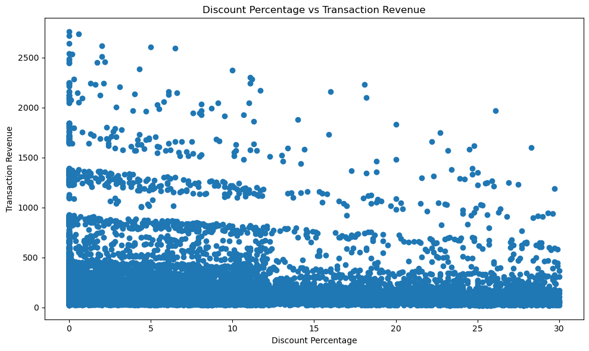
    


```python
plt.figure(figsize=(10, 6))

plt.scatter(
    df['Discount_Percentage'],
    df['Profit']
)

plt.axhline(0, linewidth=1)

plt.title('Discount Percentage vs Profit')
plt.xlabel('Discount Percentage')
plt.ylabel('Profit')

plt.tight_layout()
plt.show()
```


    
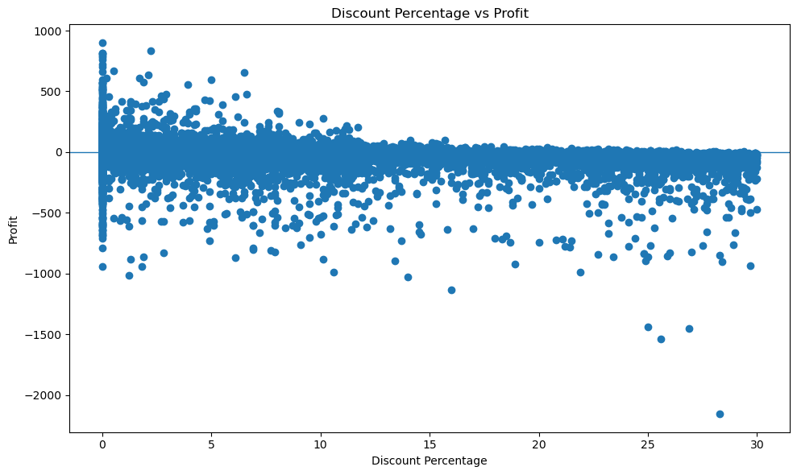
    


```python
promotion_score_analysis = (
    df.groupby(pd.cut(
        df['Promotion_Score'],
        bins=[-1, 25, 50, 75, 100],
        labels=['0-25', '26-50', '51-75', '76-100']
    ))
    .agg(
        Transactions=('Transaction_ID', 'nunique'),
        Revenue=('Total_Bill', 'sum'),
        Avg_Profit=('Profit', 'mean')
    )
)

display(promotion_score_analysis)
```

    C:\Users\hanra\AppData\Local\Temp\ipykernel_8100\3539746285.py:2: FutureWarning: The default of observed=False is deprecated and will be changed to True in a future version of pandas. Pass observed=False to retain current behavior or observed=True to adopt the future default and silence this warning.
      df.groupby(pd.cut(
    


<div>
<style scoped>
    .dataframe tbody tr th:only-of-type {
        vertical-align: middle;
    }

    .dataframe tbody tr th {
        vertical-align: top;
    }

    .dataframe thead th {
        text-align: right;
    }
</style>
<table border="1" class="dataframe">
  <thead>
    <tr style="text-align: right;">
      <th></th>
      <th>Transactions</th>
      <th>Revenue</th>
      <th>Avg_Profit</th>
    </tr>
    <tr>
      <th>Promotion_Score</th>
      <th></th>
      <th></th>
      <th></th>
    </tr>
  </thead>
  <tbody>
    <tr>
      <th>0-25</th>
      <td>804</td>
      <td>170385.66</td>
      <td>3.236144</td>
    </tr>
    <tr>
      <th>26-50</th>
      <td>4053</td>
      <td>892397.61</td>
      <td>0.230570</td>
    </tr>
    <tr>
      <th>51-75</th>
      <td>7140</td>
      <td>1538928.76</td>
      <td>-0.092716</td>
    </tr>
    <tr>
      <th>76-100</th>
      <td>4572</td>
      <td>842400.92</td>
      <td>-51.009103</td>
    </tr>
  </tbody>
</table>
</div>


```python
# ==========================================
# 8. INVENTORY & WASTE ANALYSIS
# ==========================================

inventory_summary = (
    df.groupby('Product')
      .agg(
          Units_Produced=('Units_Produced', 'sum'),
          Units_Sold=('Units_Sold', 'sum'),
          Unsold_Units=('Unsold_Units', 'sum'),
          Stock_Available=('Stock_Available', 'sum'),
          Waste_Cost=('Waste_Cost', 'sum')
      )
)

inventory_summary['Sell_Through_%'] = (
    inventory_summary['Units_Sold']
    / inventory_summary['Units_Produced']
    * 100
)

display(
    inventory_summary
    .sort_values('Unsold_Units', ascending=False)
    .head(20)
)
```


<div>
<style scoped>
    .dataframe tbody tr th:only-of-type {
        vertical-align: middle;
    }

    .dataframe tbody tr th {
        vertical-align: top;
    }

    .dataframe thead th {
        text-align: right;
    }
</style>
<table border="1" class="dataframe">
  <thead>
    <tr style="text-align: right;">
      <th></th>
      <th>Units_Produced</th>
      <th>Units_Sold</th>
      <th>Unsold_Units</th>
      <th>Stock_Available</th>
      <th>Waste_Cost</th>
      <th>Sell_Through_%</th>
    </tr>
    <tr>
      <th>Product</th>
      <th></th>
      <th></th>
      <th></th>
      <th></th>
      <th></th>
      <th></th>
    </tr>
  </thead>
  <tbody>
    <tr>
      <th>Bread</th>
      <td>11217</td>
      <td>7916</td>
      <td>3301</td>
      <td>3301</td>
      <td>31020.05</td>
      <td>70.571454</td>
    </tr>
    <tr>
      <th>Coffee</th>
      <td>8290</td>
      <td>5804</td>
      <td>2486</td>
      <td>2486</td>
      <td>20988.00</td>
      <td>70.012063</td>
    </tr>
    <tr>
      <th>Soft Drink</th>
      <td>5055</td>
      <td>3002</td>
      <td>2053</td>
      <td>2053</td>
      <td>27524.99</td>
      <td>59.386746</td>
    </tr>
    <tr>
      <th>Jam</th>
      <td>4989</td>
      <td>3035</td>
      <td>1954</td>
      <td>1954</td>
      <td>65340.03</td>
      <td>60.833834</td>
    </tr>
    <tr>
      <th>Butter</th>
      <td>4715</td>
      <td>2927</td>
      <td>1788</td>
      <td>1788</td>
      <td>36540.04</td>
      <td>62.078473</td>
    </tr>
    <tr>
      <th>Eggs</th>
      <td>4458</td>
      <td>2775</td>
      <td>1683</td>
      <td>1683</td>
      <td>45359.98</td>
      <td>62.247645</td>
    </tr>
    <tr>
      <th>Biscuit</th>
      <td>3910</td>
      <td>2281</td>
      <td>1629</td>
      <td>1629</td>
      <td>14730.03</td>
      <td>58.337596</td>
    </tr>
    <tr>
      <th>Tea</th>
      <td>4570</td>
      <td>3007</td>
      <td>1563</td>
      <td>1563</td>
      <td>8920.04</td>
      <td>65.798687</td>
    </tr>
    <tr>
      <th>Milk</th>
      <td>4462</td>
      <td>2936</td>
      <td>1526</td>
      <td>1526</td>
      <td>18359.94</td>
      <td>65.800090</td>
    </tr>
    <tr>
      <th>Chocolate Cake</th>
      <td>3866</td>
      <td>2484</td>
      <td>1382</td>
      <td>1382</td>
      <td>206879.97</td>
      <td>64.252457</td>
    </tr>
    <tr>
      <th>Black Forest Cake</th>
      <td>3787</td>
      <td>2454</td>
      <td>1333</td>
      <td>1333</td>
      <td>220480.04</td>
      <td>64.800634</td>
    </tr>
    <tr>
      <th>Cold Coffee</th>
      <td>4076</td>
      <td>2745</td>
      <td>1331</td>
      <td>1331</td>
      <td>23212.00</td>
      <td>67.345437</td>
    </tr>
    <tr>
      <th>Tea Cake</th>
      <td>3331</td>
      <td>2103</td>
      <td>1228</td>
      <td>1228</td>
      <td>66555.00</td>
      <td>63.134194</td>
    </tr>
    <tr>
      <th>Sandwich</th>
      <td>3274</td>
      <td>2059</td>
      <td>1215</td>
      <td>1215</td>
      <td>28491.96</td>
      <td>62.889432</td>
    </tr>
    <tr>
      <th>Pizza Slice</th>
      <td>3460</td>
      <td>2281</td>
      <td>1179</td>
      <td>1179</td>
      <td>30551.98</td>
      <td>65.924855</td>
    </tr>
    <tr>
      <th>Cupcake</th>
      <td>3283</td>
      <td>2122</td>
      <td>1161</td>
      <td>1161</td>
      <td>14292.03</td>
      <td>64.636004</td>
    </tr>
    <tr>
      <th>Brown Bread</th>
      <td>2937</td>
      <td>1822</td>
      <td>1115</td>
      <td>1115</td>
      <td>19549.97</td>
      <td>62.036091</td>
    </tr>
    <tr>
      <th>Donut</th>
      <td>3325</td>
      <td>2212</td>
      <td>1113</td>
      <td>1113</td>
      <td>14819.99</td>
      <td>66.526316</td>
    </tr>
    <tr>
      <th>Muffin</th>
      <td>3003</td>
      <td>1895</td>
      <td>1108</td>
      <td>1108</td>
      <td>17903.99</td>
      <td>63.103563</td>
    </tr>
    <tr>
      <th>Juice</th>
      <td>2952</td>
      <td>1863</td>
      <td>1089</td>
      <td>1089</td>
      <td>18550.02</td>
      <td>63.109756</td>
    </tr>
  </tbody>
</table>
</div>


```python
print(
    "Produced - Sold = Unsold:",
    (
        df['Units_Produced'] - df['Units_Sold']
        == df['Unsold_Units']
    ).value_counts()
)

print(
    "\nUnsold Units = Stock Available:",
    (
        df['Unsold_Units'] == df['Stock_Available']
    ).value_counts()
)
```

    Produced - Sold = Unsold: True    16569
    Name: count, dtype: int64
    
    Unsold Units = Stock Available: True    16569
    Name: count, dtype: int64
    


```python
top_unsold = (
    inventory_summary
    .sort_values('Unsold_Units', ascending=False)
    .head(10)
)

plt.figure(figsize=(10, 6))

top_unsold['Unsold_Units'].sort_values().plot(kind='barh')

plt.title('Top 10 Products by Unsold Units')
plt.xlabel('Unsold Units')
plt.ylabel('Product')

plt.tight_layout()
plt.show()
```


    
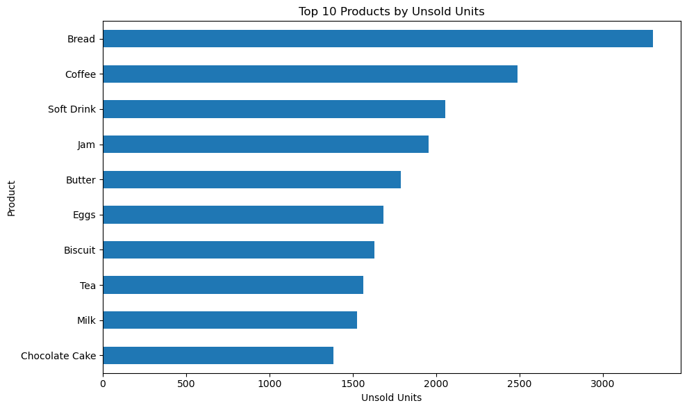
    


```python
top_waste = (
    inventory_summary
    .sort_values('Waste_Cost', ascending=False)
    .head(10)
)

display(top_waste)

plt.figure(figsize=(10, 6))

top_waste['Waste_Cost'].sort_values().plot(kind='barh')

plt.title('Top 10 Products by Waste Cost')
plt.xlabel('Waste Cost')
plt.ylabel('Product')

plt.tight_layout()
plt.show()
```


<div>
<style scoped>
    .dataframe tbody tr th:only-of-type {
        vertical-align: middle;
    }

    .dataframe tbody tr th {
        vertical-align: top;
    }

    .dataframe thead th {
        text-align: right;
    }
</style>
<table border="1" class="dataframe">
  <thead>
    <tr style="text-align: right;">
      <th></th>
      <th>Units_Produced</th>
      <th>Units_Sold</th>
      <th>Unsold_Units</th>
      <th>Stock_Available</th>
      <th>Waste_Cost</th>
      <th>Sell_Through_%</th>
    </tr>
    <tr>
      <th>Product</th>
      <th></th>
      <th></th>
      <th></th>
      <th></th>
      <th></th>
      <th></th>
    </tr>
  </thead>
  <tbody>
    <tr>
      <th>Black Forest Cake</th>
      <td>3787</td>
      <td>2454</td>
      <td>1333</td>
      <td>1333</td>
      <td>220480.04</td>
      <td>64.800634</td>
    </tr>
    <tr>
      <th>Chocolate Cake</th>
      <td>3866</td>
      <td>2484</td>
      <td>1382</td>
      <td>1382</td>
      <td>206879.97</td>
      <td>64.252457</td>
    </tr>
    <tr>
      <th>Honey</th>
      <td>2098</td>
      <td>1167</td>
      <td>931</td>
      <td>931</td>
      <td>88139.99</td>
      <td>55.624404</td>
    </tr>
    <tr>
      <th>Peanut Butter</th>
      <td>2538</td>
      <td>1483</td>
      <td>1055</td>
      <td>1055</td>
      <td>74499.97</td>
      <td>58.431836</td>
    </tr>
    <tr>
      <th>Tea Cake</th>
      <td>3331</td>
      <td>2103</td>
      <td>1228</td>
      <td>1228</td>
      <td>66555.00</td>
      <td>63.134194</td>
    </tr>
    <tr>
      <th>Jam</th>
      <td>4989</td>
      <td>3035</td>
      <td>1954</td>
      <td>1954</td>
      <td>65340.03</td>
      <td>60.833834</td>
    </tr>
    <tr>
      <th>Eggs</th>
      <td>4458</td>
      <td>2775</td>
      <td>1683</td>
      <td>1683</td>
      <td>45359.98</td>
      <td>62.247645</td>
    </tr>
    <tr>
      <th>Cheese</th>
      <td>2526</td>
      <td>1500</td>
      <td>1026</td>
      <td>1026</td>
      <td>44339.98</td>
      <td>59.382423</td>
    </tr>
    <tr>
      <th>Chocolate Cookies</th>
      <td>2215</td>
      <td>1375</td>
      <td>840</td>
      <td>840</td>
      <td>42559.99</td>
      <td>62.076749</td>
    </tr>
    <tr>
      <th>Cookies</th>
      <td>2133</td>
      <td>1298</td>
      <td>835</td>
      <td>835</td>
      <td>38090.01</td>
      <td>60.853258</td>
    </tr>
  </tbody>
</table>
</div>


    
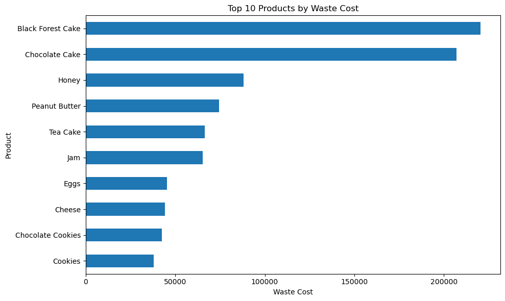
    


```python
top_sell_through = (
    inventory_summary
    .sort_values('Sell_Through_%', ascending=False)
)

display(top_sell_through.head(10))
```


<div>
<style scoped>
    .dataframe tbody tr th:only-of-type {
        vertical-align: middle;
    }

    .dataframe tbody tr th {
        vertical-align: top;
    }

    .dataframe thead th {
        text-align: right;
    }
</style>
<table border="1" class="dataframe">
  <thead>
    <tr style="text-align: right;">
      <th></th>
      <th>Units_Produced</th>
      <th>Units_Sold</th>
      <th>Unsold_Units</th>
      <th>Stock_Available</th>
      <th>Waste_Cost</th>
      <th>Sell_Through_%</th>
    </tr>
    <tr>
      <th>Product</th>
      <th></th>
      <th></th>
      <th></th>
      <th></th>
      <th></th>
      <th></th>
    </tr>
  </thead>
  <tbody>
    <tr>
      <th>Bread</th>
      <td>11217</td>
      <td>7916</td>
      <td>3301</td>
      <td>3301</td>
      <td>31020.05</td>
      <td>70.571454</td>
    </tr>
    <tr>
      <th>Coffee</th>
      <td>8290</td>
      <td>5804</td>
      <td>2486</td>
      <td>2486</td>
      <td>20988.00</td>
      <td>70.012063</td>
    </tr>
    <tr>
      <th>Cold Coffee</th>
      <td>4076</td>
      <td>2745</td>
      <td>1331</td>
      <td>1331</td>
      <td>23212.00</td>
      <td>67.345437</td>
    </tr>
    <tr>
      <th>Donut</th>
      <td>3325</td>
      <td>2212</td>
      <td>1113</td>
      <td>1113</td>
      <td>14819.99</td>
      <td>66.526316</td>
    </tr>
    <tr>
      <th>Pizza Slice</th>
      <td>3460</td>
      <td>2281</td>
      <td>1179</td>
      <td>1179</td>
      <td>30551.98</td>
      <td>65.924855</td>
    </tr>
    <tr>
      <th>Milk</th>
      <td>4462</td>
      <td>2936</td>
      <td>1526</td>
      <td>1526</td>
      <td>18359.94</td>
      <td>65.800090</td>
    </tr>
    <tr>
      <th>Tea</th>
      <td>4570</td>
      <td>3007</td>
      <td>1563</td>
      <td>1563</td>
      <td>8920.04</td>
      <td>65.798687</td>
    </tr>
    <tr>
      <th>Pastry</th>
      <td>2931</td>
      <td>1926</td>
      <td>1005</td>
      <td>1005</td>
      <td>21695.97</td>
      <td>65.711361</td>
    </tr>
    <tr>
      <th>Black Forest Cake</th>
      <td>3787</td>
      <td>2454</td>
      <td>1333</td>
      <td>1333</td>
      <td>220480.04</td>
      <td>64.800634</td>
    </tr>
    <tr>
      <th>Cupcake</th>
      <td>3283</td>
      <td>2122</td>
      <td>1161</td>
      <td>1161</td>
      <td>14292.03</td>
      <td>64.636004</td>
    </tr>
  </tbody>
</table>
</div>


```python
display(top_sell_through.tail(10))
```


<div>
<style scoped>
    .dataframe tbody tr th:only-of-type {
        vertical-align: middle;
    }

    .dataframe tbody tr th {
        vertical-align: top;
    }

    .dataframe thead th {
        text-align: right;
    }
</style>
<table border="1" class="dataframe">
  <thead>
    <tr style="text-align: right;">
      <th></th>
      <th>Units_Produced</th>
      <th>Units_Sold</th>
      <th>Unsold_Units</th>
      <th>Stock_Available</th>
      <th>Waste_Cost</th>
      <th>Sell_Through_%</th>
    </tr>
    <tr>
      <th>Product</th>
      <th></th>
      <th></th>
      <th></th>
      <th></th>
      <th></th>
      <th></th>
    </tr>
  </thead>
  <tbody>
    <tr>
      <th>Chocolate Cookies</th>
      <td>2215</td>
      <td>1375</td>
      <td>840</td>
      <td>840</td>
      <td>42559.99</td>
      <td>62.076749</td>
    </tr>
    <tr>
      <th>Brown Bread</th>
      <td>2937</td>
      <td>1822</td>
      <td>1115</td>
      <td>1115</td>
      <td>19549.97</td>
      <td>62.036091</td>
    </tr>
    <tr>
      <th>Cookies</th>
      <td>2133</td>
      <td>1298</td>
      <td>835</td>
      <td>835</td>
      <td>38090.01</td>
      <td>60.853258</td>
    </tr>
    <tr>
      <th>Jam</th>
      <td>4989</td>
      <td>3035</td>
      <td>1954</td>
      <td>1954</td>
      <td>65340.03</td>
      <td>60.833834</td>
    </tr>
    <tr>
      <th>Rusk</th>
      <td>2395</td>
      <td>1444</td>
      <td>951</td>
      <td>951</td>
      <td>11339.99</td>
      <td>60.292276</td>
    </tr>
    <tr>
      <th>Soft Drink</th>
      <td>5055</td>
      <td>3002</td>
      <td>2053</td>
      <td>2053</td>
      <td>27524.99</td>
      <td>59.386746</td>
    </tr>
    <tr>
      <th>Cheese</th>
      <td>2526</td>
      <td>1500</td>
      <td>1026</td>
      <td>1026</td>
      <td>44339.98</td>
      <td>59.382423</td>
    </tr>
    <tr>
      <th>Peanut Butter</th>
      <td>2538</td>
      <td>1483</td>
      <td>1055</td>
      <td>1055</td>
      <td>74499.97</td>
      <td>58.431836</td>
    </tr>
    <tr>
      <th>Biscuit</th>
      <td>3910</td>
      <td>2281</td>
      <td>1629</td>
      <td>1629</td>
      <td>14730.03</td>
      <td>58.337596</td>
    </tr>
    <tr>
      <th>Honey</th>
      <td>2098</td>
      <td>1167</td>
      <td>931</td>
      <td>931</td>
      <td>88139.99</td>
      <td>55.624404</td>
    </tr>
  </tbody>
</table>
</div>


```python
expiry_analysis = (
    df.groupby('Expiry_Risk', dropna=False)
      .agg(
          Transactions=('Transaction_ID', 'nunique'),
          Revenue=('Total_Bill', 'sum'),
          Unsold_Units=('Unsold_Units', 'sum'),
          Waste_Cost=('Waste_Cost', 'sum'),
          Profit=('Profit', 'sum')
      )
      .sort_values('Waste_Cost', ascending=False)
)

display(expiry_analysis)
```


<div>
<style scoped>
    .dataframe tbody tr th:only-of-type {
        vertical-align: middle;
    }

    .dataframe tbody tr th {
        vertical-align: top;
    }

    .dataframe thead th {
        text-align: right;
    }
</style>
<table border="1" class="dataframe">
  <thead>
    <tr style="text-align: right;">
      <th></th>
      <th>Transactions</th>
      <th>Revenue</th>
      <th>Unsold_Units</th>
      <th>Waste_Cost</th>
      <th>Profit</th>
    </tr>
    <tr>
      <th>Expiry_Risk</th>
      <th></th>
      <th></th>
      <th></th>
      <th></th>
      <th></th>
    </tr>
  </thead>
  <tbody>
    <tr>
      <th>Medium</th>
      <td>8799</td>
      <td>1769601.05</td>
      <td>24670</td>
      <td>759876.99</td>
      <td>-159096.49</td>
    </tr>
    <tr>
      <th>Low</th>
      <td>5938</td>
      <td>1229671.14</td>
      <td>9603</td>
      <td>379074.92</td>
      <td>31355.86</td>
    </tr>
    <tr>
      <th>High</th>
      <td>1832</td>
      <td>444840.76</td>
      <td>11253</td>
      <td>249860.89</td>
      <td>-102598.62</td>
    </tr>
  </tbody>
</table>
</div>


```python
# ==========================================
# 9. PROFITABILITY & WASTE ANALYSIS
# ==========================================

profit_summary = {
    'Total Revenue': df['Total_Bill'].sum(),
    'Total Profit': df['Profit'].sum(),
    'Total Waste Cost': df['Waste_Cost'].sum(),
    'Average Profit': df['Profit'].mean(),
    'Median Profit': df['Profit'].median(),
    'Profitable Transactions': (df['Profit'] > 0).sum(),
    'Loss-Making Transactions': (df['Profit'] < 0).sum(),
    'Break-Even Transactions': (df['Profit'] == 0).sum()
}

for metric, value in profit_summary.items():
    print(f"{metric}: {value:,.2f}" if isinstance(value, float)
          else f"{metric}: {value:,}")
```

    Total Revenue: 3,444,112.95
    Total Profit: -230,339.25
    Total Waste Cost: 1,388,812.80
    Average Profit: -13.90
    Median Profit: -0.42
    Profitable Transactions: 8,215
    Loss-Making Transactions: 8,353
    Break-Even Transactions: 1
    


```python
df['Profit_Margin_%'] = (
    df['Profit'] / df['Total_Bill'] * 100
)

print(
    "Average Profit Margin:",
    df['Profit_Margin_%'].mean()
)

print(
    "Median Profit Margin:",
    df['Profit_Margin_%'].median()
)
```

    Average Profit Margin: -10.939872874136809
    Median Profit Margin: -0.45050315937280605
    


```python
profit_by_category = (
    df.groupby('Category')
      .agg(
          Revenue=('Total_Bill', 'sum'),
          Profit=('Profit', 'sum'),
          Waste_Cost=('Waste_Cost', 'sum'),
          Transactions=('Transaction_ID', 'nunique')
      )
      .sort_values('Profit', ascending=False)
)

display(profit_by_category)
```


<div>
<style scoped>
    .dataframe tbody tr th:only-of-type {
        vertical-align: middle;
    }

    .dataframe tbody tr th {
        vertical-align: top;
    }

    .dataframe thead th {
        text-align: right;
    }
</style>
<table border="1" class="dataframe">
  <thead>
    <tr style="text-align: right;">
      <th></th>
      <th>Revenue</th>
      <th>Profit</th>
      <th>Waste_Cost</th>
      <th>Transactions</th>
    </tr>
    <tr>
      <th>Category</th>
      <th></th>
      <th></th>
      <th></th>
      <th></th>
    </tr>
  </thead>
  <tbody>
    <tr>
      <th>Beverages</th>
      <td>356122.32</td>
      <td>74823.99</td>
      <td>99195.05</td>
      <td>2938</td>
    </tr>
    <tr>
      <th>Cupcakes</th>
      <td>112313.00</td>
      <td>2550.53</td>
      <td>40845.98</td>
      <td>1239</td>
    </tr>
    <tr>
      <th>Bakery Snacks</th>
      <td>105506.11</td>
      <td>1993.42</td>
      <td>37559.95</td>
      <td>910</td>
    </tr>
    <tr>
      <th>Savoury Snacks</th>
      <td>205352.82</td>
      <td>667.53</td>
      <td>75839.92</td>
      <td>1736</td>
    </tr>
    <tr>
      <th>Bakery Staples</th>
      <td>203043.67</td>
      <td>-1436.10</td>
      <td>70145.00</td>
      <td>1943</td>
    </tr>
    <tr>
      <th>Muffins</th>
      <td>85219.23</td>
      <td>-3177.92</td>
      <td>32915.98</td>
      <td>746</td>
    </tr>
    <tr>
      <th>Biscuits &amp; Cookies</th>
      <td>253973.20</td>
      <td>-18558.17</td>
      <td>106720.02</td>
      <td>1427</td>
    </tr>
    <tr>
      <th>Spreads</th>
      <td>471715.05</td>
      <td>-74018.07</td>
      <td>227979.99</td>
      <td>1251</td>
    </tr>
    <tr>
      <th>Dairy</th>
      <td>362120.30</td>
      <td>-105527.20</td>
      <td>181999.93</td>
      <td>2498</td>
    </tr>
    <tr>
      <th>Cakes</th>
      <td>1288747.25</td>
      <td>-107657.26</td>
      <td>515610.98</td>
      <td>1881</td>
    </tr>
  </tbody>
</table>
</div>


```python
plt.figure(figsize=(10, 5))

profit_by_category['Profit'].sort_values().plot(kind='barh')

plt.axvline(0, linewidth=1)

plt.title('Profit by Product Category')
plt.xlabel('Profit')
plt.ylabel('Category')

plt.tight_layout()
plt.show()
```


    
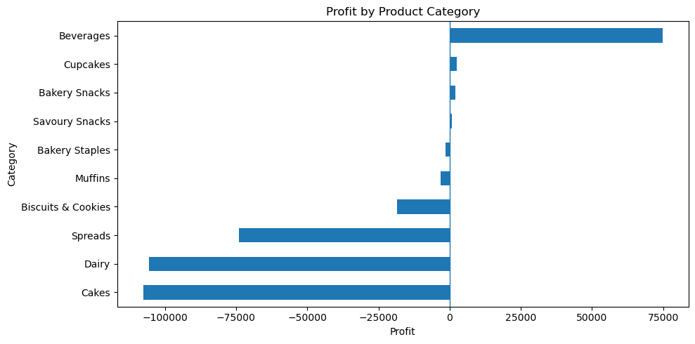
    


```python
plt.figure(figsize=(10, 6))

plt.scatter(
    df['Waste_Cost'],
    df['Profit']
)

plt.axhline(0, linewidth=1)

plt.title('Waste Cost vs Profit')
plt.xlabel('Waste Cost')
plt.ylabel('Profit')

plt.tight_layout()
plt.show()
```


    
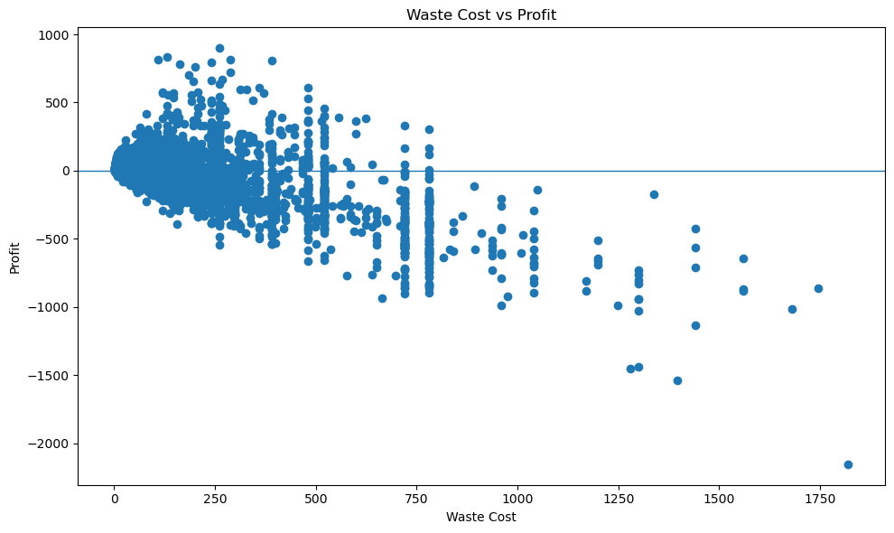
    


```python
segment_profit = (
    df.groupby('Customer_Segment')
      .agg(
          Revenue=('Total_Bill', 'sum'),
          Profit=('Profit', 'sum'),
          Avg_Profit=('Profit', 'mean'),
          Waste_Cost=('Waste_Cost', 'sum')
      )
      .sort_values('Profit', ascending=False)
)

display(segment_profit)
```


<div>
<style scoped>
    .dataframe tbody tr th:only-of-type {
        vertical-align: middle;
    }

    .dataframe tbody tr th {
        vertical-align: top;
    }

    .dataframe thead th {
        text-align: right;
    }
</style>
<table border="1" class="dataframe">
  <thead>
    <tr style="text-align: right;">
      <th></th>
      <th>Revenue</th>
      <th>Profit</th>
      <th>Avg_Profit</th>
      <th>Waste_Cost</th>
    </tr>
    <tr>
      <th>Customer_Segment</th>
      <th></th>
      <th></th>
      <th></th>
      <th></th>
    </tr>
  </thead>
  <tbody>
    <tr>
      <th>Senior Citizen</th>
      <td>431552.94</td>
      <td>-32371.15</td>
      <td>-16.357327</td>
      <td>177746.21</td>
    </tr>
    <tr>
      <th>Student</th>
      <td>885323.43</td>
      <td>-51699.99</td>
      <td>-11.680974</td>
      <td>351990.85</td>
    </tr>
    <tr>
      <th>Young Professional</th>
      <td>1046190.82</td>
      <td>-71542.07</td>
      <td>-13.851320</td>
      <td>427170.47</td>
    </tr>
    <tr>
      <th>Family</th>
      <td>1081045.76</td>
      <td>-74726.04</td>
      <td>-14.948198</td>
      <td>431905.27</td>
    </tr>
  </tbody>
</table>
</div>


```python
worst_transactions = (
    df[
        [
            'Transaction_ID',
            'Product',
            'Quantity',
            'Unit_Price',
            'Discount_Percentage',
            'Total_Bill',
            'Profit',
            'Waste_Cost'
        ]
    ]
    .sort_values('Profit')
    .head(15)
)

display(worst_transactions)
```


<div>
<style scoped>
    .dataframe tbody tr th:only-of-type {
        vertical-align: middle;
    }

    .dataframe tbody tr th {
        vertical-align: top;
    }

    .dataframe thead th {
        text-align: right;
    }
</style>
<table border="1" class="dataframe">
  <thead>
    <tr style="text-align: right;">
      <th></th>
      <th>Transaction_ID</th>
      <th>Product</th>
      <th>Quantity</th>
      <th>Unit_Price</th>
      <th>Discount_Percentage</th>
      <th>Total_Bill</th>
      <th>Profit</th>
      <th>Waste_Cost</th>
    </tr>
  </thead>
  <tbody>
    <tr>
      <th>5405</th>
      <td>TXN005399</td>
      <td>Black Forest Cake</td>
      <td>5</td>
      <td>445.78</td>
      <td>28.3</td>
      <td>1598.12</td>
      <td>-2152.66</td>
      <td>1820.00</td>
    </tr>
    <tr>
      <th>3762</th>
      <td>TXN003771</td>
      <td>Chocolate Cake</td>
      <td>4</td>
      <td>419.96</td>
      <td>25.6</td>
      <td>1249.80</td>
      <td>-1536.60</td>
      <td>1396.36</td>
    </tr>
    <tr>
      <th>3900</th>
      <td>TXN003904</td>
      <td>Chocolate Cake</td>
      <td>4</td>
      <td>427.04</td>
      <td>26.9</td>
      <td>1248.66</td>
      <td>-1450.84</td>
      <td>1280.00</td>
    </tr>
    <tr>
      <th>922</th>
      <td>TXN000946</td>
      <td>Black Forest Cake</td>
      <td>4</td>
      <td>450.37</td>
      <td>25.0</td>
      <td>1351.11</td>
      <td>-1439.26</td>
      <td>1300.00</td>
    </tr>
    <tr>
      <th>13452</th>
      <td>TXN013459</td>
      <td>Chocolate Cake</td>
      <td>6</td>
      <td>428.32</td>
      <td>16.0</td>
      <td>2158.73</td>
      <td>-1132.46</td>
      <td>1440.00</td>
    </tr>
    <tr>
      <th>14273</th>
      <td>TXN014282</td>
      <td>Black Forest Cake</td>
      <td>5</td>
      <td>437.36</td>
      <td>14.0</td>
      <td>1880.65</td>
      <td>-1025.50</td>
      <td>1300.00</td>
    </tr>
    <tr>
      <th>14910</th>
      <td>TXN014914</td>
      <td>Chocolate Cake</td>
      <td>4</td>
      <td>416.10</td>
      <td>1.2</td>
      <td>1644.43</td>
      <td>-1015.54</td>
      <td>1680.00</td>
    </tr>
    <tr>
      <th>4666</th>
      <td>TXN004662</td>
      <td>Chocolate Cake</td>
      <td>3</td>
      <td>410.54</td>
      <td>21.9</td>
      <td>961.90</td>
      <td>-987.82</td>
      <td>960.00</td>
    </tr>
    <tr>
      <th>1605</th>
      <td>TXN001599</td>
      <td>Black Forest Cake</td>
      <td>3</td>
      <td>440.34</td>
      <td>10.6</td>
      <td>1180.99</td>
      <td>-987.04</td>
      <td>1248.00</td>
    </tr>
    <tr>
      <th>578</th>
      <td>TXN000580</td>
      <td>Black Forest Cake</td>
      <td>2</td>
      <td>454.32</td>
      <td>1.8</td>
      <td>892.28</td>
      <td>-944.08</td>
      <td>1300.00</td>
    </tr>
    <tr>
      <th>16389</th>
      <td>TXN016367</td>
      <td>Black Forest Cake</td>
      <td>2</td>
      <td>440.69</td>
      <td>0.0</td>
      <td>881.38</td>
      <td>-938.62</td>
      <td>1300.00</td>
    </tr>
    <tr>
      <th>16421</th>
      <td>TXN016433</td>
      <td>Chocolate Cake</td>
      <td>4</td>
      <td>423.26</td>
      <td>29.7</td>
      <td>1190.21</td>
      <td>-937.24</td>
      <td>664.62</td>
    </tr>
    <tr>
      <th>2105</th>
      <td>TXN002100</td>
      <td>Black Forest Cake</td>
      <td>3</td>
      <td>444.95</td>
      <td>18.9</td>
      <td>1082.56</td>
      <td>-924.73</td>
      <td>975.00</td>
    </tr>
    <tr>
      <th>10847</th>
      <td>TXN010846</td>
      <td>Chocolate Cake</td>
      <td>3</td>
      <td>416.44</td>
      <td>28.4</td>
      <td>894.51</td>
      <td>-900.30</td>
      <td>720.00</td>
    </tr>
    <tr>
      <th>2442</th>
      <td>TXN002437</td>
      <td>Black Forest Cake</td>
      <td>3</td>
      <td>441.12</td>
      <td>24.9</td>
      <td>993.84</td>
      <td>-895.68</td>
      <td>780.00</td>
    </tr>
  </tbody>
</table>
</div>


```python
best_transactions = (
    df[
        [
            'Transaction_ID',
            'Product',
            'Quantity',
            'Unit_Price',
            'Discount_Percentage',
            'Total_Bill',
            'Profit',
            'Waste_Cost'
        ]
    ]
    .sort_values('Profit', ascending=False)
    .head(15)
)

display(best_transactions)
```


<div>
<style scoped>
    .dataframe tbody tr th:only-of-type {
        vertical-align: middle;
    }

    .dataframe tbody tr th {
        vertical-align: top;
    }

    .dataframe thead th {
        text-align: right;
    }
</style>
<table border="1" class="dataframe">
  <thead>
    <tr style="text-align: right;">
      <th></th>
      <th>Transaction_ID</th>
      <th>Product</th>
      <th>Quantity</th>
      <th>Unit_Price</th>
      <th>Discount_Percentage</th>
      <th>Total_Bill</th>
      <th>Profit</th>
      <th>Waste_Cost</th>
    </tr>
  </thead>
  <tbody>
    <tr>
      <th>9881</th>
      <td>TXN009887</td>
      <td>Black Forest Cake</td>
      <td>6</td>
      <td>453.07</td>
      <td>0.0</td>
      <td>2718.42</td>
      <td>898.42</td>
      <td>260.00</td>
    </tr>
    <tr>
      <th>7565</th>
      <td>TXN007561</td>
      <td>Chocolate Cake</td>
      <td>6</td>
      <td>418.89</td>
      <td>2.2</td>
      <td>2458.05</td>
      <td>831.85</td>
      <td>130.91</td>
    </tr>
    <tr>
      <th>1047</th>
      <td>TXN001040</td>
      <td>Chocolate Cake</td>
      <td>6</td>
      <td>423.38</td>
      <td>0.0</td>
      <td>2540.28</td>
      <td>812.28</td>
      <td>288.00</td>
    </tr>
    <tr>
      <th>7559</th>
      <td>TXN007563</td>
      <td>Chocolate Cake</td>
      <td>5</td>
      <td>424.19</td>
      <td>0.0</td>
      <td>2120.95</td>
      <td>811.86</td>
      <td>109.09</td>
    </tr>
    <tr>
      <th>15449</th>
      <td>TXN015451</td>
      <td>Black Forest Cake</td>
      <td>6</td>
      <td>459.83</td>
      <td>0.0</td>
      <td>2758.98</td>
      <td>808.98</td>
      <td>390.00</td>
    </tr>
    <tr>
      <th>10652</th>
      <td>TXN010648</td>
      <td>Chocolate Cake</td>
      <td>6</td>
      <td>412.46</td>
      <td>0.0</td>
      <td>2474.76</td>
      <td>794.76</td>
      <td>240.00</td>
    </tr>
    <tr>
      <th>1868</th>
      <td>TXN001860</td>
      <td>Black Forest Cake</td>
      <td>5</td>
      <td>449.10</td>
      <td>0.0</td>
      <td>2245.50</td>
      <td>783.00</td>
      <td>162.50</td>
    </tr>
    <tr>
      <th>10392</th>
      <td>TXN010384</td>
      <td>Chocolate Cake</td>
      <td>5</td>
      <td>432.33</td>
      <td>0.0</td>
      <td>2161.65</td>
      <td>761.65</td>
      <td>200.00</td>
    </tr>
    <tr>
      <th>5840</th>
      <td>TXN005830</td>
      <td>Chocolate Cake</td>
      <td>6</td>
      <td>408.74</td>
      <td>0.0</td>
      <td>2452.44</td>
      <td>724.44</td>
      <td>288.00</td>
    </tr>
    <tr>
      <th>14754</th>
      <td>TXN014757</td>
      <td>Chocolate Cake</td>
      <td>5</td>
      <td>417.34</td>
      <td>0.0</td>
      <td>2086.70</td>
      <td>702.08</td>
      <td>184.62</td>
    </tr>
    <tr>
      <th>6935</th>
      <td>TXN006931</td>
      <td>Chocolate Cake</td>
      <td>5</td>
      <td>431.22</td>
      <td>0.5</td>
      <td>2145.32</td>
      <td>667.87</td>
      <td>266.67</td>
    </tr>
    <tr>
      <th>8277</th>
      <td>TXN008286</td>
      <td>Chocolate Cake</td>
      <td>5</td>
      <td>419.78</td>
      <td>0.0</td>
      <td>2098.90</td>
      <td>658.90</td>
      <td>240.00</td>
    </tr>
    <tr>
      <th>5600</th>
      <td>TXN005600</td>
      <td>Black Forest Cake</td>
      <td>6</td>
      <td>462.35</td>
      <td>6.5</td>
      <td>2593.78</td>
      <td>658.46</td>
      <td>195.00</td>
    </tr>
    <tr>
      <th>642</th>
      <td>TXN000624</td>
      <td>Black Forest Cake</td>
      <td>5</td>
      <td>458.79</td>
      <td>2.1</td>
      <td>2245.78</td>
      <td>637.61</td>
      <td>260.00</td>
    </tr>
    <tr>
      <th>7248</th>
      <td>TXN007239</td>
      <td>Chocolate Cake</td>
      <td>6</td>
      <td>423.10</td>
      <td>0.2</td>
      <td>2533.52</td>
      <td>608.44</td>
      <td>480.00</td>
    </tr>
  </tbody>
</table>
</div>


```python
# ==========================================
# 10. CUSTOMER BEHAVIOR — RFM ANALYSIS
# ==========================================

analysis_date = df['Date'].max()

rfm = (
    df.groupby('Customer_ID')
      .agg(
          Recency=('Date', lambda x: (analysis_date - x.max()).days),
          Frequency=('Transaction_ID', 'nunique'),
          Monetary=('Total_Bill', 'sum')
      )
)

display(rfm.head())
```


<div>
<style scoped>
    .dataframe tbody tr th:only-of-type {
        vertical-align: middle;
    }

    .dataframe tbody tr th {
        vertical-align: top;
    }

    .dataframe thead th {
        text-align: right;
    }
</style>
<table border="1" class="dataframe">
  <thead>
    <tr style="text-align: right;">
      <th></th>
      <th>Recency</th>
      <th>Frequency</th>
      <th>Monetary</th>
    </tr>
    <tr>
      <th>Customer_ID</th>
      <th></th>
      <th></th>
      <th></th>
    </tr>
  </thead>
  <tbody>
    <tr>
      <th>CUST00001</th>
      <td>91</td>
      <td>12</td>
      <td>2914.21</td>
    </tr>
    <tr>
      <th>CUST00002</th>
      <td>18</td>
      <td>12</td>
      <td>1661.35</td>
    </tr>
    <tr>
      <th>CUST00003</th>
      <td>138</td>
      <td>11</td>
      <td>1617.53</td>
    </tr>
    <tr>
      <th>CUST00004</th>
      <td>83</td>
      <td>8</td>
      <td>910.70</td>
    </tr>
    <tr>
      <th>CUST00005</th>
      <td>17</td>
      <td>2</td>
      <td>491.63</td>
    </tr>
  </tbody>
</table>
</div>


```python
rfm['R_Score'] = pd.qcut(
    rfm['Recency'],
    4,
    labels=[4, 3, 2, 1],
    duplicates='drop'
)

rfm['F_Score'] = pd.qcut(
    rfm['Frequency'].rank(method='first'),
    4,
    labels=[1, 2, 3, 4]
)

rfm['M_Score'] = pd.qcut(
    rfm['Monetary'].rank(method='first'),
    4,
    labels=[1, 2, 3, 4]
)

rfm['RFM_Score'] = (
    rfm['R_Score'].astype(int) +
    rfm['F_Score'].astype(int) +
    rfm['M_Score'].astype(int)
)

display(rfm.head())
```


<div>
<style scoped>
    .dataframe tbody tr th:only-of-type {
        vertical-align: middle;
    }

    .dataframe tbody tr th {
        vertical-align: top;
    }

    .dataframe thead th {
        text-align: right;
    }
</style>
<table border="1" class="dataframe">
  <thead>
    <tr style="text-align: right;">
      <th></th>
      <th>Recency</th>
      <th>Frequency</th>
      <th>Monetary</th>
      <th>R_Score</th>
      <th>F_Score</th>
      <th>M_Score</th>
      <th>RFM_Score</th>
    </tr>
    <tr>
      <th>Customer_ID</th>
      <th></th>
      <th></th>
      <th></th>
      <th></th>
      <th></th>
      <th></th>
      <th></th>
    </tr>
  </thead>
  <tbody>
    <tr>
      <th>CUST00001</th>
      <td>91</td>
      <td>12</td>
      <td>2914.21</td>
      <td>3</td>
      <td>4</td>
      <td>4</td>
      <td>11</td>
    </tr>
    <tr>
      <th>CUST00002</th>
      <td>18</td>
      <td>12</td>
      <td>1661.35</td>
      <td>4</td>
      <td>4</td>
      <td>3</td>
      <td>11</td>
    </tr>
    <tr>
      <th>CUST00003</th>
      <td>138</td>
      <td>11</td>
      <td>1617.53</td>
      <td>2</td>
      <td>4</td>
      <td>3</td>
      <td>9</td>
    </tr>
    <tr>
      <th>CUST00004</th>
      <td>83</td>
      <td>8</td>
      <td>910.70</td>
      <td>3</td>
      <td>3</td>
      <td>2</td>
      <td>8</td>
    </tr>
    <tr>
      <th>CUST00005</th>
      <td>17</td>
      <td>2</td>
      <td>491.63</td>
      <td>4</td>
      <td>1</td>
      <td>1</td>
      <td>6</td>
    </tr>
  </tbody>
</table>
</div>


```python
def classify_customer(score):
    if score >= 10:
        return 'High Value'
    elif score >= 7:
        return 'Regular'
    elif score >= 5:
        return 'Occasional'
    else:
        return 'Low Engagement'

rfm['Customer_Group'] = rfm['RFM_Score'].apply(classify_customer)

display(
    rfm['Customer_Group']
    .value_counts()
)
```


    Customer_Group
    Regular           792
    High Value        583
    Occasional        444
    Low Engagement    354
    Name: count, dtype: int64


```python
customer_groups = (
    rfm['Customer_Group']
    .value_counts()
)

plt.figure(figsize=(9, 5))

customer_groups.plot(kind='bar')

plt.title('Customer Distribution by RFM Group')
plt.xlabel('Customer Group')
plt.ylabel('Number of Customers')

plt.xticks(rotation=30)
plt.tight_layout()
plt.show()
```


    
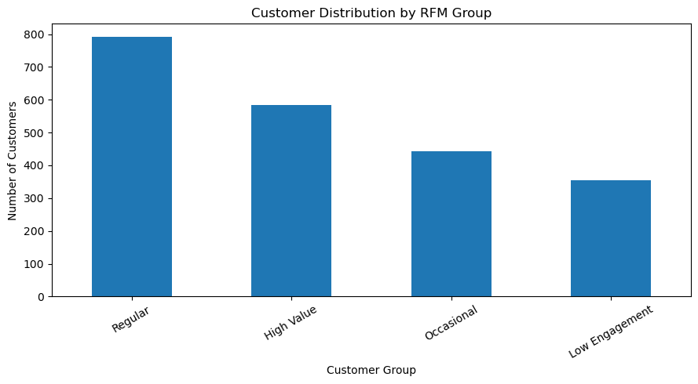
    


```python
customer_group_value = (
    rfm.groupby('Customer_Group')
       .agg(
           Customers=('Monetary', 'size'),
           Revenue=('Monetary', 'sum'),
           Avg_Spend=('Monetary', 'mean'),
           Avg_Frequency=('Frequency', 'mean')
       )
       .sort_values('Revenue', ascending=False)
)

display(customer_group_value)
```


<div>
<style scoped>
    .dataframe tbody tr th:only-of-type {
        vertical-align: middle;
    }

    .dataframe tbody tr th {
        vertical-align: top;
    }

    .dataframe thead th {
        text-align: right;
    }
</style>
<table border="1" class="dataframe">
  <thead>
    <tr style="text-align: right;">
      <th></th>
      <th>Customers</th>
      <th>Revenue</th>
      <th>Avg_Spend</th>
      <th>Avg_Frequency</th>
    </tr>
    <tr>
      <th>Customer_Group</th>
      <th></th>
      <th></th>
      <th></th>
      <th></th>
    </tr>
  </thead>
  <tbody>
    <tr>
      <th>High Value</th>
      <td>583</td>
      <td>1591198.77</td>
      <td>2729.328937</td>
      <td>11.986278</td>
    </tr>
    <tr>
      <th>Regular</th>
      <td>792</td>
      <td>1280524.66</td>
      <td>1616.824066</td>
      <td>7.907828</td>
    </tr>
    <tr>
      <th>Occasional</th>
      <td>444</td>
      <td>410607.27</td>
      <td>924.791149</td>
      <td>4.963964</td>
    </tr>
    <tr>
      <th>Low Engagement</th>
      <td>354</td>
      <td>161782.25</td>
      <td>457.012006</td>
      <td>3.146893</td>
    </tr>
  </tbody>
</table>
</div>


```python
# ==========================================
# 11. DECLINING PRODUCT ANALYSIS
# ==========================================

product_monthly = (
    df.groupby(['Year_Month', 'Product'])
      .agg(
          Quantity_Sold=('Quantity', 'sum'),
          Revenue=('Total_Bill', 'sum')
      )
      .reset_index()
)

display(product_monthly.head())
```


<div>
<style scoped>
    .dataframe tbody tr th:only-of-type {
        vertical-align: middle;
    }

    .dataframe tbody tr th {
        vertical-align: top;
    }

    .dataframe thead th {
        text-align: right;
    }
</style>
<table border="1" class="dataframe">
  <thead>
    <tr style="text-align: right;">
      <th></th>
      <th>Year_Month</th>
      <th>Product</th>
      <th>Quantity_Sold</th>
      <th>Revenue</th>
    </tr>
  </thead>
  <tbody>
    <tr>
      <th>0</th>
      <td>2023-01</td>
      <td>Biscuit</td>
      <td>53</td>
      <td>1480.30</td>
    </tr>
    <tr>
      <th>1</th>
      <td>2023-01</td>
      <td>Black Forest Cake</td>
      <td>64</td>
      <td>26769.79</td>
    </tr>
    <tr>
      <th>2</th>
      <td>2023-01</td>
      <td>Bread</td>
      <td>100</td>
      <td>3755.76</td>
    </tr>
    <tr>
      <th>3</th>
      <td>2023-01</td>
      <td>Brown Bread</td>
      <td>41</td>
      <td>1750.92</td>
    </tr>
    <tr>
      <th>4</th>
      <td>2023-01</td>
      <td>Butter</td>
      <td>63</td>
      <td>3260.37</td>
    </tr>
  </tbody>
</table>
</div>


```python
product_trend = (
    product_monthly
    .pivot(
        index='Product',
        columns='Year_Month',
        values='Quantity_Sold'
    )
)

first_month = product_trend.columns.min()
last_month = product_trend.columns.max()

product_trend['First_Month_Sales'] = product_trend[first_month]
product_trend['Last_Month_Sales'] = product_trend[last_month]

product_trend['Change_%'] = (
    (
        product_trend['Last_Month_Sales']
        - product_trend['First_Month_Sales']
    )
    / product_trend['First_Month_Sales']
    * 100
)

declining_products = (
    product_trend[
        product_trend['Change_%'] < 0
    ]
    .sort_values('Change_%')
)

display(
    declining_products[
        [
            'First_Month_Sales',
            'Last_Month_Sales',
            'Change_%'
        ]
    ].head(15)
)
```


<div>
<style scoped>
    .dataframe tbody tr th:only-of-type {
        vertical-align: middle;
    }

    .dataframe tbody tr th {
        vertical-align: top;
    }

    .dataframe thead th {
        text-align: right;
    }
</style>
<table border="1" class="dataframe">
  <thead>
    <tr style="text-align: right;">
      <th>Year_Month</th>
      <th>First_Month_Sales</th>
      <th>Last_Month_Sales</th>
      <th>Change_%</th>
    </tr>
    <tr>
      <th>Product</th>
      <th></th>
      <th></th>
      <th></th>
    </tr>
  </thead>
  <tbody>
    <tr>
      <th>Honey</th>
      <td>23</td>
      <td>10</td>
      <td>-56.521739</td>
    </tr>
    <tr>
      <th>Sandwich</th>
      <td>75</td>
      <td>41</td>
      <td>-45.333333</td>
    </tr>
    <tr>
      <th>Croissant</th>
      <td>52</td>
      <td>30</td>
      <td>-42.307692</td>
    </tr>
    <tr>
      <th>Chocolate Cookies</th>
      <td>39</td>
      <td>25</td>
      <td>-35.897436</td>
    </tr>
    <tr>
      <th>Peanut Butter</th>
      <td>46</td>
      <td>30</td>
      <td>-34.782609</td>
    </tr>
    <tr>
      <th>Milk</th>
      <td>64</td>
      <td>42</td>
      <td>-34.375000</td>
    </tr>
    <tr>
      <th>Butter</th>
      <td>63</td>
      <td>45</td>
      <td>-28.571429</td>
    </tr>
    <tr>
      <th>Juice</th>
      <td>53</td>
      <td>39</td>
      <td>-26.415094</td>
    </tr>
    <tr>
      <th>Cookies</th>
      <td>42</td>
      <td>31</td>
      <td>-26.190476</td>
    </tr>
    <tr>
      <th>Paneer</th>
      <td>58</td>
      <td>43</td>
      <td>-25.862069</td>
    </tr>
    <tr>
      <th>Rusk</th>
      <td>33</td>
      <td>25</td>
      <td>-24.242424</td>
    </tr>
    <tr>
      <th>Muffin</th>
      <td>47</td>
      <td>36</td>
      <td>-23.404255</td>
    </tr>
    <tr>
      <th>Jam</th>
      <td>77</td>
      <td>59</td>
      <td>-23.376623</td>
    </tr>
    <tr>
      <th>Puff</th>
      <td>35</td>
      <td>27</td>
      <td>-22.857143</td>
    </tr>
    <tr>
      <th>Veg Puff</th>
      <td>53</td>
      <td>41</td>
      <td>-22.641509</td>
    </tr>
  </tbody>
</table>
</div>


```python
import numpy as np

trend_results = []

for product, group in product_monthly.groupby('Product'):

    group = group.sort_values('Year_Month')

    x = np.arange(len(group))
    y = group['Quantity_Sold'].values

    slope = np.polyfit(x, y, 1)[0]

    trend_results.append({
        'Product': product,
        'Trend_Slope': slope,
        'Average_Monthly_Sales': y.mean()
    })

product_trends = pd.DataFrame(trend_results)

declining_products = (
    product_trends[
        product_trends['Trend_Slope'] < 0
    ]
    .sort_values('Trend_Slope')
)

display(declining_products.head(15))
```


<div>
<style scoped>
    .dataframe tbody tr th:only-of-type {
        vertical-align: middle;
    }

    .dataframe tbody tr th {
        vertical-align: top;
    }

    .dataframe thead th {
        text-align: right;
    }
</style>
<table border="1" class="dataframe">
  <thead>
    <tr style="text-align: right;">
      <th></th>
      <th>Product</th>
      <th>Trend_Slope</th>
      <th>Average_Monthly_Sales</th>
    </tr>
  </thead>
  <tbody>
    <tr>
      <th>19</th>
      <td>Juice</td>
      <td>-0.556087</td>
      <td>44.958333</td>
    </tr>
    <tr>
      <th>4</th>
      <td>Butter</td>
      <td>-0.269130</td>
      <td>62.375000</td>
    </tr>
    <tr>
      <th>23</th>
      <td>Pastry</td>
      <td>-0.259130</td>
      <td>45.833333</td>
    </tr>
    <tr>
      <th>12</th>
      <td>Cookies</td>
      <td>-0.247826</td>
      <td>32.833333</td>
    </tr>
    <tr>
      <th>21</th>
      <td>Muffin</td>
      <td>-0.216957</td>
      <td>46.291667</td>
    </tr>
    <tr>
      <th>28</th>
      <td>Sandwich</td>
      <td>-0.188261</td>
      <td>50.041667</td>
    </tr>
    <tr>
      <th>33</th>
      <td>Veg Puff</td>
      <td>-0.148696</td>
      <td>41.500000</td>
    </tr>
    <tr>
      <th>10</th>
      <td>Coffee</td>
      <td>-0.140000</td>
      <td>93.333333</td>
    </tr>
    <tr>
      <th>15</th>
      <td>Donut</td>
      <td>-0.114348</td>
      <td>51.125000</td>
    </tr>
    <tr>
      <th>11</th>
      <td>Cold Coffee</td>
      <td>-0.103478</td>
      <td>58.083333</td>
    </tr>
    <tr>
      <th>17</th>
      <td>Honey</td>
      <td>-0.090000</td>
      <td>32.458333</td>
    </tr>
    <tr>
      <th>9</th>
      <td>Chocolate Muffin</td>
      <td>-0.084348</td>
      <td>34.666667</td>
    </tr>
    <tr>
      <th>20</th>
      <td>Milk</td>
      <td>-0.080870</td>
      <td>61.416667</td>
    </tr>
    <tr>
      <th>24</th>
      <td>Peanut Butter</td>
      <td>-0.075217</td>
      <td>39.375000</td>
    </tr>
    <tr>
      <th>0</th>
      <td>Biscuit</td>
      <td>-0.054348</td>
      <td>50.708333</td>
    </tr>
  </tbody>
</table>
</div>


```python
top_declining = declining_products.head(10)

plt.figure(figsize=(10, 6))

top_declining.set_index('Product')['Trend_Slope'].sort_values().plot(
    kind='barh'
)

plt.axvline(0, linewidth=1)

plt.title('Products with Strongest Declining Sales Trends')
plt.xlabel('Monthly Sales Trend Slope')
plt.ylabel('Product')

plt.tight_layout()
plt.show()
```


    
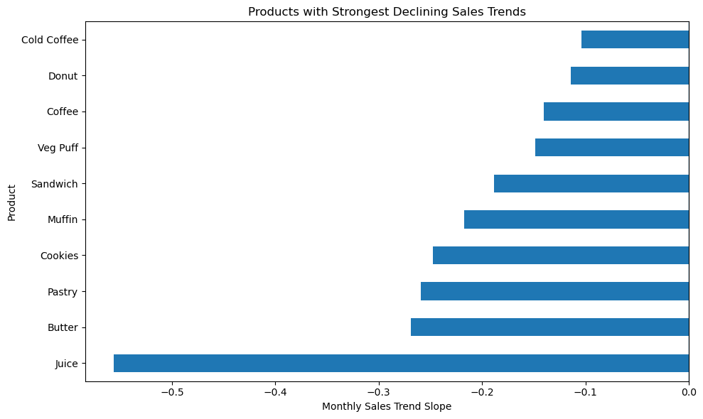
    


```python
# ==========================================
# 12. SALES ANOMALY DETECTION
# ==========================================

Q1 = df['Total_Bill'].quantile(0.25)
Q3 = df['Total_Bill'].quantile(0.75)

IQR = Q3 - Q1

lower_bound = Q1 - 1.5 * IQR
upper_bound = Q3 + 1.5 * IQR

df['Sales_Anomaly'] = np.where(
    (df['Total_Bill'] < lower_bound) |
    (df['Total_Bill'] > upper_bound),
    'Anomaly',
    'Normal'
)

print("Lower Bound:", lower_bound)
print("Upper Bound:", upper_bound)

print(
    df['Sales_Anomaly'].value_counts()
)
```

    Lower Bound: -127.81500000000003
    Upper Bound: 411.26500000000004
    Sales_Anomaly
    Normal     14817
    Anomaly     1752
    Name: count, dtype: int64
    


```python
anomaly_count = (
    df['Sales_Anomaly'] == 'Anomaly'
).sum()

anomaly_percentage = (
    anomaly_count / len(df) * 100
)

print(f"Anomalous Transactions: {anomaly_count:,}")
print(f"Anomaly Percentage: {anomaly_percentage:.2f}%")
```

    Anomalous Transactions: 1,752
    Anomaly Percentage: 10.57%
    


```python
plt.figure(figsize=(10, 5))

plt.hist(df['Total_Bill'], bins=50)

plt.axvline(
    upper_bound,
    linewidth=2,
    label='Upper Anomaly Bound'
)

plt.title('Transaction Revenue Distribution')
plt.xlabel('Transaction Revenue')
plt.ylabel('Number of Transactions')

plt.legend()
plt.tight_layout()
plt.show()
```


    
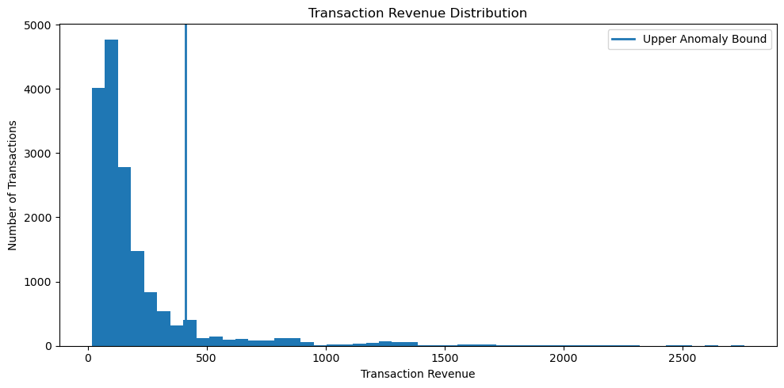
    


```python
anomalies = (
    df[df['Sales_Anomaly'] == 'Anomaly']
    [
        [
            'Transaction_ID',
            'Date',
            'Time',
            'Product',
            'Category',
            'Quantity',
            'Unit_Price',
            'Discount_Percentage',
            'Total_Bill',
            'Profit'
        ]
    ]
    .sort_values('Total_Bill', ascending=False)
)

display(anomalies.head(20))
```


<div>
<style scoped>
    .dataframe tbody tr th:only-of-type {
        vertical-align: middle;
    }

    .dataframe tbody tr th {
        vertical-align: top;
    }

    .dataframe thead th {
        text-align: right;
    }
</style>
<table border="1" class="dataframe">
  <thead>
    <tr style="text-align: right;">
      <th></th>
      <th>Transaction_ID</th>
      <th>Date</th>
      <th>Time</th>
      <th>Product</th>
      <th>Category</th>
      <th>Quantity</th>
      <th>Unit_Price</th>
      <th>Discount_Percentage</th>
      <th>Total_Bill</th>
      <th>Profit</th>
    </tr>
  </thead>
  <tbody>
    <tr>
      <th>15449</th>
      <td>TXN015451</td>
      <td>2024-11-11</td>
      <td>2026-09-23 17:03:00</td>
      <td>Black Forest Cake</td>
      <td>Cakes</td>
      <td>6</td>
      <td>459.83</td>
      <td>0.0</td>
      <td>2758.98</td>
      <td>808.98</td>
    </tr>
    <tr>
      <th>8315</th>
      <td>TXN008320</td>
      <td>2024-01-06</td>
      <td>2026-09-23 16:07:00</td>
      <td>Black Forest Cake</td>
      <td>Cakes</td>
      <td>6</td>
      <td>459.44</td>
      <td>0.6</td>
      <td>2740.10</td>
      <td>-173.58</td>
    </tr>
    <tr>
      <th>9881</th>
      <td>TXN009887</td>
      <td>2024-03-19</td>
      <td>2026-09-23 09:43:00</td>
      <td>Black Forest Cake</td>
      <td>Cakes</td>
      <td>6</td>
      <td>453.07</td>
      <td>0.0</td>
      <td>2718.42</td>
      <td>898.42</td>
    </tr>
    <tr>
      <th>749</th>
      <td>TXN000759</td>
      <td>2023-02-03</td>
      <td>2026-09-23 07:48:00</td>
      <td>Black Forest Cake</td>
      <td>Cakes</td>
      <td>6</td>
      <td>440.47</td>
      <td>0.0</td>
      <td>2642.82</td>
      <td>302.82</td>
    </tr>
    <tr>
      <th>16211</th>
      <td>TXN016212</td>
      <td>2024-12-15</td>
      <td>2026-09-23 16:19:00</td>
      <td>Black Forest Cake</td>
      <td>Cakes</td>
      <td>6</td>
      <td>445.68</td>
      <td>2.0</td>
      <td>2620.60</td>
      <td>383.12</td>
    </tr>
    <tr>
      <th>13836</th>
      <td>TXN013846</td>
      <td>2024-09-04</td>
      <td>2026-09-23 14:56:00</td>
      <td>Black Forest Cake</td>
      <td>Cakes</td>
      <td>6</td>
      <td>457.19</td>
      <td>5.0</td>
      <td>2605.98</td>
      <td>596.82</td>
    </tr>
    <tr>
      <th>5600</th>
      <td>TXN005600</td>
      <td>2023-09-09</td>
      <td>2026-09-23 15:49:00</td>
      <td>Black Forest Cake</td>
      <td>Cakes</td>
      <td>6</td>
      <td>462.35</td>
      <td>6.5</td>
      <td>2593.78</td>
      <td>658.46</td>
    </tr>
    <tr>
      <th>1047</th>
      <td>TXN001040</td>
      <td>2023-02-16</td>
      <td>2026-09-23 18:58:00</td>
      <td>Chocolate Cake</td>
      <td>Cakes</td>
      <td>6</td>
      <td>423.38</td>
      <td>0.0</td>
      <td>2540.28</td>
      <td>812.28</td>
    </tr>
    <tr>
      <th>7248</th>
      <td>TXN007239</td>
      <td>2023-11-20</td>
      <td>2026-09-23 18:15:00</td>
      <td>Chocolate Cake</td>
      <td>Cakes</td>
      <td>6</td>
      <td>423.10</td>
      <td>0.2</td>
      <td>2533.52</td>
      <td>608.44</td>
    </tr>
    <tr>
      <th>2662</th>
      <td>TXN002627</td>
      <td>2023-04-29</td>
      <td>2026-09-23 19:21:00</td>
      <td>Chocolate Cake</td>
      <td>Cakes</td>
      <td>6</td>
      <td>426.58</td>
      <td>2.0</td>
      <td>2508.29</td>
      <td>-422.90</td>
    </tr>
    <tr>
      <th>5530</th>
      <td>TXN005522</td>
      <td>2023-09-05</td>
      <td>2026-09-23 20:58:00</td>
      <td>Chocolate Cake</td>
      <td>Cakes</td>
      <td>6</td>
      <td>414.60</td>
      <td>0.0</td>
      <td>2487.60</td>
      <td>327.60</td>
    </tr>
    <tr>
      <th>10652</th>
      <td>TXN010648</td>
      <td>2024-04-19</td>
      <td>2026-09-23 11:02:00</td>
      <td>Chocolate Cake</td>
      <td>Cakes</td>
      <td>6</td>
      <td>412.46</td>
      <td>0.0</td>
      <td>2474.76</td>
      <td>794.76</td>
    </tr>
    <tr>
      <th>7565</th>
      <td>TXN007561</td>
      <td>2023-12-06</td>
      <td>2026-09-23 17:23:00</td>
      <td>Chocolate Cake</td>
      <td>Cakes</td>
      <td>6</td>
      <td>418.89</td>
      <td>2.2</td>
      <td>2458.05</td>
      <td>831.85</td>
    </tr>
    <tr>
      <th>5840</th>
      <td>TXN005830</td>
      <td>2023-09-20</td>
      <td>2026-09-23 16:06:00</td>
      <td>Chocolate Cake</td>
      <td>Cakes</td>
      <td>6</td>
      <td>408.74</td>
      <td>0.0</td>
      <td>2452.44</td>
      <td>724.44</td>
    </tr>
    <tr>
      <th>15826</th>
      <td>TXN015829</td>
      <td>2024-11-28</td>
      <td>2026-09-23 11:23:00</td>
      <td>Chocolate Cake</td>
      <td>Cakes</td>
      <td>6</td>
      <td>415.16</td>
      <td>1.7</td>
      <td>2448.61</td>
      <td>606.26</td>
    </tr>
    <tr>
      <th>11693</th>
      <td>TXN011677</td>
      <td>2024-06-06</td>
      <td>2026-09-23 19:58:00</td>
      <td>Chocolate Cake</td>
      <td>Cakes</td>
      <td>6</td>
      <td>407.85</td>
      <td>0.0</td>
      <td>2447.10</td>
      <td>527.10</td>
    </tr>
    <tr>
      <th>6525</th>
      <td>TXN006537</td>
      <td>2023-10-21</td>
      <td>2026-09-23 10:11:00</td>
      <td>Chocolate Cake</td>
      <td>Cakes</td>
      <td>6</td>
      <td>415.37</td>
      <td>4.3</td>
      <td>2385.05</td>
      <td>357.88</td>
    </tr>
    <tr>
      <th>3221</th>
      <td>TXN003182</td>
      <td>2023-05-21</td>
      <td>2026-09-23 18:09:00</td>
      <td>Black Forest Cake</td>
      <td>Cakes</td>
      <td>6</td>
      <td>439.32</td>
      <td>10.0</td>
      <td>2372.33</td>
      <td>103.03</td>
    </tr>
    <tr>
      <th>10459</th>
      <td>TXN010433</td>
      <td>2024-04-11</td>
      <td>2026-09-23 19:26:00</td>
      <td>Chocolate Cake</td>
      <td>Cakes</td>
      <td>6</td>
      <td>431.53</td>
      <td>11.1</td>
      <td>2301.78</td>
      <td>190.38</td>
    </tr>
    <tr>
      <th>16024</th>
      <td>TXN016045</td>
      <td>2024-12-07</td>
      <td>2026-09-23 11:30:00</td>
      <td>Chocolate Cake</td>
      <td>Cakes</td>
      <td>6</td>
      <td>428.88</td>
      <td>11.2</td>
      <td>2285.07</td>
      <td>218.04</td>
    </tr>
  </tbody>
</table>
</div>


```python
anomaly_products = (
    df[df['Sales_Anomaly'] == 'Anomaly']
    .groupby('Product')
    .agg(
        Anomalous_Transactions=('Transaction_ID', 'nunique'),
        Revenue=('Total_Bill', 'sum'),
        Quantity=('Quantity', 'sum')
    )
    .sort_values(
        'Anomalous_Transactions',
        ascending=False
    )
)

display(anomaly_products.head(15))
```


<div>
<style scoped>
    .dataframe tbody tr th:only-of-type {
        vertical-align: middle;
    }

    .dataframe tbody tr th {
        vertical-align: top;
    }

    .dataframe thead th {
        text-align: right;
    }
</style>
<table border="1" class="dataframe">
  <thead>
    <tr style="text-align: right;">
      <th></th>
      <th>Anomalous_Transactions</th>
      <th>Revenue</th>
      <th>Quantity</th>
    </tr>
    <tr>
      <th>Product</th>
      <th></th>
      <th></th>
      <th></th>
    </tr>
  </thead>
  <tbody>
    <tr>
      <th>Black Forest Cake</th>
      <td>461</td>
      <td>516887.62</td>
      <td>1225</td>
    </tr>
    <tr>
      <th>Chocolate Cake</th>
      <td>448</td>
      <td>509326.55</td>
      <td>1299</td>
    </tr>
    <tr>
      <th>Honey</th>
      <td>215</td>
      <td>138301.93</td>
      <td>666</td>
    </tr>
    <tr>
      <th>Tea Cake</th>
      <td>185</td>
      <td>100275.27</td>
      <td>702</td>
    </tr>
    <tr>
      <th>Peanut Butter</th>
      <td>172</td>
      <td>106942.98</td>
      <td>629</td>
    </tr>
    <tr>
      <th>Jam</th>
      <td>88</td>
      <td>42845.89</td>
      <td>405</td>
    </tr>
    <tr>
      <th>Chocolate Cookies</th>
      <td>77</td>
      <td>43748.49</td>
      <td>359</td>
    </tr>
    <tr>
      <th>Cookies</th>
      <td>61</td>
      <td>31105.12</td>
      <td>274</td>
    </tr>
    <tr>
      <th>Cheese</th>
      <td>24</td>
      <td>11546.29</td>
      <td>131</td>
    </tr>
    <tr>
      <th>Paneer</th>
      <td>11</td>
      <td>4998.96</td>
      <td>66</td>
    </tr>
    <tr>
      <th>Cold Coffee</th>
      <td>6</td>
      <td>2529.89</td>
      <td>36</td>
    </tr>
    <tr>
      <th>Pizza Slice</th>
      <td>4</td>
      <td>1676.47</td>
      <td>24</td>
    </tr>
  </tbody>
</table>
</div>


```python
anomaly_comparison = (
    df.groupby('Sales_Anomaly')
      .agg(
          Transactions=('Transaction_ID', 'nunique'),
          Avg_Revenue=('Total_Bill', 'mean'),
          Avg_Quantity=('Quantity', 'mean'),
          Avg_Discount=('Discount_Percentage', 'mean'),
          Avg_Profit=('Profit', 'mean')
      )
)

display(anomaly_comparison)
```


<div>
<style scoped>
    .dataframe tbody tr th:only-of-type {
        vertical-align: middle;
    }

    .dataframe tbody tr th {
        vertical-align: top;
    }

    .dataframe thead th {
        text-align: right;
    }
</style>
<table border="1" class="dataframe">
  <thead>
    <tr style="text-align: right;">
      <th></th>
      <th>Transactions</th>
      <th>Avg_Revenue</th>
      <th>Avg_Quantity</th>
      <th>Avg_Discount</th>
      <th>Avg_Profit</th>
    </tr>
    <tr>
      <th>Sales_Anomaly</th>
      <th></th>
      <th></th>
      <th></th>
      <th></th>
      <th></th>
    </tr>
  </thead>
  <tbody>
    <tr>
      <th>Anomaly</th>
      <td>1752</td>
      <td>861.978002</td>
      <td>3.319635</td>
      <td>5.524886</td>
      <td>-52.019247</td>
    </tr>
    <tr>
      <th>Normal</th>
      <td>14817</td>
      <td>130.520854</td>
      <td>2.504421</td>
      <td>6.789924</td>
      <td>-9.394718</td>
    </tr>
  </tbody>
</table>
</div>


```python
# ==========================================
# 13. CROSS-SELLING ANALYSIS
# ==========================================

products_per_transaction = (
    df.groupby('Transaction_ID')['Product']
      .nunique()
)

print("Transactions:", len(products_per_transaction))
print(
    "Transactions with multiple products:",
    (products_per_transaction > 1).sum()
)

print(
    "Maximum products in one transaction:",
    products_per_transaction.max()
)
```

    Transactions: 16569
    Transactions with multiple products: 0
    Maximum products in one transaction: 1
    


```python
display(
    products_per_transaction
    .value_counts()
    .sort_index()
)
```


    Product
    1    16569
    Name: count, dtype: int64


```python
# Check transaction-level product structure

products_per_transaction = (
    df.groupby('Transaction_ID')['Product']
      .nunique()
)

print("Total Transactions:", len(products_per_transaction))

print(
    "Transactions with multiple products:",
    (products_per_transaction > 1).sum()
)

print(
    "Maximum products in one transaction:",
    products_per_transaction.max()
)

print("\nProducts per Transaction:")
print(
    products_per_transaction
    .value_counts()
    .sort_index()
)
```

    Total Transactions: 16569
    Transactions with multiple products: 0
    Maximum products in one transaction: 1
    
    Products per Transaction:
    Product
    1    16569
    Name: count, dtype: int64
    


```python
# Cross-Selling Analysis — Data Limitation

print("""
Cross-selling analysis is not supported by the current dataset.

Reason:
Each Transaction_ID contains exactly one Product.
Therefore, product-to-product purchase associations
cannot be reliably identified from this transaction grain.

Recommendation:
Collect transaction-level basket data containing multiple
products under the same Transaction_ID for future cross-selling analysis.
""")
```

    
    Cross-selling analysis is not supported by the current dataset.
    
    Reason:
    Each Transaction_ID contains exactly one Product.
    Therefore, product-to-product purchase associations
    cannot be reliably identified from this transaction grain.
    
    Recommendation:
    Collect transaction-level basket data containing multiple
    products under the same Transaction_ID for future cross-selling analysis.
    
    


```python
# ==========================================
# 14. SALES DRIVERS & RELATIONSHIPS
# ==========================================

numeric_cols = [
    'Quantity',
    'Unit_Price',
    'Discount_Percentage',
    'Temperature',
    'Promotion_Score',
    'Customer_Rating',
    'Total_Bill',
    'Profit',
    'Waste_Cost'
]

correlation_matrix = df[numeric_cols].corr()

display(
    correlation_matrix['Total_Bill']
    .sort_values(ascending=False)
)
```


    Total_Bill             1.000000
    Unit_Price             0.839487
    Waste_Cost             0.724246
    Quantity               0.358174
    Customer_Rating       -0.006200
    Temperature           -0.006468
    Profit                -0.019926
    Promotion_Score       -0.039309
    Discount_Percentage   -0.064603
    Name: Total_Bill, dtype: float64


```python
plt.figure(figsize=(10, 6))

correlation_matrix['Total_Bill'].sort_values().plot(
    kind='barh'
)

plt.title('Correlation with Transaction Revenue')
plt.xlabel('Correlation')
plt.ylabel('Variable')

plt.tight_layout()
plt.show()
```


    
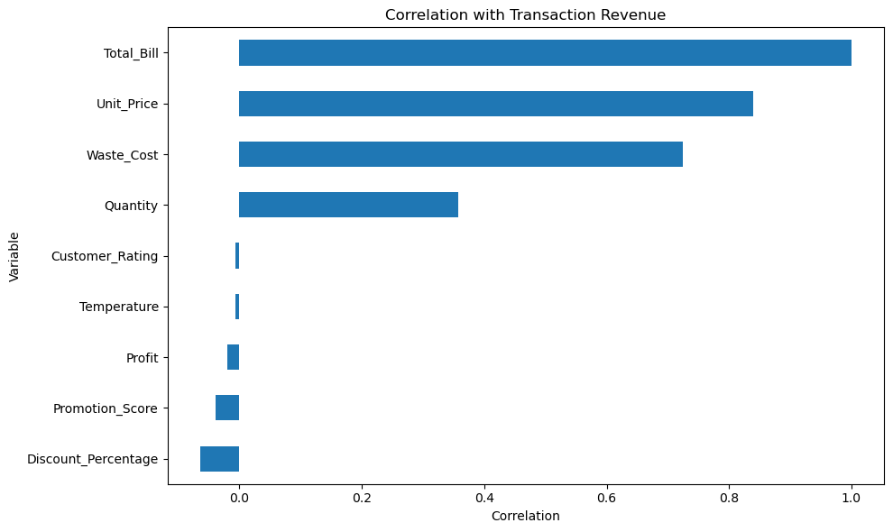
    


```python
weekend_analysis = (
    df.groupby('Weekend')
      .agg(
          Transactions=('Transaction_ID', 'nunique'),
          Revenue=('Total_Bill', 'sum'),
          Avg_Transaction=('Total_Bill', 'mean'),
          Quantity=('Quantity', 'sum')
      )
)

display(weekend_analysis)
```


<div>
<style scoped>
    .dataframe tbody tr th:only-of-type {
        vertical-align: middle;
    }

    .dataframe tbody tr th {
        vertical-align: top;
    }

    .dataframe thead th {
        text-align: right;
    }
</style>
<table border="1" class="dataframe">
  <thead>
    <tr style="text-align: right;">
      <th></th>
      <th>Transactions</th>
      <th>Revenue</th>
      <th>Avg_Transaction</th>
      <th>Quantity</th>
    </tr>
    <tr>
      <th>Weekend</th>
      <th></th>
      <th></th>
      <th></th>
      <th></th>
    </tr>
  </thead>
  <tbody>
    <tr>
      <th>No</th>
      <td>8711</td>
      <td>1902532.81</td>
      <td>218.405787</td>
      <td>22708</td>
    </tr>
    <tr>
      <th>Yes</th>
      <td>7858</td>
      <td>1541580.14</td>
      <td>196.179707</td>
      <td>20216</td>
    </tr>
  </tbody>
</table>
</div>


```python
weather_analysis = (
    df.groupby('Weather')
      .agg(
          Transactions=('Transaction_ID', 'nunique'),
          Revenue=('Total_Bill', 'sum'),
          Avg_Transaction=('Total_Bill', 'mean'),
          Quantity=('Quantity', 'sum')
      )
      .sort_values('Revenue', ascending=False)
)

display(weather_analysis)
```


<div>
<style scoped>
    .dataframe tbody tr th:only-of-type {
        vertical-align: middle;
    }

    .dataframe tbody tr th {
        vertical-align: top;
    }

    .dataframe thead th {
        text-align: right;
    }
</style>
<table border="1" class="dataframe">
  <thead>
    <tr style="text-align: right;">
      <th></th>
      <th>Transactions</th>
      <th>Revenue</th>
      <th>Avg_Transaction</th>
      <th>Quantity</th>
    </tr>
    <tr>
      <th>Weather</th>
      <th></th>
      <th></th>
      <th></th>
      <th></th>
    </tr>
  </thead>
  <tbody>
    <tr>
      <th>Clear</th>
      <td>3024</td>
      <td>638546.43</td>
      <td>211.159534</td>
      <td>7766</td>
    </tr>
    <tr>
      <th>Cold</th>
      <td>2487</td>
      <td>509608.60</td>
      <td>204.908967</td>
      <td>6477</td>
    </tr>
    <tr>
      <th>Rainy</th>
      <td>2340</td>
      <td>477696.67</td>
      <td>204.143876</td>
      <td>6167</td>
    </tr>
    <tr>
      <th>Cloudy</th>
      <td>2125</td>
      <td>439313.95</td>
      <td>206.735976</td>
      <td>5428</td>
    </tr>
    <tr>
      <th>Sunny</th>
      <td>2061</td>
      <td>414951.53</td>
      <td>201.335046</td>
      <td>5270</td>
    </tr>
    <tr>
      <th>Humid</th>
      <td>1532</td>
      <td>314919.66</td>
      <td>205.561136</td>
      <td>3964</td>
    </tr>
    <tr>
      <th>Hot</th>
      <td>1483</td>
      <td>306433.10</td>
      <td>206.630546</td>
      <td>3883</td>
    </tr>
    <tr>
      <th>Pleasant</th>
      <td>853</td>
      <td>193666.03</td>
      <td>227.041067</td>
      <td>2255</td>
    </tr>
    <tr>
      <th>Foggy</th>
      <td>664</td>
      <td>148976.98</td>
      <td>224.362922</td>
      <td>1714</td>
    </tr>
  </tbody>
</table>
</div>


```python
print(
    df['Festival']
    .value_counts(dropna=False)
)
```

    Festival
    NaN                 15960
    Diwali                119
    Eid                   114
    Dussehra               96
    Christmas              82
    New Year               78
    Holi                   63
    Independence Day       57
    Name: count, dtype: int64
    


```python
festival_analysis = (
    df.assign(
        Festival_Status=df['Festival'].fillna('No Festival')
    )
    .groupby('Festival_Status')
    .agg(
        Transactions=('Transaction_ID', 'nunique'),
        Revenue=('Total_Bill', 'sum'),
        Avg_Transaction=('Total_Bill', 'mean'),
        Quantity=('Quantity', 'sum'),
        Profit=('Profit', 'sum')
    )
    .sort_values('Revenue', ascending=False)
)

display(festival_analysis)
```


<div>
<style scoped>
    .dataframe tbody tr th:only-of-type {
        vertical-align: middle;
    }

    .dataframe tbody tr th {
        vertical-align: top;
    }

    .dataframe thead th {
        text-align: right;
    }
</style>
<table border="1" class="dataframe">
  <thead>
    <tr style="text-align: right;">
      <th></th>
      <th>Transactions</th>
      <th>Revenue</th>
      <th>Avg_Transaction</th>
      <th>Quantity</th>
      <th>Profit</th>
    </tr>
    <tr>
      <th>Festival_Status</th>
      <th></th>
      <th></th>
      <th></th>
      <th></th>
      <th></th>
    </tr>
  </thead>
  <tbody>
    <tr>
      <th>No Festival</th>
      <td>15960</td>
      <td>3291422.74</td>
      <td>206.229495</td>
      <td>41351</td>
      <td>-212794.91</td>
    </tr>
    <tr>
      <th>Eid</th>
      <td>114</td>
      <td>29514.24</td>
      <td>258.896842</td>
      <td>303</td>
      <td>228.40</td>
    </tr>
    <tr>
      <th>Diwali</th>
      <td>119</td>
      <td>26892.60</td>
      <td>225.988235</td>
      <td>295</td>
      <td>-2656.78</td>
    </tr>
    <tr>
      <th>Dussehra</th>
      <td>96</td>
      <td>24866.64</td>
      <td>259.027500</td>
      <td>239</td>
      <td>-3680.99</td>
    </tr>
    <tr>
      <th>Christmas</th>
      <td>82</td>
      <td>23126.34</td>
      <td>282.028537</td>
      <td>221</td>
      <td>-3704.07</td>
    </tr>
    <tr>
      <th>Holi</th>
      <td>63</td>
      <td>17512.97</td>
      <td>277.983651</td>
      <td>165</td>
      <td>-1416.53</td>
    </tr>
    <tr>
      <th>New Year</th>
      <td>78</td>
      <td>15526.53</td>
      <td>199.058077</td>
      <td>204</td>
      <td>-3777.78</td>
    </tr>
    <tr>
      <th>Independence Day</th>
      <td>57</td>
      <td>15250.89</td>
      <td>267.559474</td>
      <td>146</td>
      <td>-2536.59</td>
    </tr>
  </tbody>
</table>
</div>


```python
promotion_weekend = (
    df.groupby(['Promotion_Applied', 'Weekend'])
      .agg(
          Transactions=('Transaction_ID', 'nunique'),
          Revenue=('Total_Bill', 'sum'),
          Avg_Transaction=('Total_Bill', 'mean'),
          Quantity=('Quantity', 'sum'),
          Profit=('Profit', 'sum')
      )
      .reset_index()
)

display(promotion_weekend)
```


<div>
<style scoped>
    .dataframe tbody tr th:only-of-type {
        vertical-align: middle;
    }

    .dataframe tbody tr th {
        vertical-align: top;
    }

    .dataframe thead th {
        text-align: right;
    }
</style>
<table border="1" class="dataframe">
  <thead>
    <tr style="text-align: right;">
      <th></th>
      <th>Promotion_Applied</th>
      <th>Weekend</th>
      <th>Transactions</th>
      <th>Revenue</th>
      <th>Avg_Transaction</th>
      <th>Quantity</th>
      <th>Profit</th>
    </tr>
  </thead>
  <tbody>
    <tr>
      <th>0</th>
      <td>No</td>
      <td>No</td>
      <td>7740</td>
      <td>1720978.71</td>
      <td>222.348671</td>
      <td>20166</td>
      <td>26582.39</td>
    </tr>
    <tr>
      <th>1</th>
      <td>No</td>
      <td>Yes</td>
      <td>5469</td>
      <td>1129157.12</td>
      <td>206.465006</td>
      <td>14145</td>
      <td>-24629.35</td>
    </tr>
    <tr>
      <th>2</th>
      <td>Yes</td>
      <td>No</td>
      <td>971</td>
      <td>181554.10</td>
      <td>186.976416</td>
      <td>2542</td>
      <td>-77752.49</td>
    </tr>
    <tr>
      <th>3</th>
      <td>Yes</td>
      <td>Yes</td>
      <td>2389</td>
      <td>412423.02</td>
      <td>172.634165</td>
      <td>6071</td>
      <td>-154539.80</td>
    </tr>
  </tbody>
</table>
</div>


```python
# ==========================================
# 15. PYTHON BUSINESS INSIGHTS SUMMARY
# ==========================================

print("=" * 60)
print("BAKERY ANALYTICS — PYTHON BUSINESS INSIGHTS SUMMARY")
print("=" * 60)

# Sales
print("\n--- SALES ---")
print(f"Total Revenue       : {df['Total_Bill'].sum():,.2f}")
print(f"Total Quantity      : {df['Quantity'].sum():,.0f}")
print(f"Total Transactions  : {df['Transaction_ID'].nunique():,}")
print(f"Average Transaction : {df['Total_Bill'].mean():,.2f}")

# Profit
print("\n--- PROFITABILITY ---")
print(f"Total Profit        : {df['Profit'].sum():,.2f}")
print(f"Average Profit      : {df['Profit'].mean():,.2f}")
print(f"Median Profit       : {df['Profit'].median():,.2f}")
print(f"Total Waste Cost    : {df['Waste_Cost'].sum():,.2f}")

# Customers
print("\n--- CUSTOMERS ---")
print(f"Unique Customers    : {df['Customer_ID'].nunique():,}")

repeat_customers = (
    df.groupby('Customer_ID')['Transaction_ID']
      .nunique()
      .gt(1)
      .sum()
)

print(f"Repeat Customers    : {repeat_customers:,}")

repeat_pct = (
    repeat_customers /
    df['Customer_ID'].nunique() * 100
)

print(f"Repeat Customer %   : {repeat_pct:.2f}%")

# Inventory
print("\n--- INVENTORY ---")
print(f"Units Produced     : {df['Units_Produced'].sum():,.0f}")
print(f"Units Sold         : {df['Units_Sold'].sum():,.0f}")
print(f"Unsold Units       : {df['Unsold_Units'].sum():,.0f}")

# Promotions
print("\n--- PROMOTIONS ---")
print(
    df['Promotion_Applied']
      .value_counts(dropna=False)
)

# Cross-selling limitation
print("\n--- DATA LIMITATION ---")
print("Cross-selling analysis: NOT SUPPORTED")
print("Reason: Each Transaction_ID contains exactly one Product.")

print("\n" + "=" * 60)
```

    ============================================================
    BAKERY ANALYTICS — PYTHON BUSINESS INSIGHTS SUMMARY
    ============================================================
    
    --- SALES ---
    Total Revenue       : 3,444,112.95
    Total Quantity      : 42,924
    Total Transactions  : 16,569
    Average Transaction : 207.86
    
    --- PROFITABILITY ---
    Total Profit        : -230,339.25
    Average Profit      : -13.90
    Median Profit       : -0.42
    Total Waste Cost    : 1,388,812.80
    
    --- CUSTOMERS ---
    Unique Customers    : 2,173
    Repeat Customers    : 2,116
    Repeat Customer %   : 97.38%
    
    --- INVENTORY ---
    Units Produced     : 126,710
    Units Sold         : 81,184
    Unsold Units       : 45,526
    
    --- PROMOTIONS ---
    Promotion_Applied
    No     13209
    Yes     3360
    Name: count, dtype: int64
    
    --- DATA LIMITATION ---
    Cross-selling analysis: NOT SUPPORTED
    Reason: Each Transaction_ID contains exactly one Product.
    
    ============================================================
    


```python
output_file = "bakery_analysis_ready.csv"

df.to_csv(
    output_file,
    index=False
)

print(f"Saved: {output_file}")
```

    Saved: bakery_analysis_ready.csv
    


```python

```
